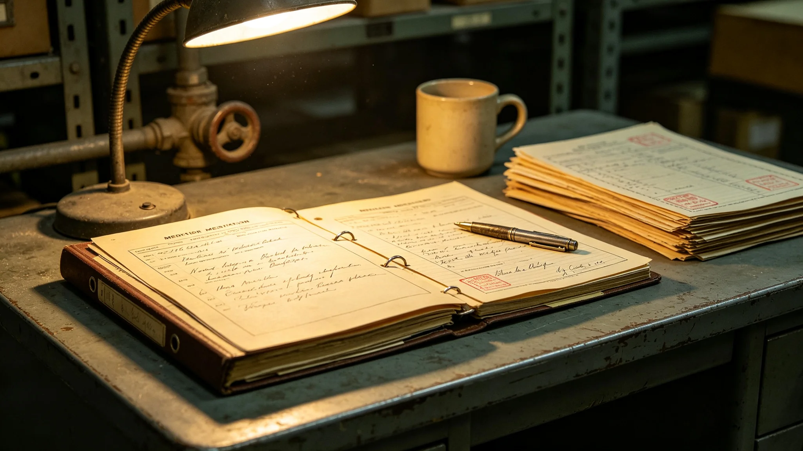

# 代际文化断层弥合项目首任传译人岑桥生十六年考勤与调解案卷

**档案形成机构**：三恒星系社会与家庭委员会人事组
**归档日期**：3526年11月5日
**档案密级**：人事公开

## 一、基本登记

岑桥生，男，3468年生于第四恒星系垂直晨昏城，代际文化断层弥合项目首任"传译人"（3510—3526）。传译人职责为在祖辈与孙辈共修（见GS-3522-01）出现卡壳时居中传话、不评判。本档案为其考勤与调解案卷汇编。

## 二、考勤

| 年度 | 应到 | 实到 | 调解场次 | 出差 |
|---|---|---|---|---|
| 3510 | 248 | 247 | 310 | 4 |
| 3515 | 250 | 249 | 520 | 9 |
| 3520 | 249 | 248 | 710 | 14 |
| 3526 | 247 | 245 | 840 | 18 |

十六年累计调解代际卡壳场次约7600场。

## 三、典型调解案卷

**（一）拒认地球案（3527）**

某青少年共修中拒认老地球叙事（见GS-3527-01），岑桥生为现场传译人。其调解记录载：未劝青少年"认地球"，只对祖辈说"他问的不是地球，是他自己在哪"，对青少年说"你祖辈讲的不是要你认，是要你知道他从哪来"。案卷结尾双方继续共修至结束。

**（二）双重归属案（3518）**

跨系移民第二代孙辈自述"既不像这边也不像那边"。岑桥生调解记录载：未给答案，只把祖孙二人的话各重复一遍。

## 四、处分记录

任内无处分。

## 五、体检

| 年度 | 声带 | 听力 | 血压 |
|---|---|---|---|
| 3510 | 正常 | 正常 | 正常 |
| 3520 | 慢性咽炎 | 正常 | 轻度偏高 |
| 3526 | 慢性咽炎 | 正常 | 偏高 |

## 六、传译人手则

岑桥生在任内编写《传译人手则》十二条，第一条为："不传结论，只传原话。"人事组注明：这是他唯一留下的文字遗产。

## 七、人事组注

岑桥生不是什么"两代人的桥梁"。他只是一个坐了十六年、听了一万五千句双方说不下去的话、然后原封不动再传一遍的传译人。他没解决过任何一场争论，他只是让争论里的双方终于听清了对方说了什么。够了。档案如此。

## 八、手则第一条的由来

手则第一条"不传结论，只传原话"，据岑桥生自述源于3512年一次调解：他当时急于劝和，替祖辈说了句软话，结果孙辈更反感。此后他定下规矩，只传话，不传话里的意思。

## 九、退休后

退休后未再任传译人，亦未著书。人事组注明：他把话都传给别人了，自己一句没写。这正是传译人该做的。

## 十一、调解案卷统计

| 类 | 起数 | 当场和解 |
|---|---|---|
| 叙事之争 | 4100 | 3900 |
| 生活习惯 | 6800 | 6500 |
| 代际误解 | 4300 | 4100 |

人事组注明：一万五千起，他一桩桩听完，一桩桩原话传回。没有一场是他"说服"了谁，只是两边终于听清了对方。听清了，火就小了。

## 十二、手则第一条

"不传结论，只传原话。"人事组注明：这八个字，是他坐了十六年坐出来的。传译人是翻译，不是裁判。

## 十三、无徒弟

未指定徒弟，传译人由公开竞聘。人事组注明：他不带徒。传译这行，教不出，只能坐得多了自然会。

---

**档案编号**：HR-CQS-3526-019
**编制**：联合体社会与家庭委员会人事组
**日期**：3526年11月5日

## 十五、十六年的位置
人事组在案卷末尾说明：岑桥生十六年，传译了一万五千句，没解决过一场争论。人事组注明：他的工作不是解决，是让两边听清。听清了，火就小了；听不清，再传一遍。传译人不立门户，不带徒弟。

## 十六、传译人的一天
人事组在案卷附记中说明，岑桥生一天最多传译六场，每场两小时。传译时他不看任何一方，只重复。人事组注明：他一天重复一万五千句原话，不添一个字。十六年下来，他的嗓音平了，情绪平了，人也平了。这是传译人的样子。

## 十七、传译人的饭
人事组在案卷附记中说明，岑桥生传译时不吃饭、不喝水，怕打断双方说话。人事组注明：他一天六场，从早坐到晚，一口水不喝。他说，一喝水，两边的话就接不上了。

## 十八、传译人的平
人事组在案卷附记中说明，岑桥生传译时不看任何一方，只重复。人事组注明：他一天重复一万五千句原话，不添一个字。

## 十九、传译人的眼
人事组在案卷附记中说明，岑桥生传译时闭眼。人事组注明：他不看祖辈，也不看孙辈。闭眼，才能专心听两边的原话。

## 二十、传译人的眼
人事组在案卷附记中说明，岑桥生传译时闭眼。人事组注明：不看任何一方，只听原话。

## 二十一、传译人的平
人事组在案卷附记中说明，岑桥生一天重复一万五千句原话，不添一个字。人事组注明：他不是在解决争论，是在让两边听清。

## 二十二、传译人的眼
人事组在案卷附记中说明，岑桥生传译时闭眼。人事组注明：不看任何一方，只听原话。闭眼，才能专心听。

## 二十三、传译人的平
人事组在案卷附记中说明，岑桥生一天重复一万五千句原话，不添一个字。人事组注明：他不是在解决争论，是在让两边听清。

## 二十四、传译人的眼
人事组在案卷附记中说明，岑桥生传译时闭眼。人事组注明：不看任何一方，只听原话。闭眼，才能专心听。

## 二十五、传译人的眼
人事组在案卷附记中说明，岑桥生传译时闭眼。人事组注明：不看任何一方，只听原话。闭眼，才能专心听。

---

**档案编号**：HR-CQS-3526-019
**编制**：联合体社会与家庭委员会人事组
**日期**：3526年11月5日
