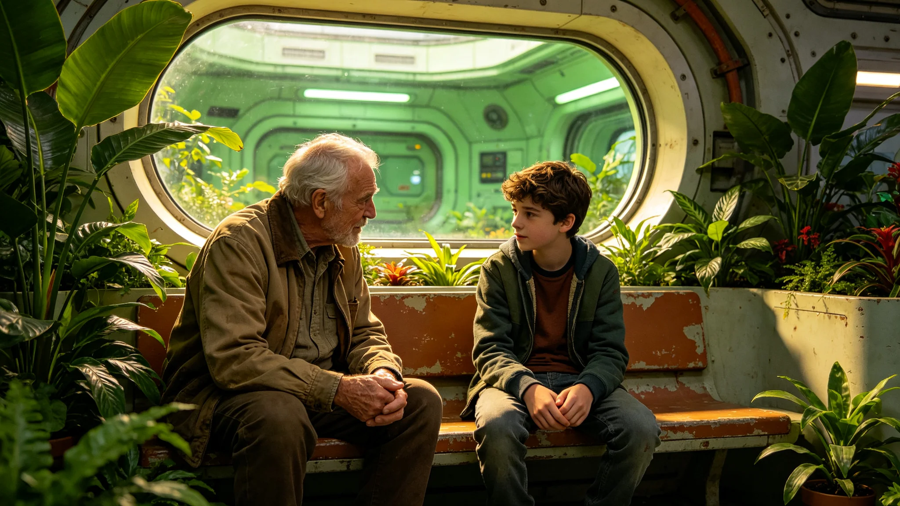

# 代际共修活动中某青少年拒认老地球叙事引发代际讨论事件公报

**发布机构**：三恒星系文明联合体社会与家庭委员会共修协调组
**事件编号**：INC-3527-031
**发布日期**：3527年7月14日
**文件等级**：跨星系公开

## 一、事件经过

3527年6月，某社区祖孙共修（见GS-3522-01）活动中，一名十五岁纯本土出生青少年在共阅一件老地球初代文书时，当众发问："这东西和我有什么关系？我生在这里，长在这里，你们凭什么要我认一个我从没去过的球？"其结对祖辈一时语塞。现场录像后被其他参与者上传，引发跨系代际讨论。

## 二、事件定性

共修协调组研判：

- 非冲突：现场无人争吵，青少年事后仍完成了共修；
- 非事故：无人员伤亡，无设施损坏；
- 真讨论：该问题正是3503年问卷异常（见GS-3503-01）的现场版。

协调组注明：这不是闹事，这是孩子在问一个真问题。问得好。

## 三、各方回应

| 方面 | 回应要点 |
|---|---|
| 祖辈 | "我不是要你认地球，我是要你知道我从哪来" |
| 同场其他青少年 | 约半数认同该发问，约半数认为"也该听听" |
| 共修协调组 | 不批评、不封号、不追责 |
| 文化部门 | 借机增设"你从哪来"自主讲述环节 |

## 四、处置措施

1. 不追责：青少年与祖辈均未受任何处分；
2. 改共修：祖孙共修内容中增设"孙辈也讲一段自己的来历"环节，由单向讲述变双向；
3. 不删帖：现场录像保留公开，作为讨论素材；
4. 入教材：该发问被收入代际共修教材，作为"好问题"范例。

## 五、事件影响

事件未引发社会对立，未引发跨系摩擦。讨论持续三周后自然降温。协调组注明：三周的讨论，比三次讲座都管用。年轻人开始认真想"我是谁"了，这正是共修要的。

## 六、协调组注明

## 七、录像素材的使用

现场录像保留公开后，被多所终身学习平台（见GS-3265-01）用作"如何回应好问题"的教学案例。处置组注明：孩子的发问成了教材，不是被当成反面典型。

## 八、青少年本人

该青少年次年继续参加共修，未再拒认，亦未变热情。处置组注明：他没变爱，也没变冷淡，只是开始问了。问了，就是好事。

## 十、讨论后续

事件后，同场祖辈无一人离场。处置组注明：祖辈们没有生气，只是沉默了一会儿，然后有一位开口说"我们当年也问过一样的话"。一句话，把两代人接上了。

## 十一、录像传播量

录像公开半年，播放410万次，评论以"被戳中"居多。处置组注明：孩子的发问不是孤例，是一代人共同的问题。他替很多人问了。

## 十二、不封号不删帖

录像保留原帖，不剪辑、不打码。处置组注明：一个真实的好问题，不该被美化成广告，也不该被删成没发生过。

孩子问"这和我有什么关系"。五百年前，第一批走的人也问过自己"我们为什么要走"。问题不一样，提问的人是一样的——都在找自己。我们不逼他认地球，我们把椅子多摆一把，让他也讲一句。讲完，他自己会决定认不认。

## 十三、事件的余波
处置组在公报末尾说明：该青少年次年继续参加共修，未再拒认，亦未变热情。处置组注明：他没变爱，也没变冷淡，只是开始问了。问了，就是好事。一个愿意问的人，比一个默不吭声认下来的人，更真。

## 十四、事件的公开
处置组在公报附记中说明，事件录像原片保留公开，不剪辑、不打码、不加字幕。处置组注明：一个真实的好问题，不该被美化成广告，也不该被删成没发生过。年轻人问了，就留着。后人看到，知道自己也曾被问过。

## 十五、青少年的后续
处置组在公报附记中说明，该青少年次年参加共修，被问还认不认老地球，他答不知道。处置组注明：不知道，比假装认了强。一个说不知道的人，比一个背书的人，更像真公民。

## 十六、录像的保留
处置组在公报附记中说明，录像保留原帖，不剪辑、不打码。处置组注明：一个真实的好问题，不该被美化成广告。

## 十七、孩子的问
处置组在公报附记中说明，孩子那句这和我有什么关系，成了终身学习平台的固定开场。处置组注明：不是被当成反面教材，是被当成一个好问题。

## 十八、孩子的话
处置组在公报附记中说明，那句这和我有什么关系，成了终身学习平台的开场。处置组注明：不是反面教材，是好问题。

## 十九、录像的保留
处置组在公报附记中说明，录像原片保留公开，不剪辑、不打码。处置组注明：一个真实的好问题，不该被美化成广告。

## 二十、孩子的话
处置组在公报附记中说明，那句这和我有什么关系，成了终身学习平台的开场。处置组注明：不是反面教材，是好问题。

## 二十一、录像的保留
处置组在公报附记中说明，录像原片保留公开，不剪辑、不打码。处置组注明：一个真实的好问题，不该被美化成广告。

---

**归档编号**：INC-3527-031
**编制**：联合体共修协调组
**日期**：3527年7月14日
