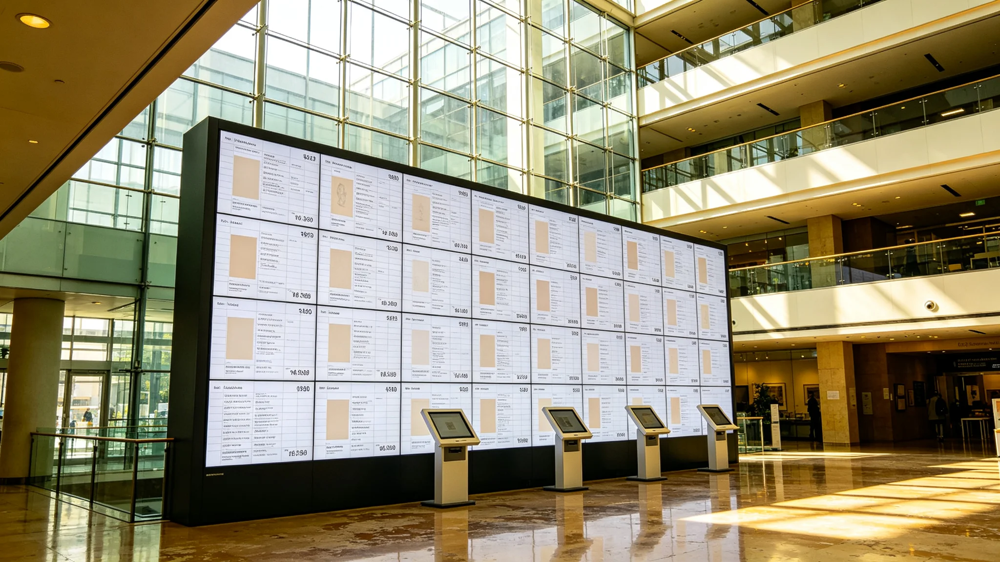

# 跨星系文化创意与艺术传播产业3529年度决算报告

**编制单位**：三恒星系文明联合体经济产业署
**报告年度**：3529年
**发布日期**：3530年7月22日
**文件等级**：跨星系公开

## 一、产业范围

跨星系文化创意与艺术传播产业包括：跨系文艺作品交易、版权清算（见GS-3529-01）、高保真复制（见GS-3532-01）、巡展运营（见GS-3535-01星月展）、文化衍生品。本产业随三系合籍后艺术跨系传播而兴。

## 二、年度决算

| 项目 | 金额（亿星汇） | 占比 |
|---|---|---|
| 文艺作品交易 | 18.2 | 33% |
| 版权清算与授权 | 9.4 | 17% |
| 高保真复制 | 6.8 | 12% |
| 巡展运营 | 8.1 | 15% |
| 文化衍生品 | 7.3 | 13% |
| 技术研发 | 2.8 | 5% |
| 跨系运输 | 2.7 | 5% |
| 合计 | 55.3 | 100% |

## 三、服务量

| 指标 | 3528年 | 3529年 |
|---|---|---|
| 跨系作品交易（万件） | 4.2 | 6.8 |
| 版权清算（件） | 2100 | 3140 |
| 巡展参观（亿人次） | 0.8 | 1.1 |
| 复制件制作（件） | 3.1万 | 4.7万 |

## 四、产业特征

经济署注明：以前一件画在A系画完，只在A系挂着；现在它能坐飞船去B系、C系，版权算清楚，复制件卖出去。艺术跨了系，钱也跨了系。有人说俗，俗了才说明活了。

## 五、与遗产的边界

甲类遗产原件（见GS-3508-01）不进入本产业交易，仅复制件可流通。经济署注明：真迹不卖，复印件可以卖。真迹受不可交易名录保护（见GS-3374-01），钱动不了它。

## 六、就业

本产业直接从业约22万人，其中交易与版权5万、复制制作4万、巡展运营6万、衍生品5万、运输2万。

## 七、经济署注

55.3亿星汇，买的是三系的画互相看见。艺术这东西，锁在柜子里不是传播，是陪葬。让它上天、让人看、让钱转起来，它才活着。下一年，星月展开幕（见GS-3535-01），产业跟着涨。

## 八、衍生品的边界

衍生品不得用甲类遗产原件图像作商业印售。经济署注明：真迹不能印在杯子上卖。复制件可以，真迹的脸不行。

## 九、新人扶持

产业对跨系新人创作者设孵化补贴。经济署注明：不能让产业只认老作品。新人画的，也得有人看。

## 十一、产业结构

| 项 | 占比 |
|---|---|
| 跨系版权清算 | 31% |
| 巡展运输与护航 | 27% |
| 艺术品复制 | 19% |
| 衍生品 | 13% |
| 新人孵化 | 10% |

经济署注明：这门产业近三分之一花在跨系算账和运输上。艺术要跨星系，路费和账房占了大头。值，因为不运出去，它就只是一个系的事。

## 十二、不设审查

作品展出不设内容审查，仅过生物安全检疫。经济署注明：艺术好不好，观众说了算。审查不算。

## 十三、经济署注

本产业作品展出不设内容审查，仅过生物安全检疫（见GS-3394-01）。经济署注明：艺术好不好，观众说了算，审查不算。

## 十四、产业的节制
经济署在决算末尾说明：本产业不设内容审查，但也不鼓励炒作。经济署注明：一件作品火了，我们不推成爆款；冷了，我们不救成经典。让它自己飞。飞多远算多远，不拿产业的钱去抬它。

## 十四、产业的不炒
经济署在决算附记中说明，本产业不炒作、不捧新人、不造爆款。经济署注明：一件作品飞多远，是它自己的事。产业只提供路，不提供风。吹起来的作品，风停了就落；自己飞的，飞得远。

## 十五、巡展的账
经济署在决算附记中说明，星月展一轮巡展的运输与护航成本，占产业收入的两成七。经济署注明：艺术跨星系，路费比票价贵。但路费花了，三系人就看见了。

## 十六、新人的孵化
经济署在决算附记中说明，产业对跨系新人创作者设孵化补贴。经济署注明：不能让产业只认老作品。

## 十七、产业的不炒
经济署在决算附记中说明，本产业不造爆款、不推新人。经济署注明：让作品自己飞。吹起来的，风停就落；自己飞的，飞得远。

## 十八、作品的飞
经济署在决算附记中说明，本产业不造爆款。经济署注明：让作品自己飞。

## 十九、作品的飞
经济署在决算附记中说明，本产业不造爆款。经济署注明：让作品自己飞，吹起来的风停就落。

## 二十、作品的飞
经济署在决算附记中说明，本产业不造爆款。经济署注明：让作品自己飞。吹起来的，风停就落。

## 二十一、作品的飞
经济署在决算附记中说明，本产业不造爆款。经济署注明：让作品自己飞。吹起来的，风停就落。

## 二十二、作品的飞
经济署在决算附记中说明，本产业不造爆款。经济署注明：让作品自己飞。吹起来的，风停就落。

## 二十三、作品的飞
经济署在决算附记中说明，本产业不造爆款。经济署注明：让作品自己飞。吹起来的，风停就落。

## 二十四、作品的飞
经济署在决算附记中说明，本产业不造爆款。经济署注明：让作品自己飞。吹起来的，风停就落。

## 二十五、作品的飞
经济署在决算附记中说明，本产业不造爆款。经济署注明：让作品自己飞。吹起来的，风停就落。

## 二十六、作品的飞
经济署在决算附记中说明，本产业不造爆款。经济署注明：让作品自己飞。吹起来的，风停就落。

## 二十七、作品的飞
经济署在决算附记中说明，本产业不造爆款。经济署注明：让作品自己飞。

## 二十八、作品的飞
经济署在决算附记中说明，本产业不造爆款。经济署注明：让作品自己飞。

---

**报告编号**：ECON-ART-3530-023
**编制**：联合体经济产业署
**日期**：3530年7月22日
