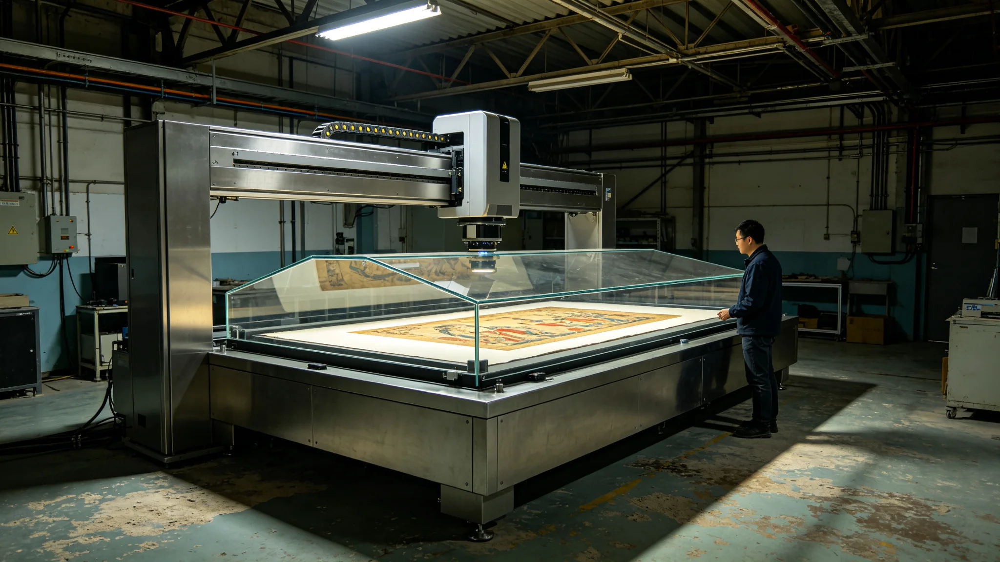

# 跨星系艺术品跨介质高保真复制与防伪水印技术公报

**编制单位**：三恒星系文化资产技术组
**报告日期**：3532年7月19日
**文件等级**：跨星系公开

## 一、技术背景

星月展（见GS-3535-01）需将初代手稿、绘画、器物跨系复制展出。原件运输昂贵且有损毁风险（见GS-3542-01），高保真复制件可替代原件赴远距离巡展。技术组开发跨介质高保真复制与防伪水印技术。

## 二、高保真复制

| 介质 | 复制方式 | 保真度 |
|---|---|---|
| 纸本手稿 | 多光谱扫描+克重重现 | 98.7% |
| 绘画 | 偏振多色扫描+颜料光谱复现 | 97.2% |
| 金属器物 | 三维光学扫描+材质纹理复刻 | 95.5% |
| 织物 | 多光谱+纤维结构复现 | 96.0% |

技术组注明：复制件不是原件。我们追求的是"近看以假乱真"，不是"偷梁换柱"。每件复制件都有防伪水印标明身份。

## 三、防伪水印

复制件内嵌三层不可见水印：

1. 光谱水印：在特定光照下显形，标"复制件"字样；
2. 坐标水印：记录复制时间、地点、设备编号；
3. 权属水印：关联版权清算（见GS-3529-01）。

## 四、与原件的区分

| 项目 | 原件 | 复制件 |
|---|---|---|
| 不可交易名录 | 受保护（见GS-3374） | 不受名录限制 |
| 巡展 | 谨慎 | 可远距离巡展 |
| 防伪标识 | 无 | 三层水印 |
| 保险 | 高 | 低 |

## 五、性能

| 指标 | 数值 |
|---|---|
| 复制误差 | <3% |
| 水印伪造难度 | 需专用多光谱设备 |
| 复制周期 | 单件48小时 |
| 复制件使用寿命 | 200年（玻璃基底，见GS-3368） |

## 六、技术组注

## 七、复制件也会旧

复制件玻璃基底寿命两百年，两百年后需重制。技术组注明：复制件不是永恒的，但它比原件耐运两百年。两百年后重制一张就是，原件不用再动。

## 八、水印不可伪造

三层水印需专用多光谱设备读取，普通扫描看不出。技术组注明：有人想把复制件当真迹卖，水印一照就露馅。

## 十、三层水印

| 层 | 载体 | 读取方式 |
|---|---|---|
| 底纹 | 玻璃基底 | 普通肉眼 |
| 光谱 | 墨层下 | 多光谱 |
| 数字 | 隐写 | 专用设备 |

技术组注明：三层水印，一层比一层难查。普通扫描看不出后两层，想把复制件当真迹卖，一照就露馅。

## 十一、保真度

复制件保真度97%~98%，故意留3%不追平。技术组注明：差那3%，是为了让人分得清真假。真要100%一样，就成造假了。

## 十二、不追"以假乱真"到侵权

复制件是为了让原件少坐飞船。原件金贵，复制件便宜。但便宜不代表可以乱造——三层水印盯着它。有人问"复制件算不算真"。我们说，复制件是复印件，不是真迹。真迹留在恒温库里，复印件去巡展。各归各位。

## 十三、复制的本分
技术组在公报末尾说明：复制件保真度九成八，故意留两成不追平。技术组注明：差那两成，是为了让人分得清真假。真迹留在恒温库，复制件去巡展。复制不是造假，是替真迹跑腿。

## 十四、复制件的寿命
技术组在公报附记中说明，复制件玻璃基底寿命两百年。技术组注明：两百年后重制一张就是，原件不用再动。原件在恒温库里躺两千年，复制件替它飞两百年。两百年后复制件旧了，再做新的。

## 十五、水印的三层
技术组在公报附记中说明，三层水印中最外一层肉眼可见，中间一层多光谱可读，最里一层需专用设备。技术组注明：造假者能仿外层，仿不了里层。三层叠起来，才叫防伪。

## 十六、复制件的寿命
技术组在公报附记中说明，复制件玻璃基底寿命两百年。技术组注明：两百年后重制一张，原件不用再动。

## 十七、水印的查
技术组在公报附记中说明，复制件出厂前，三层水印逐件多光谱抽检。技术组注明：抽检不逐件，但抽检率一成。一成里出问题，整批重检。

## 十八、水印的抽
技术组在公报附记中说明，复制件三层水印逐件多光谱抽检。技术组注明：抽检一成，出问题整批重检。

## 十九、水印的查
技术组在公报附记中说明，复制件三层水印逐件多光谱抽检。技术组注明：抽检一成，出问题整批重检。

## 二十、水印的查
技术组在公报附记中说明，复制件三层水印逐件多光谱抽检。技术组注明：抽检一成，出问题整批重检。

## 二十一、水印的查
技术组在公报附记中说明，复制件三层水印逐件多光谱抽检。技术组注明：抽检一成，出问题整批重检。

## 二十二、水印的查
技术组在公报附记中说明，复制件三层水印逐件多光谱抽检。技术组注明：抽检一成，出问题整批重检。

## 二十三、水印的查
技术组在公报附记中说明，复制件三层水印逐件多光谱抽检。技术组注明：抽检一成，出问题整批重检。

## 二十四、水印的查
技术组在公报附记中说明，复制件三层水印逐件多光谱抽检。技术组注明：抽检一成，出问题整批重检。

## 二十五、水印的查
技术组在公报附记中说明，复制件三层水印逐件多光谱抽检。技术组注明：抽检一成，出问题整批重检。

---

**报告编号**：ENG-ART-3532-029
**编制**：联合体文化资产技术组
**日期**：3532年7月19日
