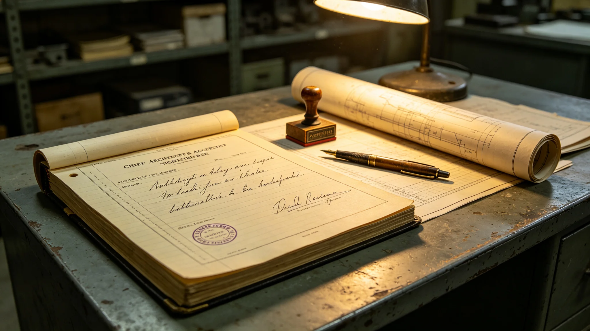

# 文明记忆工程首任总架构师闻长记二十八年考勤与系统验收签名档案

**档案形成机构**：三恒星系文明记忆工程委员会人事组
**归档日期**：3533年12月12日
**档案密级**：人事公开

## 一、基本登记

闻长记，男，3455年生于太阳系外缘ARK-01原舱保护站方向，文明记忆工程首任总架构师（3505—3533）。本档案为其二十八年考勤、体检与系统验收签名汇编。

## 二、考勤

| 年度 | 应到 | 实到 | 出差节点 | 病假 |
|---|---|---|---|---|
| 3505 | 248 | 246 | 6 | 2 |
| 3515 | 250 | 248 | 14 | 2 |
| 3525 | 249 | 247 | 21 | 2 |
| 3533 | 247 | 244 | 26 | 3 |

出差节点为跨星系文明记忆分布式存储节点建设工地（见GS-3539-01）。

## 三、系统验收签名

文明记忆工程分三期建成，闻长记在三期验收文件上分别签名：

- 一期（3515）：分布式存储骨架，签名完整无涂改；
- 二期（3524）：口述史库与去伪存真模块（见GS-3534-01），签名完整；
- 三期（3533）：冷光玻璃刻写（见GS-3539-01）与点灯封档（见GS-3543-01），签名末笔略抖，体检显示左手轻度震颤。

人事组注明：三期那一笔，手已经抖了。他签完没说话，把笔放下就去住院了。

## 四、体检

| 年度 | 骨骼 | 神经 | 左手震颤 |
|---|---|---|---|
| 3505 | 正常 | 正常 | 无 |
| 3520 | 轻度下降 | 正常 | 无 |
| 3530 | 轻度下降 | 周围神经轻度病变 | 轻度 |
| 3533 | 轻度下降 | 周围神经病变 | 明显 |

## 五、处分记录

任内无处分。

## 六、退休

3533年12月三期验收后即退休住院，未留任。交接清单载明：分布式节点127处、口述库480亿条、冷光玻璃副本三系异地。

## 七、人事组注

闻长记不是什么"文明记忆之父"。他只是一个跑了二十六年工地、把左手跑震出神经病变、三期验收时手抖得签不稳最后一笔的工程师。文明记忆工程是一群人建的，他只是在最后一张纸上签了名。手抖没关系，字签上了。档案如此。

## 八、最后一次出差

3533年三期验收前，闻长记最后一次赴第七地节点。归程后左手震颤加重。人事组注明：他自己知道该住院了，没说，把验收签完才躺下。

## 九、未留技术遗嘱

退休住院后未留技术遗嘱，工程文档全部公开。人事组注明：他不把技术攥在手里。文档在库里，谁都能看。

## 十一、节点分布

| 期 | 节点 | 状态 |
|---|---|---|
| 一期 | 28 | 验收 |
| 二期 | 45 | 验收 |
| 三期 | 54 | 验收 |
| 合计 | 127 | 全部点验 |

人事组注明：127个节点，他一个一个跑过。跑了二十六年，把左手跑震出神经病变。验收那天，手签不稳最后一笔。字签上了，就够了。

## 十二、验收签名

三期验收签名，闻长记左手震颤，末笔拖长。人事组注明：字丑，但签了。他没让别人代签。

## 十三、人事组注

交接清单127处节点，逐项点验。人事组注明：他跑了二十六年，临走把每一处都点了一遍。点完，退了。

---

**档案编号**：HR-WCJ-3533-022
**编制**：联合体文明记忆工程委员会人事组
**日期**：3533年12月12日

## 十四、验收的手抖
人事组在档案末尾说明：三期验收那天，闻长记左手震颤，末笔拖长。人事组注明：字丑，但签了，没让人代签。一个跑了二十六年工地的工程师，最后一笔抖得不成样。抖没关系，字签上了，工程就交了。

## 十五、二十六年的工地
人事组在档案附记中说明，闻长记二十六年出差三百余次，每次赴节点都亲到。人事组注明：他不看图纸指挥，他到工地摸焊缝、看管线。一个总架构师，把自己跑成了巡检工。左手的神经病变，就是这么跑出来的。

## 十六、工程的验收
人事组在档案附记中说明，三期验收127个节点，闻长记全部亲到。人事组注明：他不看报告签字，他到现场摸。一个节点没到，他不签。二十六年，一个没漏。

## 十七、闻长记的手
人事组在档案附记中说明，三期验收闻长记左手震颤，末笔拖长。人事组注明：字丑，但签了。

## 十八、闻长记的跑
人事组在档案附记中说明，闻长记二十六年出差三百余次，每次赴节点亲到。人事组注明：他不看图纸指挥，他到工地摸焊缝。

## 十九、闻长记的跑
人事组在档案附记中说明，闻长记二十六年出差三百余次，每次亲到。人事组注明：他不看图纸指挥。

## 二十、闻长记的跑
人事组在档案附记中说明，闻长记二十六年出差三百余次，每次亲到。人事组注明：他到工地摸焊缝，不看图纸指挥。

## 二十一、闻长记的跑
人事组在档案附记中说明，闻长记二十六年出差三百余次，每次亲到。人事组注明：他到工地摸焊缝，不看图纸指挥。

## 二十二、闻长记的跑
人事组在档案附记中说明，闻长记二十六年出差三百余次，每次亲到。人事组注明：他到工地摸焊缝，不看图纸指挥。

## 二十三、闻长记的跑
人事组在档案附记中说明，闻长记二十六年出差三百余次，每次亲到。人事组注明：他到工地摸焊缝，不看图纸指挥。

## 二十四、闻长记的跑
人事组在档案附记中说明，闻长记二十六年出差三百余次，每次亲到。人事组注明：他到工地摸焊缝，不看图纸指挥。

## 二十五、闻长记的跑
人事组在档案附记中说明，闻长记二十六年出差三百余次，每次亲到。人事组注明：他到工地摸焊缝，不看图纸指挥。

---

**档案编号**：HR-WCJ-3533-022
**编制**：联合体文明记忆工程委员会人事组
**日期**：3533年12月12日
