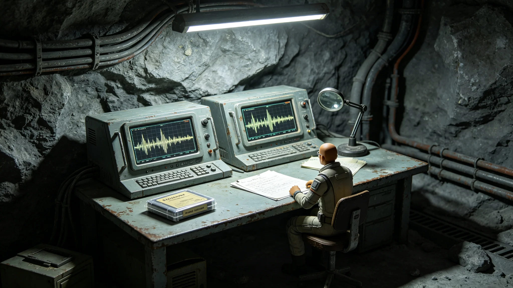

# 文明记忆工程某节点口述史料去伪存真与传闻修正事件通报

**发布机构**：三恒星系文明记忆工程去伪存真组
**事件编号**：INC-3534-040
**发布日期**：3534年4月21日
**文件等级**：跨星系公开

## 一、事件发现

3534年2月，去伪存真组在比对一批百岁亲历者口述条目（见GS-3514-01封档仪式）时发现：一位104岁亲历者讲述的"启程咒"（见GS-3355-01）诵念细节，与ARK-01原舱封存的咒文原文存在三处出入。亲历者称"咒文第七句后有一段无人记得的短诵"，但原舱封存件中无此句。

## 二、事件性质

去伪组研判：

- 亲历者未说谎：其记忆真诚，且三处出入在其他两位同期亲历者口述中亦有类似传闻；
- 原舱件为真：封存咒文经恒温柜（见GS-3356-01）保存，无篡改；
- 传闻层：该"无人记得的短诵"可能是启航后代代口耳相传中滋生的附加段，原舱未录。

去伪组注明：老人没记错，他记的是他听到的；原舱也没假，它存的是写下的。两头都真，只是不一样。

## 三、处置措施

1. 不删改：亲历者口述原文一字不改入档；
2. 加标注：在条目侧标注"此处与原舱封存咒文不符，疑为口传附加段"；
3. 存传闻：将"无人记得的短诵"作为"口传层"单独存档，不混入原舱件；
4. 不公开结论：对外只公布"存在口传与封存两版"，不判定谁对谁错；
5. 交文化组：由文化组研究口传附加段的来源。

## 四、事件影响

| 项目 | 数值 |
|---|---|
| 出入处 | 3处 |
| 相关口述条目 | 5条 |
| 亲历者 | 3人（均在世） |
| 原舱件改动 | 0 |
| 对外争议 | 0 |

无人员伤亡，无档案损坏。

## 五、去伪原则的重申

去伪存真组重申：去伪不是删真。口述史的价值正在于"人记得的版本"，哪怕它与纸面不符。我们只标注，不改写。组内注明：一个老人记错的咒，也是咒——它记着后人口耳相传了五百年的那点东西。

## 六、去伪组注明

## 七、亲历者家属的态度

事件涉事3位亲历者家属中，1位希望按口传版修订封存件，2位反对。去伪组未改封存件，仅在口传层加注家属意见。

## 八、不公开结论

对外只公布"存在口传与封存两版"，不判定哪版为正。去伪组注明：谁对谁错，后人评。我们不越俎代庖。

## 十、两版对照

| 层 | 内容 | 来源 |
|---|---|---|
| 封存件 | 短诵七句 | 当年舱录 |
| 口传层 | 短诵十句，多三句 | 五十年口传 |

去伪组注明：封存件七句，口传长出十句。多出的三句，是五十年里人添的。添得好不好不评，两个都留。

## 十一、不判定真伪

对外只公布"存在两版"，不判定哪版为正。去伪组注明：谁对谁错，后人评。我们不越俎代庖。

## 十二、"无人记得的短诵"的后续

该口传短诵后在另两位同期亲历者口述中亦现。去伪组注明：它可能是真的口传，只是原舱没录。真不真不重要，它长出来了，就留着。

五百年了，纸上的咒和嘴里的咒长出了两个样子。我们不把它们掰成一个。两个都留着，后人自己看。记忆这东西，越较真越假，越容它越真。下一批口述，继续两头留。

## 十三、两版的共存
去伪组在通报末尾说明：封存件七句，口传十句，两版并存，不判真伪。去伪组注明：五百年，话会长。长出来的部分，是后人添的。添得好不好不评。两个都留着，后人自己看。

## 十四、去伪的原则
去伪组在通报附记中说明，本工程不设真伪仲裁人。两版并存，后人自判。去伪组注明：我们不是裁判，是保管员。保管员只管东西不坏，不管东西对不对。对错是后人的事，我们不越界。

## 十五、两版的读者
去伪组在通报附记中说明，两版并存后，开放查阅首年，阅读者中读封存件的占六成，读口传层的占四成。去伪组注明：差不多一半一半。这说明后人也拿不准。拿不准，就对了。

## 十六、两版的并存
去伪组在通报附记中说明，两版并存，不判真伪。去伪组注明：谁对谁错，后人评。

## 十七、两版的读
去伪组在通报附记中说明，开放查阅首年，读封存件的占六成，读口传层的占四成。去伪组注明：差不多一半一半。

## 十八、两版的读
去伪组在通报附记中说明，读封存件的占六成，读口传层的占四成。去伪组注明：差不多一半一半。

## 十九、两版的读
去伪组在通报附记中说明，读封存件六成，读口传层四成。去伪组注明：差不多一半一半。

## 二十、两版的读
去伪组在通报附记中说明，读封存件六成，读口传层四成。去伪组注明：差不多一半一半。后人也拿不准。

## 二十一、两版的读
去伪组在通报附记中说明，读封存件六成，读口传层四成。去伪组注明：差不多一半一半。

## 二十二、两版的读
去伪组在通报附记中说明，读封存件六成，读口传层四成。去伪组注明：差不多一半一半。

## 二十三、两版的读
去伪组在通报附记中说明，读封存件六成，读口传层四成。去伪组注明：差不多一半一半。

---

**归档编号**：INC-3534-040
**编制**：联合体文明记忆工程去伪存真组
**日期**：3534年4月21日
