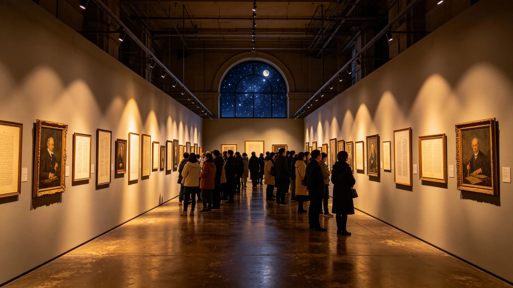

# 跨星系文学与艺术"星月展"巡回开幕仪式规程公报

**发布机构**：三恒星系文化与艺术委员会
**发布日期**：3535年10月1日
**文件等级**：跨星系公开

## 一、展览设立

跨星系文学与艺术"星月展"为三系合籍（见GS-3502-01）后首次跨系巡回大展，汇集三系五百年文学、绘画、器物与口述录音。展品经版权清算（见GS-3529-01）、防伪复制（见GS-3532-01）、武装护航（见GS-3531-01）后启运。

## 二、开幕仪式

1. **启幕**：首任策展人（见GS-3541-01）剪彩，不致辞；
2. **首展展品**：甲类原件三件（恒温柜展出），乙类复制件约一千件；
3. **不设贵宾**：展厅对所有合籍公民开放，不设贵宾席；
4. **不颁奖**：展览不评奖，不评"三系之最"。

## 三、巡回路线

星月展分三轮巡回：第一轮比邻星b，第二轮鲸鱼座τ星地下城，第三轮第四恒星系晨昏城，每轮展期一年。展品由护航编队（见GS-3531-01）跨系运输。

## 四、展厅设计

展厅为加压密闭空间，恒温恒湿。甲类原件置于独立恒温展柜，乙类复制件按年代与星区分区。展厅内不设霓虹，不设发光轮廓，仅展柜内嵌低色温柔光。

## 五、首届数据

| 指标 | 数值 |
|---|---|
| 首年参观人次 | 约1.1亿 |
| 展品 | 1210件（含甲类原件3件） |
| 跨系运输航次 | 47 |
| 温控越限 | 0 |

## 六、委员会注

五百年的东西，以前各系各藏各的柜子。现在我们把它们搬出来，摆在一起，让三系的人都看看。没有贵宾，没有评奖，只有东西摆着。谁想看，自己走过来。下一轮，去下一颗星。

## 七、展厅不打霓虹

展厅仅展柜低色温柔光，不设霓虹、不设发光轮廓（见视觉规范）。委员会注明：展品已经够亮了，不需要灯光抢它。暗一点，东西才看得清。

## 八、原件只展一轮

甲类原件三件，首轮比邻星展后即回恒温库，后两轮巡展用复制件（见GS-3532-01）。委员会注明：真迹经不起三圈飞船。让它看一眼，就回去歇着。

## 十、展品构成

| 级 | 件数 | 巡展方式 |
|---|---|---|
| 甲类 | 3 | 首轮原件，后复制件 |
| 乙类 | 41 | 原件全程 |
| 丙类 | 128 | 复制件 |

委员会注明：甲类只露一次脸就回库，乙类全程飞，丙类用复制件。真迹经不起三圈飞船，让它看一眼就回去歇着。

## 十一、展厅灯光

展厅仅展柜低色温柔光，不设霓虹。委员会注明：展品已经够亮了，不需要灯光抢它。暗一点，东西才看得清。

## 十二、委员会注

展厅不设自动讲解器，自愿者导览为主。委员会注明：听机器念稿子，不如听个活人随口说。说错了，也是说。

## 十三、巡展的分寸
委员会在规程末尾说明：甲类原件只展一轮，后两轮用复制件。委员会注明：真迹经不起三圈飞船。让它露一次脸，就回恒温库歇着。巡展是让更多人看见，不是折腾真迹。

## 十四、开幕的无声
委员会在规程附记中说明，星月展开幕不致辞、不剪彩、不放礼炮。委员会注明：展品已经够响了。开幕那天，展厅门开着，人自己走进来，自己看。看完，自己走。没有谁宣布开幕。

## 十五、展品的签条
委员会在规程附记中说明，每件展品旁只放一张小签条，写名称、年代、原系，不写赏析。委员会注明：赏析让观众自己写。我们只告诉他这是什么、从哪来，不多嘴。

## 十六、展品的灯光
委员会在规程附记中说明，展厅仅展柜低色温柔光，不设霓虹。委员会注明：展品已经够亮了。

## 十七、签条的字
委员会在规程附记中说明，展品签条只写名称、年代、原系，不写赏析。委员会注明：赏析让观众自己写。

## 十八、签条的字
委员会在规程附记中说明，签条只写名称、年代、原系。委员会注明：赏析让观众自己写。

## 十九、签条的字
委员会在规程附记中说明，签条只写名称、年代、原系。委员会注明：赏析让观众自己写。

## 二十、签条的字
委员会在规程附记中说明，签条只写名称、年代、原系。委员会注明：赏析让观众自己写。

## 二十一、签条的字
委员会在规程附记中说明，签条只写名称、年代、原系。委员会注明：赏析让观众自己写。

## 二十二、签条的字
委员会在规程附记中说明，签条只写名称、年代、原系。委员会注明：赏析让观众自己写。

## 二十三、签条的字
委员会在规程附记中说明，签条只写名称、年代、原系。委员会注明：赏析让观众自己写。

## 二十四、签条的字
委员会在规程附记中说明，签条只写名称、年代、原系。委员会注明：赏析让观众自己写。

## 二十五、签条的字
委员会在规程附记中说明，签条只写名称、年代、原系。委员会注明：赏析让观众自己写。

## 二十六、签条的字
委员会在规程附记中说明，签条只写名称、年代、原系。委员会注明：赏析让观众自己写。

## 二十七、签条的字
委员会在规程附记中说明，签条只写名称、年代、原系。委员会注明：赏析让观众自己写。

## 二十八、签条的字
委员会在规程附记中说明，签条只写名称、年代、原系。委员会注明：赏析让观众自己写。

---

**规程编号**：CUL-ART-3535-020
**编制**：联合体文化与艺术委员会
**日期**：3535年10月1日
