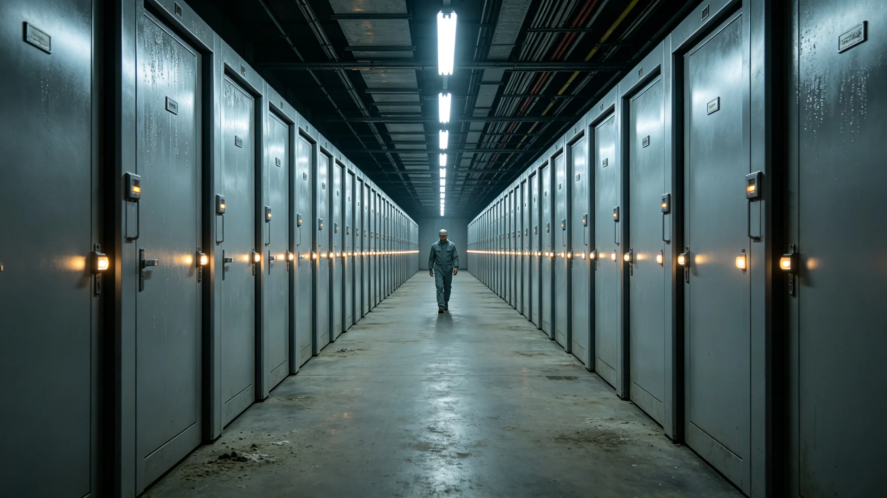

# 文明记忆工程运营与遗产托管产业3536年度决算报告

**编制单位**：三恒星系文明联合体经济产业署
**报告年度**：3536年
**发布日期**：3537年8月14日
**文件等级**：跨星系公开

## 一、产业范围

文明记忆工程运营与遗产托管产业承接千年遗产看护产业（见GS-3357-01）与文明记忆产业（见GS-3376-01），包括：恒温库运维、冷光玻璃刻写与异地分发（见GS-3539-01）、非接触光学著录（见GS-3546-01）、遗产托管、点灯封档（见GS-3543-01）。

## 二、年度决算

| 项目 | 金额（亿星汇） | 占比 |
|---|---|---|
| 恒温库运维 | 14.6 | 34% |
| 冷光玻璃刻写与分发 | 11.2 | 26% |
| 非接触光学著录 | 6.3 | 15% |
| 遗产托管服务 | 5.1 | 12% |
| 技术研发 | 3.4 | 8% |
| 安全防护 | 2.1 | 5% |
| 合计 | 42.7 | 100% |

## 三、服务量

| 指标 | 3535年 | 3536年 |
|---|---|---|
| 恒温库运行（万舱日） | 124 | 142 |
| 冷光玻璃刻写（块） | 280 | 354 |
| 光学著录（件） | 18万 | 24万 |
| 托管遗产（万件） | 61 | 78 |

## 四、产业特征

经济署注明：这门产业不生产商品，只"守"。守恒温、守玻璃、守著录、守遗产。42.7亿星汇，买的是五百年后这些东西还在。它不赚钱，但它不能不花——不花，五百年后就什么都没了。

## 五、与安全的衔接

安全防护一项含冷备渗透防护（见GS-3387-01）与身份档案安全（见GS-3501-01）。经济署注明：守东西不能只守温度，还得防人偷。

## 六、就业

本产业直接从业约18万人，其中恒温库运维6万、刻写分发3万、光学著录4万、托管服务3万、安全防护2万。

## 七、经济署注

42.7亿，买的是两千年后还有人能翻开这块玻璃。这账五十年后算不出来，五百年后才算得出来。我们现在花，是因为我们等得起。下一年，继续守。守着守着，五百年就过去了。

## 八、不追求效率

本产业不追求单人运维更多舱位。经济署注明：守东西的人，多看一个舱就多一分走神。宁可人多舱少，不挤。

## 九、恒温库不对外开放

恒温库是工作场所，不设参观。经济署注明：库里存着五百年的纸，多一个人呼吸就多一分水汽。参观去展厅，不进库。

## 十一、产业支出

| 项 | 占比 |
|---|---|
| 恒温库运转 | 38% |
| 冷备刻写与七地备份 | 26% |
| 守卫与温控巡检 | 18% |
| 修复与著录 | 12% |
| 其他 | 6% |

经济署注明：这门产业近四成花在恒温库的电上。冷，是要花钱的。但不冷，纸就化了。这笔账五百年后才算得出来。

## 十二、不对外开放

恒温库是工作场所，不设参观。经济署注明：多一个人呼吸就多一分水汽。参观去展厅，不进库。

## 十三、经济署注

安全防护一项含冷备渗透防护（见GS-3387-01）。经济署注明：守东西不能只守温度，还得防人偷。

## 十四、守的耐心
经济署在决算末尾说明：本产业不追求效率，不追求单人运维更多舱位。经济署注明：守东西的人，多看一个舱就多一分走神。宁可人多舱少，不挤。两千年后的账，现在花着。

## 十四、恒温库的温度
经济署在决算附记中说明，恒温库常年十八度、湿度四十五。经济署注明：这两个数，维持了五百年。五百年不变的温度，比任何宣言都硬。纸在这个温度下，能躺两千年。

## 十五、恒温库的电
经济署在决算附记中说明，恒温库一年的电费，比库内所有展品的保险费还高。经济署注明：电比展品贵。但电供着，展品就在。电一断，五百年的纸一夜就化了。

## 十六、恒温库的人
经济署在决算附记中说明，恒温库不对外开放，不设参观。经济署注明：多一个人呼吸就多一分水汽。

## 十七、电的账
经济署在决算附记中说明，恒温库一年电费比库内展品保险还高。经济署注明：电比展品贵，但电供着，展品就在。

## 十八、电的账
经济署在决算附记中说明，恒温库电费比展品保险高。经济署注明：电供着，展品就在。

## 十九、电的账
经济署在决算附记中说明，恒温库电费比展品保险高。经济署注明：电供着，展品就在。

## 二十、电的账
经济署在决算附记中说明，恒温库电费比展品保险高。经济署注明：电供着，展品就在。电一断，五百年的纸一夜化了。

## 二十一、电的账
经济署在决算附记中说明，恒温库电费比展品保险高。经济署注明：电供着，展品就在。电一断，五百年的纸一夜化了。

## 二十二、电的账
经济署在决算附记中说明，恒温库电费比展品保险高。经济署注明：电供着，展品就在。电一断，五百年的纸一夜化了。

## 二十三、电的账
经济署在决算附记中说明，恒温库电费比展品保险高。经济署注明：电供着，展品就在。电一断，五百年的纸一夜化了。

## 二十四、电的账
经济署在决算附记中说明，恒温库电费比展品保险高。经济署注明：电供着，展品就在。电一断，五百年的纸一夜化了。

## 二十五、电的账
经济署在决算附记中说明，恒温库电费比展品保险高。经济署注明：电供着，展品就在。

## 二十六、电的账
经济署在决算附记中说明，恒温库电费比展品保险高。经济署注明：电供着，展品就在。

## 二十七、电的账
经济署在决算附记中说明，恒温库电费比展品保险高。经济署注明：电供着，展品就在。

---

**报告编号**：ECON-HER-3537-029
**编制**：联合体经济产业署
**日期**：3537年8月14日
