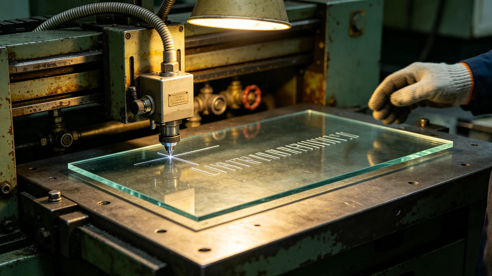

# 文明记忆工程分布式冷光玻璃刻写第六代技术报告

**编制单位**：三恒星系文明记忆工程存储技术组
**报告日期**：3539年5月27日
**文件等级**：跨星系公开

## 一、技术背景

冷光光刻玻璃千年存档介质（见GS-3368-01）自第一代以来已历五代。文明记忆工程（见GS-3533-01总架构师）需将口述史、遗产著录、身份档案刻入玻璃，三系异地存储。存储技术组推出第六代分布式刻写。

## 二、第六代改进

| 指标 | 第五代 | 第六代 |
|---|---|---|
| 单块玻璃容量 | 1.2TB | 4.8TB |
| 刻写精度 | 10微米 | 2微米 |
| 理论寿命 | 千年 | 两千年 |
| 分布式节点 | 三地 | 七地 |
| 刻写速度 | 24小时/块 | 8小时/块 |

## 三、分布式七地

第六代玻璃副本刻写后分发至三系七地异地存储：比邻星b地下库、鲸鱼座τ星地下城、第四恒星系晨昏城、老地球方向野化区边缘库、太阳系外缘ARK-01方向库、第五恒星系方向接触区外预备库两处。任一地损毁，其余六地副本仍在。

存储组注明：一块玻璃坏了不可怕，可怕的是七块同时坏。七地分存，就是为了不让七块一起坏。

## 四、刻写内容

| 内容 | 刻写占比 |
|---|---|
| 口述史摘要（非全量音频） | 42% |
| 遗产著录目录（见GS-3508） | 28% |
| 三系合籍身份索引（见GS-3502） | 18% |
| 标准语与濒危语言词表（见GS-3515） | 12% |

全量音频不刻玻璃（容量不足），仅刻摘要与索引；全量音频存于分布式电子库，玻璃仅作"千年冷备"。

## 五、与刻石通信的关系

万年尺度深时间刻石通信（见GS-3399-01）面向万年外的未知接收者；本项玻璃刻写面向本文明千年后自身。存储组注明：刻石是给外人看的，玻璃是给自己人留的。两样都留。

## 六、存储组注

第六代把4.8TB刻进一块玻璃，分七地藏好。两千年后，如果还有人，他们拿得起这块玻璃，就能看见我们这代人说了什么。刻的不完美，摘要不全，但根在。够了。下一批，继续刻。

## 七、七地不同时取电

七地副本取电错开，防同时断电。存储组注明：七块玻璃如果同一天停电，七地同时停。错开取电，一个停了其他六地还在。

## 八、玻璃不刻全量音频

全量音频不刻玻璃（容量不足），仅刻摘要索引。存储组注明：玻璃是千年冷备，不是全量库。全量在电子库，玻璃只留个目录。两千年后，电子库早没了，玻璃上的目录还在，后人按目录找，知道我们存过什么。

## 十、七地副本

| 地 | 用途 |
|---|---|
| 比邻星b | 主副本 |
| 鲸鱼座τ星地下城 | 备副本 |
| 第四恒星系晨昏城 | 备副本 |
| 其余四地 | 冷副本 |

存储组注明：七块玻璃，散在七地。一处被打坏、断电、地震，其他六地还在。我们赌七地不会同时出事。

## 十一、寿命目标

玻璃设计寿命两千年，刻写密度4.8TB。存储组注明：两千年后，电子库早没了，玻璃上的目录还在。能不能读出来，是后人的事。

## 十二、取玻璃的人

两千年后谁来取玻璃，我们不知道。存储组注明：我们不假设后人长什么样、用什么读。我们只把玻璃做结实，字刻清楚。能不能读出来，是他们的事。

## 十三、刻写的克制
存储组在报告末尾说明：玻璃只刻摘要索引，不刻全量音频。存储组注明：两千年后，电子库早没了，玻璃上的目录还在。后人按目录找，知道我们存过什么。全量在电子库，玻璃留个根。

## 十四、七地的分散
存储组在报告附记中说明，七地副本刻意选在地质稳定、气候各异、互不相邻的位置。存储组注明：一处被打坏、断电、地震、战乱，其他六地还在。我们赌七地不会同时出事。赌赢了，两千年后还有人读得到。

## 十五、玻璃的字
存储组在报告附记中说明，玻璃上刻的字，比米粒小十倍。存储组注明：肉眼看不见，需显微镜。两千年后后人若有显微镜，就读得到；没有，就读不到。我们不强求。

## 十六、七地的分散
存储组在报告附记中说明，七地副本选在地质稳定、互不相邻的位置。存储组注明：赌七地不会同时出事。

## 十七、字的小
存储组在报告附记中说明，玻璃上刻的字比米粒小十倍，需显微镜读。存储组注明：两千年后若有显微镜，就读得到。

## 十八、字的小
存储组在报告附记中说明，玻璃字比米粒小十倍。存储组注明：两千年后有显微镜就读得到。

## 十九、字的小
存储组在报告附记中说明，玻璃字比米粒小十倍。存储组注明：两千年后有显微镜就读得到。

## 二十、字的小
存储组在报告附记中说明，玻璃字比米粒小十倍。存储组注明：两千年后有显微镜就读得到。没有，就读不到。

## 二十一、字的小
存储组在报告附记中说明，玻璃字比米粒小十倍。存储组注明：两千年后有显微镜就读得到。没有，就读不到。

## 二十二、字的小
存储组在报告附记中说明，玻璃字比米粒小十倍。存储组注明：两千年后有显微镜就读得到。没有，就读不到。

## 二十三、字的小
存储组在报告附记中说明，玻璃字比米粒小十倍。存储组注明：两千年后有显微镜就读得到。没有，就读不到。

---

**报告编号**：ENG-GLS-3539-033
**编制**：联合体文明记忆工程存储技术组
**日期**：3539年5月27日
