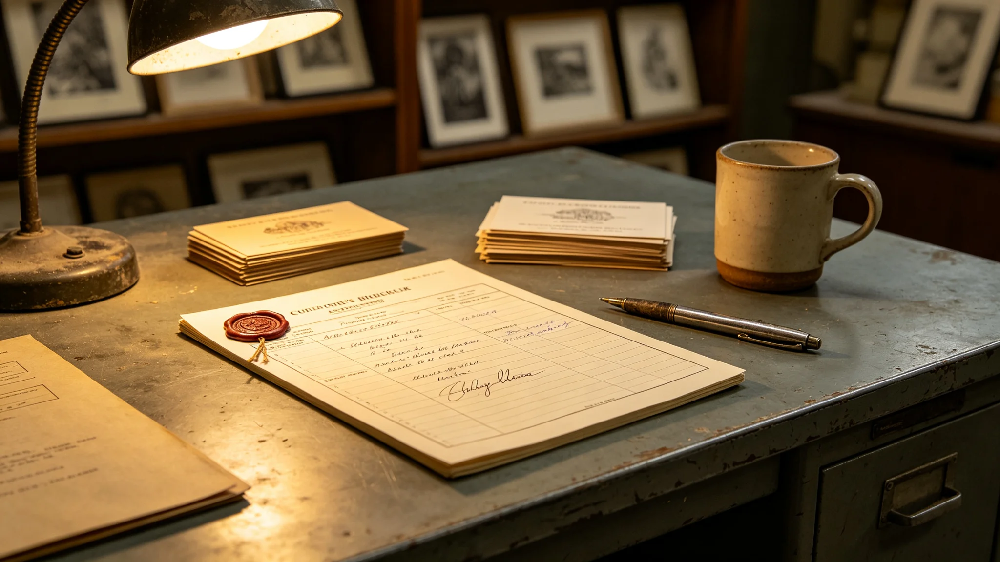

# 跨星系文学巡回展首任策展人钟文锦十一年考勤与展品交接档案

**档案形成机构**：三恒星系文化部门人事组
**归档日期**：3541年8月18日
**档案密级**：人事公开

## 一、基本登记

钟文锦，女，3483年生于老地球方向野化区边缘定居点，跨星系文学巡回展"星月展"首任策展人（3530—3541）。本档案为其十一年考勤、展品交接与事故责任记录汇编。

## 二、考勤

| 年度 | 应到 | 实到 | 随展航次 | 病假 |
|---|---|---|---|---|
| 3530 | 248 | 247 | 2 | 1 |
| 3535 | 250 | 249 | 6 | 1 |
| 3540 | 249 | 247 | 11 | 2 |
| 3541 | 247 | 244 | 12 | 3 |

随展航次为随星月展展品跨系押运（见GS-3531-01护航）。

## 三、展品交接

星月展十一年间展品跨系交接约470次。钟文锦每次亲签交接单，逐件核对。交接差错记录：

- 3536年，一件乙类展品交接单编号与实物差一位，当日更正，未影响展出；
- 3542年手稿温控微偏事件（见GS-3542-01）中，钟文锦为随展策展人，事件非其责任。

## 四、事故责任

3542年手稿温控事件经调查，责任在护航电力重分配，非策展方。钟文锦在事件报告上签字确认，未申诉。

## 五、体检

| 年度 | 平衡 | 视力 | 前庭 |
|---|---|---|---|
| 3530 | 正常 | 正常 | 正常 |
| 3536 | 轻度太空适应波动 | 正常 | 轻度前庭敏感 |
| 3541 | 太空适应波动 | 老花 | 前庭敏感 |

随展航次多，前庭敏感逐年加重。

## 六、处分记录

无。

## 七、交展与退休

3541年8月，星月展第三轮巡展闭展，钟文锦将全部展品按交接单移交下一届策展团队，交接无遗漏。同年退休。

## 八、人事组注

## 九、随展记录

钟文锦随展47航次，每次亲签交接单。人事组注明：她不派别人去点，自己上船、下船、点货。十一年，47次，一次没漏。

## 十、3542事件中的位置

温控事件中，钟文锦在货舱外，未碰手稿。人事组注明：事件非她责任，她只是在场签字确认。不揽功，不卸责。

## 十二、交接清单

| 类 | 件数 |
|---|---|
| 甲类原件 | 3 |
| 乙类原件 | 41 |
| 复制件 | 128 |
| 交接单 | 47 |

人事组注明：47航次，每次亲签。她不派别人点货，自己上船下船。十一年，一次没漏。点完了，交了，退了。

## 十三、前庭磨损

十一年47航次跨系，前庭功能慢性敏感。人事组注明：她坐飞船坐坏了前庭。这是职业病，不是处分。

## 十四、人事组注

退休未著书。人事组注明：她不写"策展学"。展品怎么摆，她摆了十一年，没写成书。书在别处，她只摆。

钟文锦不是什么"星月展的灵魂"。她只是一个签了十一年交接单、把前庭坐出敏感、3542年那场温控事件里站在旁边签字确认的策展人。展品是她一件件点过的，但展品不是她的。她点完了，交了，退了。档案如此。

## 十五、十一年的位置
人事组在档案末尾说明：钟文锦十一年47航次，未著书，未留策展理论。人事组注明：她把展品一件件点过，但展品不是她的。她点完了，交了，退了。策展不是创作，是交接。

## 十五、钟文锦的交接
人事组在档案附记中说明，钟文锦交接时，逐件点验，在127件展品的清单上逐项打勾。人事组注明：她不相信电子交接，要亲手点。点了十一个小时，点完，签字，转身走了。十一年，一场没漏。

## 十六、钟文锦的前庭
人事组在档案附记中说明，钟文锦退休时前庭功能慢性敏感，不能再坐飞船。人事组注明：她十一年坐了47次，把前庭坐坏了。这是职业病。退休后她再没飞过。

## 十七、钟文锦的交接
人事组在档案附记中说明，钟文锦交接127件展品，逐项打勾。人事组注明：她不相信电子交接，要亲手点。

## 十八、钟文锦的47次
人事组在档案附记中说明，钟文锦十一年随展47航次，每次亲签交接单。人事组注明：她不派别人点货，自己上船下船。

## 十九、钟文锦的签
人事组在档案附记中说明，钟文锦47航次每次亲签交接单。人事组注明：她不派别人点货。

## 二十、钟文锦的签
人事组在档案附记中说明，钟文锦47航次每次亲签交接单。人事组注明：她不派别人点货。

## 二十一、钟文锦的签
人事组在档案附记中说明，钟文锦47航次每次亲签交接单。人事组注明：她不派别人点货，自己上船下船。

## 二十二、钟文锦的签
人事组在档案附记中说明，钟文锦47航次每次亲签交接单。人事组注明：她不派别人点货，自己上船下船。

## 二十三、钟文锦的签
人事组在档案附记中说明，钟文锦47航次每次亲签交接单。人事组注明：她不派别人点货，自己上船下船。

## 二十四、钟文锦的签
人事组在档案附记中说明，钟文锦47航次每次亲签交接单。人事组注明：她不派别人点货，自己上船下船。

## 二十五、钟文锦的签
人事组在档案附记中说明，钟文锦47航次每次亲签交接单。人事组注明：她不派别人点货，自己上船下船。

## 二十六、钟文锦的签
人事组在档案附记中说明，钟文锦47航次每次亲签交接单。人事组注明：她不派别人点货。

## 二十七、钟文锦的签
人事组在档案附记中说明，钟文锦47航次每次亲签交接单。人事组注明：她不派别人点货。

## 二十八、钟文锦的签
人事组在档案附记中说明，钟文锦47航次每次亲签交接单。人事组注明：她不派别人点货。

---

**档案编号**：HR-ZWJ-3541-028
**编制**：联合体文化部门人事组
**日期**：3541年8月18日
