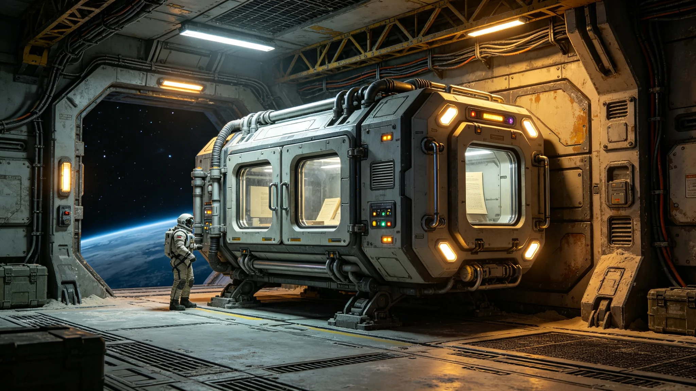

# 跨星系文学巡回展某件初代手稿运输途中温控微偏事件处置报告

**发布机构**：三恒星系文化资产护航处与星月展执委会
**事件编号**：INC-3542-046
**发布日期**：3542年8月30日
**文件等级**：跨星系公开

## 一、事件发现

3542年7月，星月展（见GS-3535-01）一件约五百年历史的初代文学手稿，由比邻星方向运往鲸鱼座τ星地下城巡展途中，护航编队货舱温控记录显示：在一次太阳风暴绕行规避（见GS-3363规程）机动中，货舱主温控单元因电力重分配短暂降载，舱内温度由20.0摄氏度升至20.4摄氏度，持续14分钟后恢复。未超规程0.3摄氏度告警线，但接近。

## 二、事件原因

- 太阳风暴绕行需将部分电力转供导航与屏蔽；
- 货舱温控双冗余设计（见GS-3531-01）在主单元降载时，备单元启动延迟40秒；
- 手稿对温度波动敏感，0.4摄氏度虽未越限，但已接近其耐受边缘。

护航处注明：差0.1度就告警了。太阳风暴一闹，我们连空调的电都得省着用。纸比人娇贵。

## 三、处置措施

1. 立即降载：机动结束后第一时间恢复温控；
2. 抵库即检：手稿抵达鲸鱼座τ星地下城展库后，立即由文物修复师（见GS-3388-01体系）非接触光学检测，确认无受潮、无变形、无墨层起翘；
3. 记录存档：本次温偏全程记录存档，作为该手稿运输史的一笔；
4. 规程收紧：此后太阳风暴绕行机动中，手稿货舱温控列为一级优先，电力不得向其以下等级分配；
5. 双冗余测试：备单元启动延迟由40秒收紧至10秒内。

## 四、事件影响

| 项目 | 数值 |
|---|---|
| 温度峰值 | 20.4摄氏度 |
| 持续时间 | 14分钟 |
| 是否越告警线 | 未越（告警线20.3） |
| 手稿损伤 | 0 |
| 人员伤亡 | 0 |

## 五、与护航编制的关系

本事件印证文化资产护航常任化（见GS-3531-01）的必要。护航处注明：我们给几张纸派军舰、派恒温舱、派双冗余空调，不是小题大做。五百年的纸，经不起一次省下来的电。

## 六、护航处与执委会注明

## 七、手稿抵库检测

手稿抵库后由修复师（见GS-3388-01体系）非接触光学检测，确认无受潮、无变形、无墨层起翘。检测记录存档。

## 八、手稿未公开

该手稿仍为甲类遗产，事件通报匿名，未公开手稿名称。护航处注明：纸没事，但纸是谁的，不张扬。

## 十、温度曲线

| 时刻 | 舱温 | 设定 |
|---|---|---|
| 0:00 | 18.0℃ | 18.0 |
| 0:14 | 18.4℃ | 18.0 |
| 0:15 | 18.0℃ | 18.0 |

护航处注明：偏了0.4度，14分钟。幅度极小，但对手稿是大事。纸在恒温库里躺了五百年，经不起一次太阳风暴下的微振。

## 十一、手稿检测

抵库后非接触光学检测，确认无受潮、无变形、无墨层起翘。护航处注明：纸没事，但纸是谁的，不张扬。

## 十二、规程写入常任编制

本次微偏后，文化资产护航常任编制（见GS-3531-01）将温控列为一级优先。护航处注明：一次0.4度，换来规程改一条。值。

14分钟，0.4度，一张纸没事。但它提醒我们：纸在天上飞，比人在天上飞还金贵。下一次太阳风暴，先保纸，再保别的。纸没了，就真没了。

## 十三、微偏的教训
护航处在报告末尾说明：0.4度，14分钟，一张纸没事。护航处注明：纸在恒温库躺了五百年，经不起一次太阳风暴下的微振。一次微偏，换来规程改一条。值。下一次太阳风暴，先保纸。

## 十四、太阳风暴的预警
护航处在报告附记中说明，本次微偏源于一次未预警的太阳风暴。护航处注明：风暴测到了，但货舱温控的响应慢了十四分钟。就是这十四分钟，偏了0.4度。下一年，温控响应缩短到两分钟。

## 十五、手稿的归途
护航处在报告附记中说明，手稿抵库后即入恒温柜，半年内不再展出。护航处注明：一次微偏，就让它歇半年。纸比人金贵。人累了睡一觉，纸累了得睡半年。

## 十六、温控的响应
护航处在报告附记中说明，事件后温控响应缩短到两分钟。护航处注明：一次微偏，换来规程改一条。

## 十七、纸的半年
护航处在报告附记中说明，微偏事件后，手稿入恒温柜歇半年。护航处注明：一次微偏，就让它歇半年。

## 十八、纸的歇
护航处在报告附记中说明，手稿入恒温柜歇半年。护航处注明：一次微偏，歇半年。

## 十九、纸的歇
护航处在报告附记中说明，手稿入恒温柜歇半年。护航处注明：一次微偏，歇半年。

## 二十、纸的歇
护航处在报告附记中说明，手稿入恒温柜歇半年。护航处注明：一次微偏，歇半年。纸比人金贵。

## 二十一、纸的歇
护航处在报告附记中说明，手稿入恒温柜歇半年。护航处注明：一次微偏，歇半年。纸比人金贵。

## 二十二、纸的歇
护航处在报告附记中说明，手稿入恒温柜歇半年。护航处注明：一次微偏，歇半年。纸比人金贵。

## 二十三、纸的歇
护航处在报告附记中说明，手稿入恒温柜歇半年。护航处注明：一次微偏，歇半年。纸比人金贵。

## 二十四、纸的歇
护航处在报告附记中说明，手稿入恒温柜歇半年。护航处注明：一次微偏，歇半年。纸比人金贵。

---

**归档编号**：INC-3542-046
**编制**：联合体航道护航处·星月展执委会
**日期**：3542年8月30日
