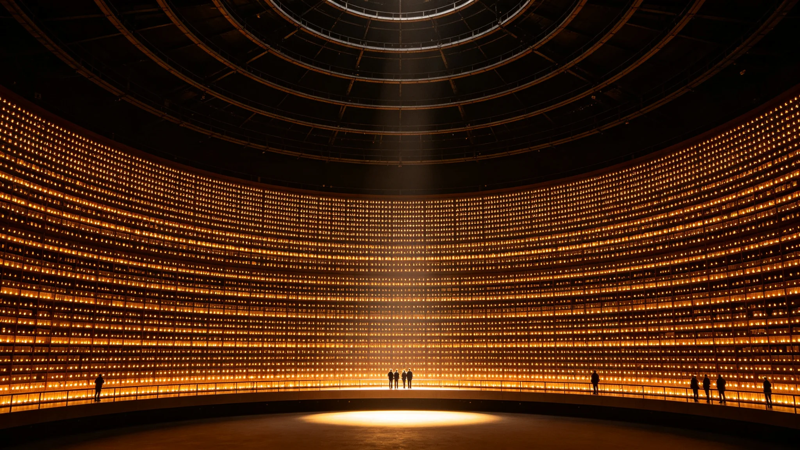

# 文明记忆工程"点灯封档"仪式规程公报

**发布机构**：三恒星系文明记忆工程委员会
**发布日期**：3543年12月21日
**文件等级**：跨星系公开

## 一、仪式设立

文明记忆工程三期建成（见GS-3533-01）后，口述史捐献条目（见GS-3536-01）经去伪存真、冷光玻璃刻写（见GS-3539-01）后正式入库存档。委员会将每年冬至日定为"点灯封档日"，为当年完成刻写的条目举行封档仪式。

## 二、仪式流程

1. **刻写完成**：当年口述条目摘要经第六代冷光玻璃刻写完成；
2. **七地分发**：玻璃副本分送三系七地异地库（见GS-3539-01）；
3. **点灯**：在文明记忆库点灯墙上，为当年刻写批次点亮一盏灯；
4. **不致辞**：仪式无致辞、无颁奖。

## 三、灯的含义

点灯墙上每一盏灯对应一个刻写批次。委员会注明：灯不是纪念谁，是标记"这一年又多存了一些话"。灯亮着，说明话在。

## 四、与开录日的关系

| 仪式 | 时间 | 意义 |
|---|---|---|
| 口述史开录日（GS-3514） | 9月9日 | 百岁亲历者补录封档 |
| 点灯封档日（本项） | 12月21日 | 年度条目冷光刻写入档 |

开录日是"人说完了"，点灯日是"话存好了"。

## 五、首届数据

| 指标 | 数值 |
|---|---|
| 首届点灯封档日 | 3543年12月21日 |
| 当年刻写条目摘要 | 1700万条 |
| 刻写玻璃块 | 354块 |
| 分发异地 | 七地 |

## 六、委员会注

冬至日，一年最长的夜。我们在这天点灯，不是因为迷信，是因为话存好了，该亮一下。一盏灯不亮什么，但四千块玻璃在七地躺着，灯亮着，说明没白存。下一年冬至，继续点灯。

## 七、灯不亮给谁看

点灯不对外直播，不邀贵宾。委员会注明：灯是点给库自己看的，不是点给人参观的。点灯墙在库内，外人不进。

## 八、灯的更换

灯坏了即换，不办仪式。委员会注明：灯亮着就行，换灯不用行礼。

## 十、点灯墙

| 项 | 内容 |
|---|---|
| 灯数 | 4096 |
| 颜色 | 暖白 |
| 亮度 | 常亮低功率 |

委员会注明：四千块玻璃对应四千盏灯。灯亮着，说明当年的条目封档了。灯不亮给谁看，亮给库自己。

## 十一、灯坏即换

灯坏了即换，不办仪式。委员会注明：灯亮着就行，换灯不用行礼。

## 十二、委员会注

9月9日开录日封档百岁亲历者（见GS-3514-01），12月21日点灯封档年度条目。一春一冬，一录一存。

## 十三、点灯的意义
委员会在规程末尾说明：点灯不直播，不邀贵宾，灯是点给库自己看的。委员会注明：四千块玻璃在七地躺着，灯亮着，说明没白存。灯在墙上，话在玻璃里。这就够了。

## 十四、点灯的冬至
委员会在规程附记中说明，点灯选在冬至，一年最长的夜。委员会注明：最长的夜里点灯，意思不是驱邪，是告诉自己：夜最长，灯也亮着。一年到头最冷最长的日子，灯亮着，人就没散。

## 十五、灯的更换
委员会在规程附记中说明，点灯墙的灯坏了即换，不办仪式，不登报。委员会注明：灯亮着就行。换灯是修东西，不是搞庆典。一盏灯坏了，另一盏还亮着。

## 十六、灯的颜色
委员会在规程附记中说明，点灯墙用暖白光，不用冷白，不用彩色。委员会注明：灯是暖的，不是舞台。

## 十七、灯的旧
委员会在规程附记中说明，点灯墙的灯用暖白光，不用冷白，不用彩色。委员会注明：灯是暖的，不是舞台。

## 十八、灯的暖
委员会在规程附记中说明，点灯墙用暖白光。委员会注明：灯是暖的，不是舞台。

## 十九、灯的暖
委员会在规程附记中说明，点灯墙用暖白光。委员会注明：灯是暖的，不是舞台。

## 二十、灯的暖
委员会在规程附记中说明，点灯墙用暖白光，不用冷白，不用彩色。委员会注明：灯是暖的，不是舞台。四千盏暖白，就是全部。

## 二十一、灯的暖
委员会在规程附记中说明，点灯墙用暖白光，不用冷白，不用彩色。委员会注明：灯是暖的，不是舞台。四千盏暖白，就是全部。

## 二十二、灯的暖
委员会在规程附记中说明，点灯墙用暖白光，不用冷白，不用彩色。委员会注明：灯是暖的，不是舞台。四千盏暖白，就是全部。

## 二十三、灯的暖
委员会在规程附记中说明，点灯墙用暖白光，不用冷白，不用彩色。委员会注明：灯是暖的，不是舞台。四千盏暖白，就是全部。

## 二十四、灯的暖
委员会在规程附记中说明，点灯墙用暖白光，不用冷白，不用彩色。委员会注明：灯是暖的，不是舞台。四千盏暖白，就是全部。

## 二十五、灯的暖
委员会在规程附记中说明，点灯墙用暖白光，不用冷白，不用彩色。委员会注明：灯是暖的，不是舞台。

## 二十六、灯的暖
委员会在规程附记中说明，点灯墙用暖白光，不用冷白，不用彩色。委员会注明：灯是暖的，不是舞台。

## 二十七、灯的暖
委员会在规程附记中说明，点灯墙用暖白光，不用冷白，不用彩色。委员会注明：灯是暖的，不是舞台。

## 二十八、灯的暖
委员会在规程附记中说明，点灯墙用暖白光，不用冷白，不用彩色。委员会注明：灯是暖的，不是舞台。

## 二十九、灯的暖
委员会在规程附记中说明，点灯墙用暖白光。委员会注明：灯是暖的。

---

**规程编号**：CUL-LAMP-3543-027
**编制**：联合体文明记忆工程委员会
**日期**：3543年12月21日
