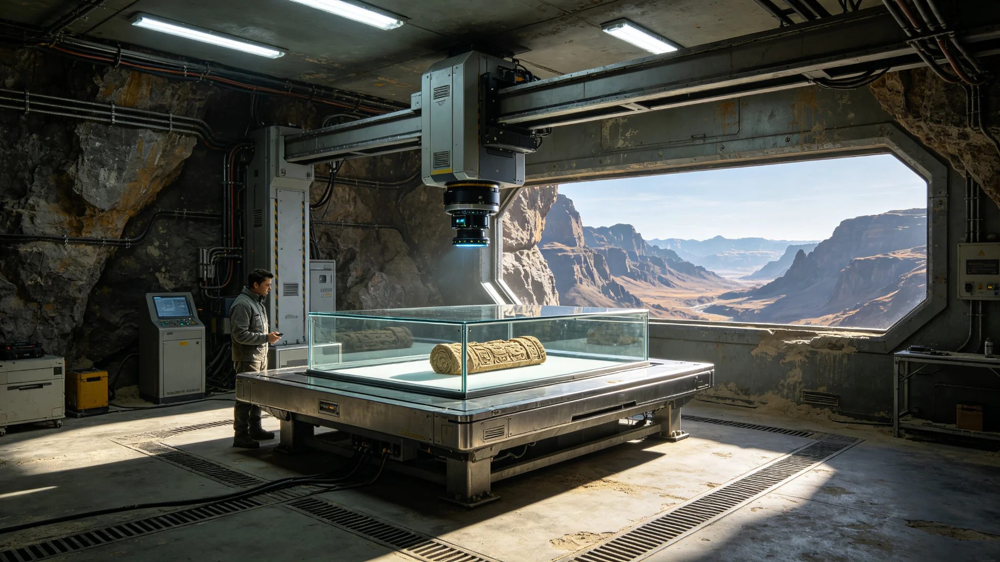

# 五百年遗产整理"非接触光学著录"第七代技术报告

**编制单位**：三恒星系文化遗产委员会技术组
**报告日期**：3546年10月22日
**文件等级**：跨星系公开

## 一、技术背景

甲类遗产（见GS-3508-01）为与文明存续直接相关的初代原物，如ARK-01船骸构件、初代文书、最后母语者录音。此类原物禁止修复、禁止触碰、禁止补全。著录只能"非接触光学"。技术组已历六代，本代为第七代。

## 二、技术原则

技术组重申三条铁律：

1. 不接触：著录全程不与原物物理接触，机械手不碰原件；
2. 不修复：光学记录原样，不做数字修补；
3. 不美化：色差、污渍、破损如实记录，不调色。

## 三、第七代改进

| 指标 | 第六代 | 第七代 |
|---|---|---|
| 光学分辨率 | 1.2亿像素 | 8亿像素 |
| 多光谱通道 | 11通道 | 23通道 |
| 三维扫描 | 微米级 | 亚微米级 |
| 单物著录时间 | 6小时 | 90分钟 |
| 环境扰动 | 遮光恒温 | 遮光恒温恒湿恒振 |

## 四、典型应用

**（一）初代文书**

多光谱通道可识别褪色墨迹下的隐写、涂改与衬页批注。第七代曾在一份3388年修复师（见GS-3388-01）经手的文书上，识别出修复痕迹下方被覆盖的原批。技术组注明：第七代能看见修复师"没盖住"的那一笔。

**（二）ARK-01船骸构件**

亚微米三维扫描记录船体微陨石擦痕与氧化层，供千年后比对（见GS-3351-01保护站）。

## 五、与结露教训的关系

3356年恒温柜结露致三件初代文书污损（见GS-3356-01）后，著录环境升级为恒温恒湿恒振。技术组注明：著录台自己不能成为第二个结露柜。

## 六、技术组注

我们给一件五百年前的纸拍一张8亿像素的照，不碰它、不修它、不美化它。拍完，纸回恒温库，照片入库。两千年后纸没了，照片还在。这就是著录的意义——不是把纸变新，是把纸的样子留住。下一批甲类，继续拍。

## 七、机械手不碰原件

著录台机械手仅定位照明，不接触原件表面。技术组注明：机械手不碰纸，只动光。纸经不起碰。

## 八、拍错了不重拍原件

若拍摄参数失误，重新打光重拍，原件不移动。技术组注明：纸在台上不动，光围着它转。拍坏了，调光重来，不动纸。

## 十、著录量

| 级 | 件数 | 著录完成 |
|---|---|---|
| 甲类 | 312 | 100% |
| 乙类 | 4100 | 91% |
| 丙类 | 12万 | 64% |

技术组注明：甲类已著录完毕。乙类还剩一成，丙类还剩三成。不催，慢慢拍。纸不急，两千年都等了，不差这几年。

## 十一、拍错不重移原件

若拍摄参数失误，重新打光重拍，原件不移动。技术组注明：纸在台上不动，光围着它转。拍坏了，调光重来，不动纸。

## 十二、技术组注

照片如实呈现污渍、破损，不数字修补。技术组注明：破了就是破了，照出来就是破的。修了，就不是著录，是造假。

## 十三、著录的克制
技术组在报告末尾说明：照片如实呈现污渍和破损，不数字补全。技术组注明：破了就是破了，照出来就是破的。修了，就不是著录，是造假。非接触，不补全，这是著录的本分。

## 十四、著录的非接触
技术组在报告附记中说明，著录台机械手只定位照明，不接触原件。技术组注明：机械手不碰纸，只动光。纸在台上不动，光围着它转。拍坏了，调光重来，不动纸。

## 十五、著录的光
技术组在报告附记中说明，著录台用单一柔光，不打多灯。技术组注明：多灯会在纸上反光，污染成像。一盏灯打过去，纸是什么样，就照什么样。

## 十六、著录的不补全
技术组在报告附记中说明，照片如实呈现污渍破损，不数字补全。技术组注明：修了，就不是著录，是造假。

## 十七、光的柔
技术组在报告附记中说明，著录台用单一柔光，不打多灯。技术组注明：多灯在纸上反光，污染成像。

## 十八、光的柔
技术组在报告附记中说明，著录台用单一柔光。技术组注明：多灯反光，污染成像。

## 十九、光的柔
技术组在报告附记中说明，著录台用单一柔光。技术组注明：多灯反光，污染成像。

## 二十、光的柔
技术组在报告附记中说明，著录台用单一柔光。技术组注明：多灯反光，污染成像。一盏灯打过去。

## 二十一、光的柔
技术组在报告附记中说明，著录台用单一柔光。技术组注明：多灯反光，污染成像。一盏灯打过去。

## 二十二、光的柔
技术组在报告附记中说明，著录台用单一柔光。技术组注明：多灯反光，污染成像。一盏灯打过去。

## 二十三、光的柔
技术组在报告附记中说明，著录台用单一柔光。技术组注明：多灯反光，污染成像。一盏灯打过去。

## 二十四、光的柔
技术组在报告附记中说明，著录台用单一柔光。技术组注明：多灯反光，污染成像。一盏灯打过去。

## 二十五、光的柔
技术组在报告附记中说明，著录台用单一柔光。技术组注明：多灯反光，污染成像。

## 二十六、光的柔
技术组在报告附记中说明，著录台用单一柔光。技术组注明：多灯反光，污染成像。

## 二十七、光的柔
技术组在报告附记中说明，著录台用单一柔光。技术组注明：多灯反光，污染成像。

---

**报告编号**：ENG-REC-3546-041
**编制**：联合体文化遗产委员会技术组
**日期**：3546年10月22日
