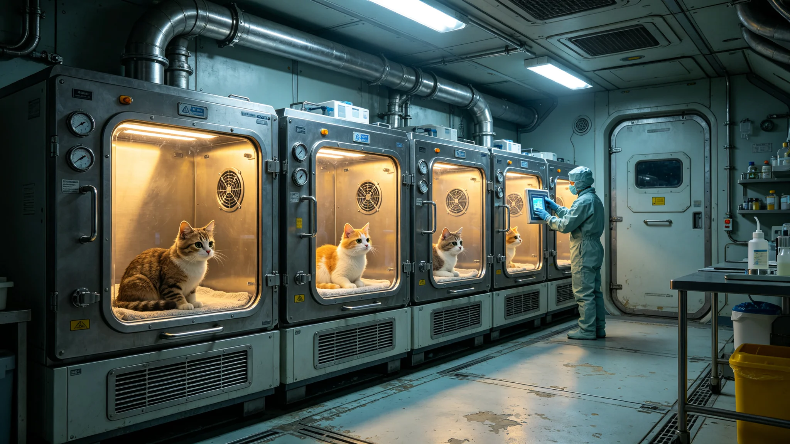

# 跨星系伴生宠物与陪伴动物跨系认养产业生态评估公报

**发布机构**：三恒星系文明联合体生态委员会与检疫总署
**发布日期**：3547年8月8日
**文件等级**：跨星系公开

## 一、评估背景

跨星系迁徙常态化（见GS-3310-01）后，公民携带伴生宠物与陪伴动物跨系迁徙增多。伴生物种检疫（见GS-3309-01）已运行多年。生态委员会与检疫总署对跨系认养伴生动物产业作生态评估。

## 二、产业现状

| 动物 | 年跨系迁徙（万只） | 检疫阳性率 |
|---|---|---|
| 猫 | 4.2 | 0.3% |
| 狗 | 2.8 | 0.4% |
| 鸟 | 1.1 | 0.8% |
| 鱼 | 0.6 | 1.2% |
| 其他 | 0.3 | 1.5% |

## 三、生态风险

1. **伴生逃逸**：跨系运输中逃逸的伴生动物可能在异星生态中入侵；
2. **微生物携带**：检疫（见GS-3309-01）拦截阳性但非零；
3. **基因污染**：跨系交配可能污染本地驯化种群。

## 四、管控措施

| 措施 | 内容 |
|---|---|
| 检疫 | 跨系迁徙前必检（见GS-3344-01检疫官体系） |
| 芯片 | 跨系动物植入不可移除身份芯片 |
| 绝育 | 商业认养动物强制绝育 |
| 逃逸追责 | 逃逸主人追责（见GS-3310迁徙制度） |
| 禁带名录 | 部分高风险动物禁跨系 |

## 五、产业评估

生态委员会注明：人能跨系，猫也想跟着走。但猫到了比邻星b，它就是个外来户。我们不拦人带猫，我们只让猫过检疫、植芯片、做绝育。这样猫有伴，生态不遭殃。

## 六、产业数据

| 指标 | 数值 |
|---|---|
| 年跨系认养 | 约9万只 |
| 逃逸事件 | 3年累计12起（均追回） |
| 生态入侵 | 0 |
| 检疫漏检 | 0 |

## 七、委员会注

人走，猫也走。猫不懂什么是生态入侵，但人懂。我们给猫植个芯片、做个绝育，不是虐猫，是让猫能跟着人走，又不把新地方的鸟吓得绝种。猫要陪人，生态要活路，两头都得顾。下一年，继续检。

## 八、逃逸即追责

跨系动物逃逸，主人追责，不论是否故意。委员会注明：猫跑了，不是猫的错，是主人没看好。主人担责，才会长记性。

## 九、禁带名录

部分高风险动物（如大型肉食、带强繁殖力物种）禁跨系。委员会注明：不是所有宠物都能上船。上船的，先过筛。

## 十一、认养量

| 类 | 跨系认养 | 逃逸 |
|---|---|---|
| 猫 | 1.2万 | 3 |
| 犬 | 0.4万 | 1 |
| 小型哺乳 | 0.2万 | 0 |

生态委员会注明：一年一万八千只宠物跨系，逃逸四只。四只逃逸，主人都追责了。人走，猫也走；猫跑了，人担着。

## 十二、强制绝育

商业认养动物强制绝育，不允许放生异星野外。生态委员会注明：养是家里养，放是野外放。放出去，就成入侵了。

## 十三、委员会注

商业认养动物强制绝育，不允许放生异星野外。委员会注明：养是家里养，放是野外放。放出去，就成入侵了。

## 十四、伴生的分寸
生态委员会在公报末尾说明：宠物跨系强制绝育，不允许放生野外。委员会注明：猫要陪人，生态要活路，两头都得顾。养是家里养，放是野外放。放出去，就成入侵了。

## 十五、宠物的检疫
生态委员会在公报附记中说明，宠物跨系须过三道检疫：芯片、血样、粪便。委员会注明：不是不信任猫，是不信任猫肚子里的东西。三道检疫过了，它才上飞船。上了飞船，它就是公民的一部分。

## 十六、猫的芯片
生态委员会在公报附记中说明，跨系宠物芯片记录跨系轨迹，逃逸后可追溯。委员会注明：猫跑了，芯片找得到。找得到，才追得回。追不回，主人担责。

## 十七、宠物的绝育
生态委员会在公报附记中说明，商业认养动物强制绝育，不允许放生野外。委员会注明：放出去，就成入侵了。

## 十八、芯片的迹
生态委员会在公报附记中说明，宠物芯片记录跨系轨迹，逃逸可追溯。委员会注明：猫跑了，芯片找得到。

## 十九、芯片的迹
生态委员会在公报附记中说明，宠物芯片记录跨系轨迹。委员会注明：猫跑了，芯片找得到。

## 二十、芯片的迹
生态委员会在公报附记中说明，宠物芯片记录跨系轨迹。委员会注明：猫跑了，芯片找得到。

## 二十一、芯片的迹
生态委员会在公报附记中说明，宠物芯片记录跨系轨迹。委员会注明：猫跑了，芯片找得到。

## 二十二、芯片的迹
生态委员会在公报附记中说明，宠物芯片记录跨系轨迹。委员会注明：猫跑了，芯片找得到。

## 二十三、芯片的迹
生态委员会在公报附记中说明，宠物芯片记录跨系轨迹。委员会注明：猫跑了，芯片找得到。

## 二十四、芯片的迹
生态委员会在公报附记中说明，宠物芯片记录跨系轨迹。委员会注明：猫跑了，芯片找得到。

## 二十五、芯片的迹
生态委员会在公报附记中说明，宠物芯片记录跨系轨迹。委员会注明：猫跑了，芯片找得到。

## 二十六、芯片的迹
生态委员会在公报附记中说明，宠物芯片记录跨系轨迹。委员会注明：猫跑了，芯片找得到。

## 二十七、芯片的迹
生态委员会在公报附记中说明，宠物芯片记录跨系轨迹。委员会注明：猫跑了，芯片找得到。

## 二十八、芯片的迹
生态委员会在公报附记中说明，宠物芯片记录跨系轨迹。委员会注明：猫跑了，芯片找得到。

---

**公报编号**：ECO-PET-3547-039
**编制**：联合体生态委员会·检疫总署
**日期**：3547年8月8日
