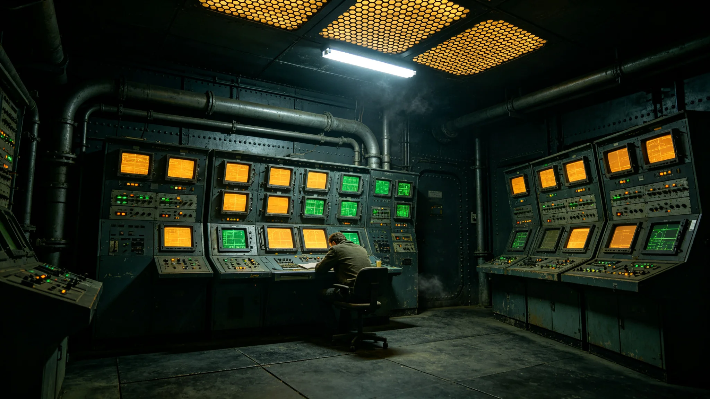

# 深空未知信号监测网首任总观测官沈夜阑四十年值班与误报签认档案

**归档单位**：深空未知信号监测网 · 总观测官值房
**档案袋编号**：OBS-LEAD-001
**立卷日期**：3591年4月17日

## 一、履历卡

| 项目 | 登记内容 |
|---|---|
| 姓名 | 沈夜阑 |
| 出生星区 | 三恒星系，第四恒星系晨昏城第三竖井 |
| 出生年 | 3512年 |
| 入网年 | 3551年 |
| 岗位 | 深空未知信号监测网第五代总观测官 |
| 在岗年限 | 至3591年满40年 |
| 经手 | 窄带信号甄别与误报复核签认 |

沈夜阑是第五代监测网从组网起的首任总观测官。与闻远图守船骸不动（见GS-3351-01）、闻久藏守遗嘱不读（见GS-3396-01）不同，沈夜阑的工作是"看"——他四十年盯着一片屏幕，等一段不属于任何人的窄带。

## 二、值班记录

第五代监测网实行三班倒，总观测官本人值夜班。四十年间沈夜阑夜班出勤记录如下：

| 年份 | 计划夜班 | 实际到岗 | 缺岗原因 |
|---|---|---|---|
| 3551 | 220 | 219 | 年度体检一次 |
| 3560 | 220 | 220 | 无 |
| 3570 | 220 | 218 | 辐射体检两次 |
| 3580 | 220 | 217 | 家中事一次、体检两次 |
| 3590 | 220 | 216 | 关节炎症两次、体检两次 |
| 3591 | 73 | 72 | 年度体检一次 |

四十年累计夜班约8,760次，缺岗共12次，全部有书面替班与复核签字。

## 三、误报签认

监测网四十年间累计触发待复核信号事件1,247起，其中经沈夜阑签认"误报"的1,243起，签认"待续观察"4起。

- 误报主因排序：轨道碎片反射（41%）、中继站自身串扰（27%）、恒星射电爆发（19%）、仪器自激（13%）。
- 4起"待续观察"均在后续一至三年内自行衰减为仪器噪声，未升级为接触事件。
- 沈夜阑在每起误报签认单上必写一句："不像。"——不写理由，只签这两个字。复核组说明：他签"不像"的意思是"这不像另一个人在说话"。

## 四、处分记录（一次）

**3573年**：监测网第五代阵首次捕获一段窄带周期信号，沈夜阑在信号持续11小时后签认"待续观察"，按规程应在24小时内上报总值班委员会。他拖到第26小时才上报，理由是"想再看两小时，怕又是碎片"。事后证实该信号最终确认为恒星射电周期，未造成实际后果，但延误上报违反分级响应规程。处分：书面检查，扣一年津贴，调离总观测官岗半年，由副手代班。

检查原件："我多等了两小时。规程说24小时必须上报，不是24小时内确认。我把两件事混了。下次哪怕只有百分之一像，我也先报。"

## 五、体检与考核

- 3591年体检：长期夜班，视网膜光敏感略降，骨密度正常，其余正常。
- 年度考核：连续35年"称职"，无"优秀"。总观测官岗不设业绩指标，只要求"不漏报、不误升级"。
- 继任安排：副手两名已在跟岗，预计3595年交接。

## 六、签名页

沈夜阑签收："我四十年看了八千家屏幕，没有一次听见谁。这不是我做得好，是这活儿本来就不该听见什么。真听见了，也不是我能回答的——我只负责把它看清楚、报上去。"签名日期3591年4月17日。

## 七、总观测官的工作

监测网档案袋末写："沈夜阑四十年值夜班，窗外什么都没有。他的工作就是确认窗外什么都没有。这活儿没有掌声，因为一切正常本身就是掌声。"

## 八、总观测官的禁忌

沈夜阑四十年有三不：不在值班室内与信号对谈、不私自延长甄别时限、不向家人谈论屏幕上的内容。监测网注明："他不与信号对谈，因为他不确定屏幕那一头是不是人。在不确定之前，先当它不是。"

## 九、总观测官不晋升

沈夜阑任总观测官四十年，从未调往委员会任职。监测网说明："这岗需要一个人安安静静看屏幕，不需要一个领导去开会。他四十年没去开会，屏幕就没漏过。"

## 十、四十年零真实接触

四十年间监测网未捕获一次确证的他文明信号。沈夜阑在档案袋末注："有人问我四十年守着一片没声音的海烦不烦。不烦。海本来就是静的。我们守的是它不静的那一刻——在它静了四十年之后，那一刻还没来。"

## 十一、履历时间线

| 年份 | 履历事项 |
|---|---|
| 3512 | 生于第四恒星系晨昏城第三竖井 |
| 3535—3551 | 联合体天文台值班观测员16年 |
| 3551 | 第五代监测网组网，任首任总观测官 |
| 3560 | 累计签认误报310起 |
| 3573 | 窄带信号延误上报受处分，离岗半年 |
| 3580 | 累计签认误报920起 |
| 3590 | 累计签认误报1,240起 |
| 3591 | 本档案立卷，累计1,247起 |
| 3595 | 预计交接退休 |

## 十二、签认方法

每起待复核信号，沈夜阑完成以下步骤：

1. 调阅三台独立干涉阵的原始波形，交叉比对；
2. 排除已知天体源与轨道碎片表；
3. 排除中继站自身串扰台账；
4. 若三项排除均不成立，签"待续观察"并上报；
5. 若三项任一成立，签"误报"，写一句"不像"。

四十年间签认"误报"1,243起，全部经复核组二次复核无翻盘。

## 十三、误报分类台账

| 误报主因 | 起数 | 占比 |
|---|---|---|
| 轨道碎片反射 | 510 | 41% |
| 中继站串扰 | 336 | 27% |
| 恒星射电爆发 | 236 | 19% |
| 仪器自激 | 161 | 13% |
| 合计 | 1,243 | 100% |

沈夜阑在台账末注："碎片最多。下一个五十年，碎片只会更多。"

## 十四、签名文件摘录

档案袋保留沈夜阑签认文件五份：

- 3555年组网初期首起误报签："轨道碎片，不像。"
- 3573年延误上报检查："我多等了两小时，下次先报。"
- 3580年十年中期复核签："一切正常，无新源。"
- 3590年三十年复核签："屏幕还亮着。"
- 3591年本档案立卷签："我四十年没听见谁。这就够了。"

## 十五、继任安排

沈夜阑3595年交接退休。副手两名在跟岗，一名来自第四恒星系天文台，一名来自比邻星b观测站。监测网说明："下一任总观测官还是值夜班，还是签'不像'，还是不与信号对谈。这活儿传下去，但不传成领导。"

## 十六、沈夜阑交班前列勤与签认摘录

沈夜阑任内（3551—3591）夜班累计出勤八千七百六十次，缺岗十二次，全部书面替班并经复核组二次签字。误报签认一千二百四十三起，四起"待续观察"均自行衰减为仪器噪声。3573年延误上报书面检查一次、扣一年津贴、离岗半年，均已结案。3591年立卷当日移交值房钥匙三把、误报台账十四本、3573年窄带事件原始波形一卷，副手签收起讫。值房注明：夜班不设业绩，只设"不漏报、不误升级"。

---

**立卷**：深空未知信号监测网 · 总观测官值房
**复核**：与值班原始记录（另卷）互锁
**日期**：3591年4月17日
