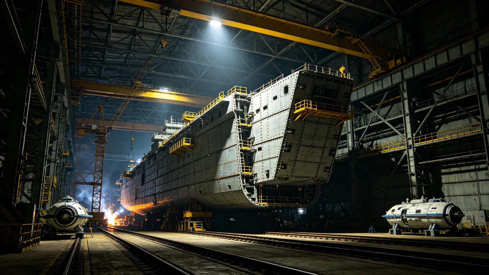

# 世代飞船船体千年维护总工程师顾铸年三百次坞修与焊缝签认档案

**归档单位**：世代飞船船体维护司 · 总工程师室
**档案袋编号**：HULL-CEO-001
**立卷日期**：3592年6月3日

## 一、履历卡

| 项目 | 登记内容 |
|---|---|
| 姓名 | 顾铸年 |
| 出生星区 | 三恒星系，原ARK-01第三代居住环 |
| 出生年 | 3508年 |
| 入司年 | 3552年 |
| 岗位 | 世代飞船船体千年维护总工程师 |
| 在岗年限 | 至3592年满40年 |
| 经手 | 分段坞修、焊缝签认、烧蚀层补覆 |

顾铸年是船体千年维护制度确立后的首任总工程师。他接手时，ARK-01及两艘姊妹船的船体已航行约一千两百年，装甲段累计微流星擦痕超过四百万处。他的工作不是让船变新，是让船在第二个千年里还不漏气。

## 二、坞修记录

四十年间顾铸年主持分段坞修共312次，平均每年近8次。船体按赤道环、中央中枢、推进端三段轮换入坞，每段约五十年完成一轮整体复检。

| 年份 | 分段坞修次数 | 累计 |
|---|---|---|
| 3552 | 6 | 6 |
| 3560 | 7 | 62 |
| 3570 | 8 | 148 |
| 3580 | 8 | 236 |
| 3590 | 8 | 304 |
| 3592 | 8 | 312 |

每次坞修时长三至十一日不等，按装甲段磨损程度定。

## 三、焊缝签认

四十年间顾铸年签认焊缝补焊与替换共47,200余条。他签认的标准是：焊缝探伤合格率不低于99.92%，低于此数的段全部重焊，不凑整。

- 3552年初任时，焊缝一次合格率为97.1%；
- 3592年，焊缝一次合格率提升至99.94%；
- 四十年间重焊累计1,860条，均为探伤不合格段，无一条带伤放行。

顾铸年签认单上必写一句："探伤合格，放行。"——不写漂亮话，只写这七个字。

## 四、处分记录（一次）

**3574年**：船体第三千七百公里装甲段被一颗微流星击穿，应急封堵后，顾铸年在封堵段探伤尚未完成时签认"临时放行，不影响航行"。事后复盘发现封堵段焊缝存在一处0.3毫米未熔合，虽未造成漏气，但违反"探伤合格才放行"的自定标准。处分：书面检查，扣两年津贴，暂停签认权六个月，由副总工程师代签。

检查原件："我自己定的规矩，我自己先破了。0.3毫米不大，但它在我签的那一行字底下。下次哪怕只剩0.1毫米，也探伤完了再签。"

## 五、体检与考核

- 3592年体检：长期船坞高温作业，听力轻度高频下降，肺部粉尘指标在限值内，骨密度正常，其余正常。
- 年度考核：连续38年"称职"，两次"优秀"。
- 继任安排：副总工程师一名在跟岗，预计3595年交接。

## 六、签名页

顾铸年签收："我四十年签了四万七千条焊缝，没有一条带伤放行。这不是我能干，是这活儿本来就不能带伤。船漏了，里面几百万人的气就漏了。我签的不是焊缝，是别让人窒息。"签名日期3592年6月3日。

## 七、总工程师的工作

船体维护司在档案袋末写："顾铸年接手时船已经一千两百岁了。他没让船变年轻，他让船别老在同一个地方。四十年三百次坞修，船身上每一块装甲都被他看过、敲过、签过。"

## 八、总工程师的禁忌

顾铸年四十年有三不：不在探伤未完成时签放行、不在雨天（船坞内人工雨）签焊缝、不替年轻工程师在不合格段上签字。维护司注明："他不替人签字，因为这活儿不能替。焊缝在谁的段上，谁的名字就在谁的签认单上。"

## 九、总工程师不调岗

顾铸年任总工程师四十年，从未调往其他系统。维护司说明："这岗需要一个把船体每一寸都摸过的人。他四十年摸了一遍，再让他走，下一个人得再摸四十年。"

## 十、四十年船体数据

| 指标 | 3552年 | 3592年 |
|---|---|---|
| 累计微流星擦痕 | 约412万处 | 约486万处 |
| 年度新增击穿 | 3起 | 1起 |
| 焊缝一次合格率 | 97.1% | 99.94% |
| 装甲补覆段 | 第6代 | 第8代（见GS-3566-01） |
| 坞修年度时长 | 约40日 | 约62日 |

顾铸年在表末注："擦痕在涨，击穿在降。这就是四十年的意思。"

## 十一、履历时间线

| 年份 | 履历事项 |
|---|---|
| 3508 | 生于原ARK-01第三代居住环 |
| 3530—3552 | 船体维护司段工长22年 |
| 3552 | 任船体千年维护总工程师 |
| 3560 | 累计坞修62次 |
| 3574 | 装甲击穿后提前放行受处分，停签六月 |
| 3580 | 累计坞修236次 |
| 3590 | 累计坞修304次 |
| 3592 | 本档案立卷，累计312次 |
| 3595 | 预计交接退休 |

## 十二、签认方法

每次坞修补焊，顾铸年完成以下步骤：

1. 探伤组报来焊缝初检报告；
2. 他亲自复敲三处随机段，听回声辨松紧；
3. 合格率≥99.92%才签"探伤合格，放行"；
4. 不合格段全数重焊，重焊后再探；
5. 签认单入卷，保存至下一轮坞修。

四十年间复敲段累计逾万处，未发现一次探伤漏报。

## 十三、坞修轮换制度

船体三段轮换，每段五十年一轮：

| 段 | 本轮维护期 | 主要工序 |
|---|---|---|
| 赤道环 | 3552—3602 | 装甲补覆、接缝重封、散热肋更换 |
| 中央中枢 | 3562—3612 | 自转轴检查（见GS-3572-01）、天井玻璃换封 |
| 推进端 | 3572—3622 | 聚变喷口烧蚀面换层、工质管路探伤 |

顾铸年在表末注："船是分三段老的。我们不让三段同时老。"

## 十四、签名文件摘录

档案袋保留顾铸年签认文件五份：

- 3552年初任首份坞修签："探伤合格，放行。"
- 3574年处分检查："我自己破了自己的规矩。"
- 3580年中期复核签："赤道环本轮维护过半，无异常。"
- 3590年三十年复核签："船还不漏。"
- 3592年本档案立卷签："四万七千条焊缝，没一条带伤。"

## 十五、继任安排

顾铸年3595年交接退休，副总工程师一名在跟岗。维护司说明："下一任总工程师还是要把船体每一寸都摸过。这活儿传下去，但不传成领导。他签的每一条焊缝，都在船身上。"

## 十六、顾铸年交班前列勤与签认摘录

顾铸年任内（3552—3592）坞修累计三百一十二次，焊缝签认四万七千二百余条，重焊一千八百六十条，无一条带伤放行。3574年装甲击穿后提前签放书面检查一次、扣两年津贴、停签六月，均已结案。3592年立卷当日移交坞修轮换图一套、焊缝探伤台账二十六本、3574年封堵段补焊记录一卷，副总工程师签收起讫。维护司注明：他签的不是焊缝，是别让人窒息。

---

**立卷**：世代飞船船体维护司 · 总工程师室
**复核**：与坞修原始探伤报告（另卷）互锁
**日期**：3592年6月3日
