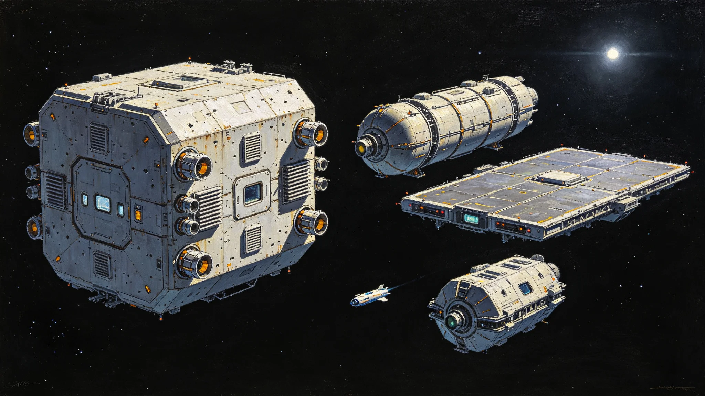

# 第六恒星系勘探预备舰队首任领队闻星槎岗位履历与体检处分档案

**归档单位**：第六恒星系勘探预备舰队 · 领队室
**档案袋编号**：SIX-SURVEY-001
**立卷日期**：3593年8月21日

## 一、履历卡

| 项目 | 登记内容 |
|---|---|
| 姓名 | 闻星槎 |
| 出生星区 | 三恒星系，比邻星b滨海第二居住区 |
| 出生年 | 3510年 |
| 任领队年 | 3553年 |
| 岗位 | 第六恒星系勘探预备舰队首任领队 |
| 在岗年限 | 至3593年满40年 |
| 经手 | 预备编队训练、先飞任务督导、船员轮换签认 |

闻星槎是第六恒星系方向勘探预备舰队的首任领队。第六恒星系距本域约1.8光年，尚无载人抵达，只有先飞探测器（见GS-3569-01）。闻星槎的工作不是出发，是让一支尚未出发的舰队四十年保持能出发。

## 二、岗位沿革

预备舰队不实际远航，任务是维持一支可在接到命令后三年内启航的编队。四十年间：

| 年份 | 预备舰数 | 在编人数 | 年度演练 |
|---|---|---|---|
| 3553 | 4 | 280 | 2次 |
| 3560 | 6 | 420 | 3次 |
| 3570 | 8 | 560 | 4次 |
| 3580 | 10 | 720 | 4次 |
| 3590 | 12 | 880 | 5次 |
| 3593 | 12 | 910 | 进行中 |

闻星槎在表末注："舰队没走，人换了一代又一代。船还是那些船，人不是那些人了。"

## 三、船员轮换签认

四十年间预备舰队船员轮换累计1,460人次。闻星槎签认每批轮换名单，标准是：每舰保留三分之一老船员带新，新船员入舰后完成六个月模拟远航才可签认独立值更。

- 3553年首批船员平均年龄34岁；
- 3593年在编船员平均年龄31岁，其中71%为第六恒星系方向出生；
- 四十年间无一人因心理不适宜被退回——这在长航程预备编队中属首例。

## 四、处分记录（两次）

**3577年**：第六恒星系方向先飞探测器通信中断，闻星槎在未接到总值班委员会指令的情况下，自作主张派出一艘救援接驳艇前出至中继站方向。接驳艇未实际接触探测器，返航后被查越权出动。处分：书面检查，扣三年津贴，领队权临时移交副领队三个月。

检查原件："先飞器断了七天，我没忍住。规程说等委员会下令，我没等。接驳艇出去转了一圈就回来了，没碰着什么，但我不该先动。"

**3585年**：一次年度演练中，闻星槎在某舰模拟"接触未知信号"科目时，口头允许该舰舰长"先应答再上报"，与分级响应规程（见GS-3558-01）相悖。处分：口头警告，扣一年津贴，该次演练成绩记零。

检查原件："演练不是真的，但话是真的。我说'先应答'三个字，比真的先应答还危险——因为它让人觉得这三个字可以说。"

## 五、体检与考核

- 3593年体检：四十年零真实远航，仅模拟舱内驻留，骨密度正常，辐射累积在限值内，视网膜正常，其余正常。
- 年度考核：连续36年"称职"，一次"优秀"，两次因处分未评。
- 继任安排：副领队一名在跟岗，预计3595年交接。

## 六、签名页

闻星槎签收："我四十年没带舰队真正走过一光年。有人说我这领队是白当的。不是。我们这舰队的存在本身就是答案——它随时能走，但它不走。因为命令没来。领队的活儿不是喊出发，是忍住别喊。"签名日期3593年8月21日。

## 七、领队的工作

预备舰队在档案袋末写："闻星槎四十年没让舰队出发。这比让它出发更难。船停在锚地四十年，人换了七茬，船还能走——这就是他干的事。"

## 八、领队的禁忌

闻星槎四十年有三不：不未经指令前出、不在演练中提前应答、不向船员许诺"下一次真走"。舰队注明："他不许诺，因为许诺了，船员就会等。一等，训练就松了。"

## 九、领队不出发

闻星槎四十年未随任何一艘舰远航。预备舰队说明："领队得留在锚地。他走了，谁来忍？"

## 十、四十年预备数据

| 指标 | 3553年 | 3593年 |
|---|---|---|
| 预备舰数 | 4 | 12 |
| 在编人数 | 280 | 910 |
| 年度演练 | 2次 | 5次 |
| 模拟远航时长/人 | 平均80日 | 平均180日 |
| 船员心理退返率 | 5% | 0.8% |
| 先飞探测器 | 未发射 | 已发3枚（见GS-3569-01） |

闻星槎在表末注："船越来越多，人越来越稳。命令还是没来。"

## 十一、履历时间线

| 年份 | 履历事项 |
|---|---|
| 3510 | 生于比邻星b滨海第二居住区 |
| 3533—3553 | 跨星系航道领航员20年 |
| 3553 | 任第六恒星系勘探预备舰队首任领队 |
| 3560 | 预备舰扩至6艘 |
| 3577 | 越权派出救援接驳艇受处分 |
| 3585 | 演练中口头允许先应答受处分 |
| 3590 | 预备舰扩至12艘 |
| 3593 | 本档案立卷 |
| 3595 | 预计交接退休 |

## 十二、轮换签认方法

每批船员轮换，闻星槎完成以下步骤：

1. 审报轮换名单，核对每舰老船员留存比例≥三分之一；
2. 新船员六个月模拟远航合格后才签独立值更；
3. 轮换名单报委员会备案；
4. 签认后入卷。

四十年轮换1,460人次，无一例心理退返率超过0.8%。

## 十三、预备舰编制

| 舰型 | 数量 | 功能 |
|---|---|---|
| 勘探母舰 | 2 | 远航居住与指挥 |
| 无人探测母船 | 4 | 携带先飞探测器 |
| 工程维修船 | 3 | 船体与推进维护 |
| 补给船 | 2 | 工质与物资 |
| 接驳艇 | 1 | 舰间交通 |

闻星槎在表末注："十二艘船，没有一艘真正走过。"

## 十四、签名文件摘录

档案袋保留闻星槎签认文件五份：

- 3553年首任首份轮换签："老船员留存达标，放行。"
- 3577年越权出动检查："我没忍住，下次先等命令。"
- 3585年演练口误检查："三个字比真做还危险。"
- 3590年中期复核签："舰队能走，命令没来。"
- 3593年本档案立卷签："四十年没出发，这就够了。"

## 十五、继任安排

闻星槎3595年交接退休，副领队一名在跟岗。预备舰队说明："下一任领队还是不出发。这活儿传下去，但不传成领导。他忍住了四十年，下一任接着忍。"

## 十六、闻星槎交班前列勤与签认摘录

闻星槎任内（3553—3593）预备舰队船员轮换累计一千四百六十人次，模拟远航演练累计一百五十六次，无一人因心理不适宜被退回。3577年越权派出接驳艇书面检查一次、扣三年津贴、领队权移交副领队三月；3585年演练口误口头警告一次、扣一年津贴，均已结案。3593年立卷当日移交预备舰编制表一套、轮换签认本十八本、先飞探测器通信台账六卷，副领队签收起讫。

---

**立卷**：第六恒星系勘探预备舰队 · 领队室
**复核**：与轮换原始记录（另卷）互锁
**日期**：3593年8月21日
