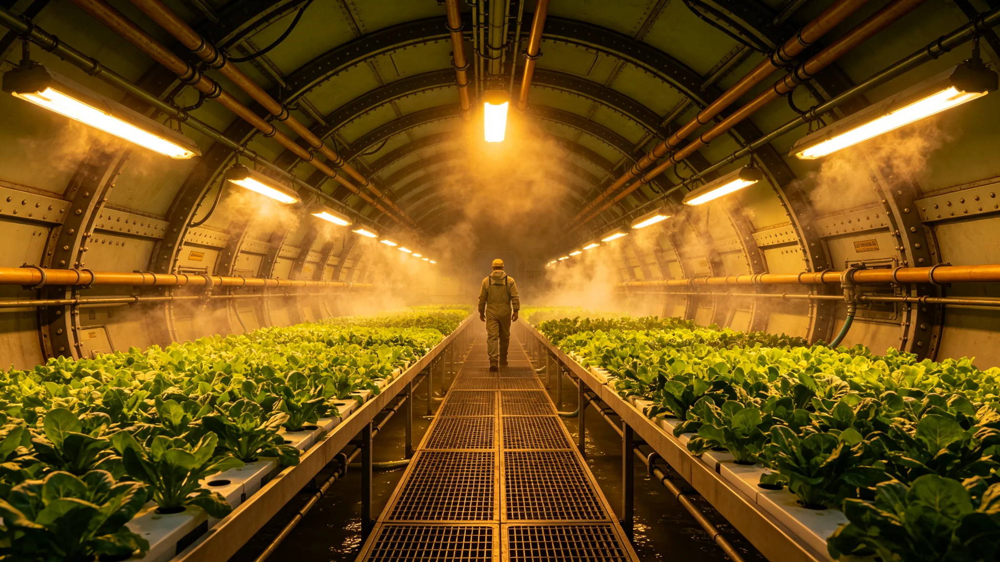

# 世代飞船生态系统更新首席生保工程师叶归根四十年轮换签认档案

**归档单位**：世代飞船生态系统更新司 · 首席生保工程师室
**档案袋编号**：ECO-RENEW-001
**立卷日期**：3595年5月30日

## 一、履历卡

| 项目 | 登记内容 |
|---|---|
| 姓名 | 叶归根 |
| 出生星区 | 三恒星系，第四恒星系晨昏城第二竖井 |
| 出生年 | 3515年 |
| 任工程师年 | 3555年 |
| 岗位 | 世代飞船生态系统更新首席生保工程师 |
| 在岗年限 | 至3595年满40年 |
| 经手 | 菌剂轮换、酶系更新、水培舱巡检签认 |

叶归根是世代飞船生态系统百年轮换制度（见GS-3563-01）确立后的首任首席生保工程师。他接手时，船上闭环生态已运行千年，菌剂活性逐年下降，分解链开始松。他的工作是给这艘老船换菌。

## 二、轮换记录

四十年间叶归根主持菌剂与酶系轮换共9轮，平均每四年一轮。每轮换覆盖赤道环全部水培舱与中央中枢藻舱。

| 年份 | 轮换轮次 | 覆盖舱数 | 当季产量波动 |
|---|---|---|---|
| 3555 | 第1轮 | 120 | 减产8% |
| 3560 | 第2轮 | 128 | 减产5% |
| 3570 | 第4轮 | 142 | 减产3% |
| 3580 | 第6轮 | 156 | 减产2% |
| 3590 | 第8轮 | 168 | 减产1% |
| 3595 | 第9轮 | 172 | 进行中 |

叶归根在表末注："减产一年比一年少。菌换顺了，船也认了。"

## 三、签认标准

每轮轮换后叶归根签认稳产的标准是：当季减产不超过10%，分解链氨氮指标三周内回稳，无单一菌种过量繁殖。四十年间9轮轮换中8轮达标，1轮未达标——即3578年那起菌剂轮换致某水培舱减产两成事件（见GS-3578-01）。

## 四、处分记录（一次）

**3578年**：第5轮菌剂轮换中，叶归根为赶工期，将某批新菌剂的观察期从六周缩至四周即批量入舱。结果该批菌剂与原有分解链不协调，某水培舱当季叶菜减产两成。处分：书面检查，扣三年津贴，暂停首席签认权半年。

检查原件："我急了。菌这东西急不得，它得自己长。我把六周压成四周，它就用减产两成告诉我它没长熟。下次哪怕再赶，也让它长够。"

## 五、体检与考核

- 3595年体检：长期水培舱高湿环境，肺部真菌指标在限值内，皮肤偶发过敏，骨密度正常，其余正常。
- 年度考核：连续36年"称职"，两次"优秀"。
- 继任安排：副工程师一名在跟岗，预计3596年交接。

## 六、签名页

叶归根签收："我四十年换了九轮菌。菌不是机器，不能拧上就走。它得在舱里住下，认得老菌，才肯干活。我签的不是批次号，是让这一舱活物愿意接着分解。"签名日期3595年5月30日。

## 七、生保工程师的工作

生态更新司在档案袋末写："叶归根接手时船已经一千岁。菌也老了。他四十年换了九轮，让一舱看不见的东西接着干活。这活儿没人鼓掌，因为菌干活的时候没人看得见。"

## 八、生保工程师的禁忌

叶归根四十年有三不：不缩短观察期、不单一菌种过量入舱、不在减产未回稳时签稳产。更新司注明："他不缩短观察期，因为菌不是人，急了不会说话——它只减产给你看。"

## 九、生保工程师不调岗

叶归根任首席生保工程师四十年，从未调往农业委员会。更新司说明："这岗需要一个跟菌打过四十年交道的人。他走了，下一个人得再跟菌学四十年。"

## 十、四十年生态数据

| 指标 | 3555年 | 3595年 |
|---|---|---|
| 闭环分解链氨氮波动 | ±18% | ±6% |
| 水培舱当季产量 | 基准 | 提升34% |
| 菌剂轮次 | 第1轮 | 第9轮 |
| 单舱减产超10%事件 | 年均1.2起 | 0.2起 |
| 本土菌驯化率 | 41% | 78% |

叶归根在表末注："菌越换越稳。船这一舱活物，比人还长情。"

## 十一、履历时间线

| 年份 | 履历事项 |
|---|---|
| 3515 | 生于第四恒星系晨昏城第二竖井 |
| 3538—3555 | 水培舱段工长17年 |
| 3555 | 任首席生保工程师 |
| 3560 | 第2轮轮换 |
| 3578 | 缩短观察期致减产两成受处分 |
| 3580 | 第6轮轮换 |
| 3590 | 第8轮轮换 |
| 3595 | 本档案立卷，第9轮进行中 |
| 3596 | 预计交接退休 |

## 十二、轮换签认方法

每轮菌剂轮换，叶归根完成以下步骤：

1. 新菌剂在观察舱培养满六周，测活性；
2. 小批量入三个试验舱，观察两周；
3. 试验舱氨氮回稳，才签认批量入舱；
4. 批量入舱后连续四周巡检，签认稳产；
5. 签认单入卷。

四十年间9轮轮换，仅3578年一次缩短观察期。

## 十三、菌剂分类

| 菌剂类 | 功能 | 3595年占比 |
|---|---|---|
| 分解菌 | 有机残体降解 | 42% |
| 固氮菌 | 氮循环 | 23% |
| 硝化菌 | 氨氮转化 | 18% |
| 伴生菌 | 植物根际 | 12% |
| 其他 | 杂项 | 5% |

叶归根在表末注："看不见的东西，管着看得见的菜。"

## 十四、签名文件摘录

档案袋保留叶归根签认文件五份：

- 3555年首轮签："减产8%，可接受。"
- 3578年处分检查："我急了，菌没急。"
- 3580年中期复核签："减产降到2%。"
- 3590年三十年复核签："菌认船了。"
- 3595年本档案立卷签："九轮菌，没让船漏一口气。"

## 十五、继任安排

叶归根3596年交接退休，副工程师一名在跟岗。更新司说明："下一任首席生保工程师还是要跟菌学。这活儿传下去，但不传成领导。他换了九轮菌，下一任接着换。"

## 十六、叶归根交班前列勤与签认摘录

叶归根任内（3555—3595）主持菌剂与酶系轮换九轮，覆盖水培舱累计一千四百六十舱次，当季减产从百分之八降至百分之一。3578年缩短观察期致减产两成书面检查一次、扣三年津贴、暂停首席签认权半年，均已结案。3595年立卷当日移交菌剂分类台账九本、试验舱巡检记录二十六卷、3578年减产事件复盘报告一份，副工程师签收起讫。更新司注明：他换了九轮菌，没让船漏一口气。

---

**立卷**：世代飞船生态系统更新司 · 首席生保工程师室
**复核**：与轮换原始巡检记录（另卷）互锁
**日期**：3595年5月30日
