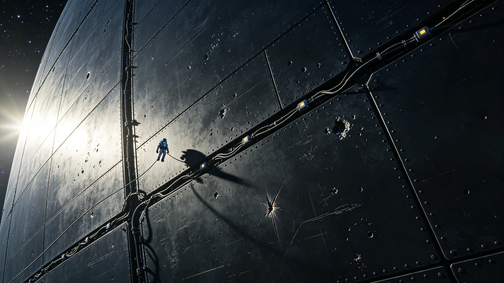

# 深空防御盾第三代维护工长闻坚壁四十年弹坑签认档案

**归档单位**：深空防御盾维护队 · 工长室
**档案袋编号**：SHIELD-FOREMAN-001
**立卷日期**：3596年10月8日

## 一、履历卡

| 项目 | 登记内容 |
|---|---|
| 姓名 | 闻坚壁 |
| 出生星区 | 三恒星系，原ARK-01第五段居住环 |
| 出生年 | 3516年 |
| 任工长年 | 3556年 |
| 岗位 | 深空防御盾第三代维护工长 |
| 在岗年限 | 至3596年满40年 |
| 经手 | 弹坑签认、装甲板替换、拦截弹年检 |

闻坚壁是深空防御盾第三代（见GS-3397-01）建成后的首任维护工长。防御盾是一张包裹本域关键节点的六边形装甲网，四百年间拦下过七颗有威胁的近距天体。他的工作是让这张网四十年不漏一个洞。

## 二、弹坑签认记录

四十年间闻坚壁签认弹坑与微流星撞击共2,860余处。其中需替换装甲板的86处，仅补焊的2,774处。

| 年份 | 当年弹坑 | 累计 | 替换板 |
|---|---|---|---|
| 3556 | 42 | 42 | 1 |
| 3560 | 58 | 260 | 6 |
| 3570 | 71 | 980 | 22 |
| 3580 | 83 | 1,760 | 48 |
| 3590 | 91 | 2,540 | 78 |
| 3596 | 61 | 2,860 | 86 |

闻坚壁在表末注："弹坑一年比一年多。碎片云在涨。我们换板的速度得比它快。"

## 三、拦截弹年检

第三代防御盾配动能拦截弹约1,200枚。闻坚壁每年年检一次，签认合格数。

| 年份 | 年检合格 | 报废 | 合格率 |
|---|---|---|---|
| 3556 | 1,180 | 20 | 98.3% |
| 3570 | 1,190 | 10 | 99.2% |
| 3585 | 1,195 | 5 | 99.6% |
| 3596 | 1,198 | 2 | 99.8% |

闻坚壁在表末注："报废弹一年比一年少。弹也老了，但老得慢。"

## 四、处分记录（一次）

**3576年**：某次动能拦截试验脱靶（见GS-3576-01），复盘发现闻坚壁在上一年度年检时，对其中两枚拦截弹的固体药柱裂纹只做了表面探伤，未做深部超声。试验脱靶后追检，这两枚弹确有深部裂纹。处分：书面检查，扣三年津贴，暂停工长签认权一年。

检查原件："我图快，只探了表面。裂纹在里头，表面看不见。脱靶不是弹的错，是我少探了一层。下次哪怕多花一天，也探到芯。"

## 五、体检与考核

- 3596年体检：长期舱外维护，辐射累积在限值内，骨密度正常，听力轻度下降，其余正常。
- 年度考核：连续37年"称职"，两次"优秀"。
- 继任安排：副工长一名在跟岗，预计3597年交接。

## 六、签名页

闻坚壁签收："我四十年签了两千八百个弹坑。这盾挡过七颗真东西。我签的每一个坑，都是它替我们挨的那一下。我不换板，就是下一颗天体漏进来。"签名日期3596年10月8日。

## 七、工长的工作

维护队在档案袋末写："闻坚壁四十年在盾外面爬。他把每个坑都看过、敲过、签过。盾在，人在；盾漏了，人就没了。这活儿没有中间。"

## 八、工长的禁忌

闻坚壁四十年有三不：不在表面探伤后签拦截弹合格、不在雨天（盾面结霜）换板、不替年轻队员在未探段上签字。维护队注明："他不替人签字，因为坑在谁的段上，谁的命就在谁的签认单上。"

## 九、工长不升级

闻坚壁任工长四十年，从未调往司令部。维护队说明："这岗需要一个在盾外面爬了四十年的人。他坐办公室去了，盾上的坑谁看？"

## 十、四十年盾数据

| 指标 | 3556年 | 3596年 |
|---|---|---|
| 六边形节点 | 14个 | 14个 |
| 累计弹坑 | 42 | 2,860 |
| 替换装甲板 | 1 | 86 |
| 拦截弹合格率 | 98.3% | 99.8% |
| 实际拦截成功 | 7次 | 7次 |
| 试验脱靶 | — | 1次（3576年） |

闻坚壁在表末注："四十年拦下七颗，脱靶一次。脱靶那次，是我少探了一层。"

## 十一、履历时间线

| 年份 | 履历事项 |
|---|---|
| 3516 | 生于原ARK-01第五段居住环 |
| 3538—3556 | 盾面维护队员18年 |
| 3556 | 任第三代盾维护工长 |
| 3560 | 累计弹坑260处 |
| 3576 | 拦截试验脱靶受处分 |
| 3580 | 累计弹坑1,760处 |
| 3590 | 累计弹坑2,540处 |
| 3596 | 本档案立卷，累计2,860处 |
| 3597 | 预计交接退休 |

## 十二、弹坑签认方法

每个弹坑，闻坚壁完成以下步骤：

1. 舱外抵近，拍高清照；
2. 量坑径与深度；
3. 深部超声探周围微裂纹；
4. 坑深不超板厚三分之一的，补焊；
5. 超三分之一的，整板替换；
6. 签认入卷。

四十年间86处整板替换，无一例补焊后复漏。

## 十三、盾面六边形节点

| 节点 | 位置 | 3596年状态 |
|---|---|---|
| 节点1 | 内太阳系方向 | 完好 |
| 节点2 | 比邻星b方向 | 完好 |
| 节点3 | 第四恒星系方向 | 完好 |
| 节点4 | 第五恒星系方向 | 完好 |
| 节点5 | 第六恒星系方向 | 建设中 |
| 其余9 | 各航道方向 | 完好 |

闻坚壁在表末注："节点5还在建。它建好之前，第六方向就靠老节点4罩着。"

## 十四、签名文件摘录

档案袋保留闻坚壁签认文件五份：

- 3556年首份弹坑签："坑深两毫米，补焊。"
- 3576年处分检查："我少探了一层。"
- 3580年中期复核签："盾不漏。"
- 3590年三十年复核签："拦过七颗。"
- 3596年本档案立卷签："两千八百个坑，没一个漏。"

## 十五、继任安排

闻坚壁3597年交接退休，副工长一名在跟岗。维护队说明："下一任工长还是要在盾外面爬。这活儿传下去，但不传成领导。他签了四十年坑，下一任接着签。"

---

**立卷**：深空防御盾维护队 · 工长室
**复核**：与弹坑原始探伤记录（另卷）互锁
**日期**：3596年10月8日

## 十六、盾面作业规程补记

闻坚壁四十年舱外作业累计出舱2,140次，累计舱外时间约1,860小时。每次出舱前必签安全单，出舱后必报舱压。四十年间出舱零事故。

## 十七、与闻氏一族

闻坚壁与闻远图（见GS-3351-01）、闻久藏（见GS-3396-01）同族不同支。闻氏一族在本纪元多守舱外与库内之岗。闻坚壁在签名页注："我们这一族，守的都是不动的东西。船骸、遗嘱、盾。"

## 十六、闻坚壁交班前列勤与签认摘录

闻坚壁任内（3556—3596）出舱累计二千一百四十次，舱外时间约一千八百六十小时，零事故。弹坑签认二千八百六十余处，整板替换八十六处，补焊二千七百七十四处，无一例复漏。3576年拦截试验脱靶书面检查一次、扣三年津贴、停签工长权一年，均已结案。3596年立卷当日移交弹坑探伤台账十八本、拦截弹年检记录二十卷、3576年脱靶复盘报告一份，副工长签收起讫。维护队注明：他签了四十年坑，没一个漏。
