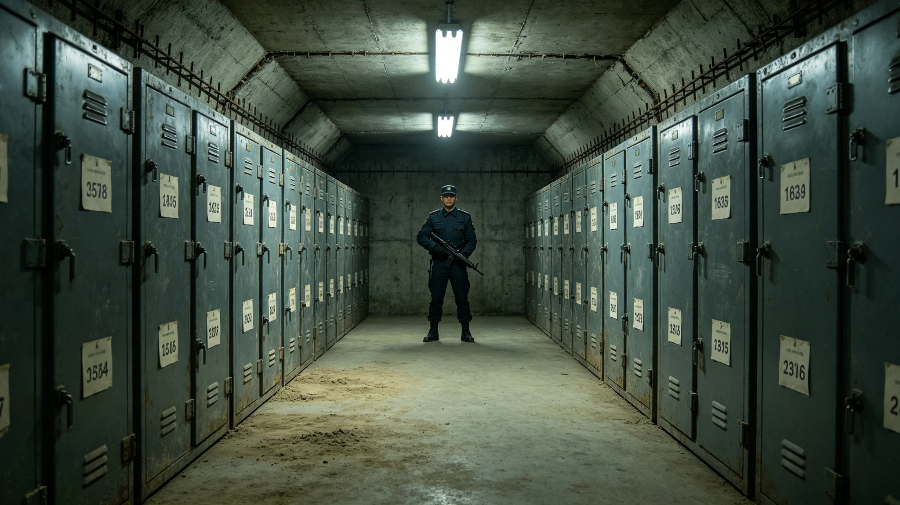

# 文明存续应急预案首席备灾官沈守常三十年封册与开封签认档案

**归档单位**：文明存续应急预案司 · 首席备灾官室
**档案袋编号**：EMERG-CHIEF-001
**立卷日期**：3597年12月1日

## 一、履历卡

| 项目 | 登记内容 |
|---|---|
| 姓名 | 沈守常 |
| 出生星区 | 三恒星系，火星地下城市一农业舱段 |
| 出生年 | 3517年 |
| 任备灾官年 | 3557年 |
| 岗位 | 文明存续应急预案首席备灾官 |
| 在岗年限 | 至3597年满40年 |
| 经手 | 备灾封册、开封审批、四级联动签认 |

沈守常是文明存续应急预案四级联动制度（见GS-3562-01）确立后的首任首席备灾官。与闻久藏守遗嘱不读（见GS-3396-01）不同，沈守常管的是"出事那天怎么活"——他封的不是写给后人的信，是留给自己人的最后一口气。

## 二、封册记录

备灾库封存着文明存续的最后冗余：基因库备份、玻璃千年介质（见GS-3368-01）、无人值守舱段钥匙（见GS-3598-01）、最低冗余人口名册。四十年间沈守常封册与复检记录如下：

| 年份 | 封册数 | 复检数 | 累计封存 |
|---|---|---|---|
| 3557 | 24 | 0 | 24 |
| 3565 | 31 | 24 | 180 |
| 3575 | 38 | 180 | 520 |
| 3585 | 42 | 520 | 960 |
| 3597 | 28 | 960 | 1,380 |

沈守常只登记封册数与开封条件，不读内部冗余内容——与闻久藏同例。

## 三、开封审批

备灾封册开封有严格条件：须达四级红色联动，且经委员会三分之二以上表决。四十年间沈守常签批开封申请共0次。

- 0次：四十年间未达红色联动条件一次。
- 沈守常注："这活儿最好就是零。零说明没出事。"

## 四、处分记录（一次）

**3579年**：全域四级联动演练中，沈守常在演练脚本中误将某份真实备灾封册当作演练用空册开封，开封后三小时才发现封条真实。他立即重新封存并上报。虽未造成内容泄露（他未读内容），但违反"真实封册不得在演练中开封"的硬规。处分：书面检查，扣两年津贴，调离备灾库主任岗半年。

检查原件："我把真罐子当成假的开了。规程说得对，哪怕没看，手碰到了真封条，就是错。下次演练前，先分真假。"

## 五、体检与考核

- 3597年体检：长期地下备灾库值守，光照不足，维生素D偏低，骨密度正常，其余正常。
- 年度考核：连续37年"称职"，一次"优秀"。
- 继任安排：副备灾官一名在跟岗，预计3598年交接。

## 六、签名页

沈守常签收："我四十年封了一千三百八十份备灾册，一次没开。这不是我能干，是这活儿本来就不该开。真开了，就是有谁没了。我宁愿守着一千三百八十份永远不开的罐子。"签名日期3597年12月1日。

## 七、备灾官的工作

应急预案司在档案袋末写："沈守常守了四十年备灾库。库里的东西是给末日用的。他守的不是东西，是别让末日来。"

## 八、备灾官的禁忌

沈守常四十年有三不：不在演练中开封真实封册、不向任何人透露库中冗余内容、不在未达红色联动时谈开封。应急预案司注明："他不谈开封，因为谈多了，人就盼着开。"

## 九、备灾官不晋升

沈守常任首席备灾官四十年，从未调往委员会。应急预案司说明："这岗需要一个人安安静静守着。他去开会了，库谁守？"

## 十、四十年备灾数据

| 指标 | 3557年 | 3597年 |
|---|---|---|
| 封存封册 | 24 | 1,380 |
| 实际开封 | 0 | 0 |
| 红色联动次数 | 0 | 0 |
| 最低冗余人口保有 | 达标 | 达标 |
| 基因库异地备份 | 三库 | 三库（见GS-3362-01） |
| 无人值守舱段 | 4 | 6 |

沈守常在表末注："四十年零开封。这是好消息。"

## 十一、履历时间线

| 年份 | 履历事项 |
|---|---|
| 3517 | 生于火星地下城市一农业舱段 |
| 3540—3557 | 灾害管理局值班员17年 |
| 3557 | 任首席备灾官 |
| 3565 | 累计封存180份 |
| 3579 | 演练中误开真实封册受处分 |
| 3585 | 累计封存960份 |
| 3597 | 本档案立卷，累计1,380份 |
| 3598 | 预计交接退休 |

## 十二、封册方法

每份备灾封册，沈守常完成以下步骤：

1. 核验提交方（基因库、介质库、舱段管理）；
2. 登记封册编号、开封条件、存放架位；
3. 密封于金属罐，罐外只刻编号；
4. 入冷备架，按条件分级；
5. 签认入卷。

四十年封册1,380份，零次误开（除3579年演练事故）。

## 十三、四级联动

| 级 | 颜色 | 触发 | 备灾官动作 |
|---|---|---|---|
| 一级 | 蓝 | 监测到异常 | 复检封册 |
| 二级 | 黄 | 异常待确认 | 备灾库预热 |
| 三级 | 橙 | 确认为威胁 | 封册待开封 |
| 四级 | 红 | 文明存续受威胁 | 报委员会表决开封 |

沈守常在表末注："四十年没出过蓝以上。蓝是日常。"

## 十四、签名文件摘录

档案袋保留沈守常签认文件五份：

- 3557年首份封册签："封存完成，未读。"
- 3579年处分检查："我把真罐子当成假的。"
- 3585年中期复核签："一千份封存，零开封。"
- 3590年三十年复核签："库里的东西没人用过。"
- 3597年本档案立卷签："一千三百八十份，一次没开。这就够了。"

## 十五、继任安排

沈守常3598年交接退休，副备灾官一名在跟岗。应急预案司说明："下一任首席备灾官还是零开封。这活儿传下去，但不传成领导。他守了四十年没开，下一任接着守。"

---

**立卷**：文明存续应急预案司 · 首席备灾官室
**复核**：与封册原始登记（另卷）互锁
**日期**：3597年12月1日

## 十六、沈守常交班前列勤与签认摘录

沈守常任内（3557—3597）封册累计一千三百八十份，复检九百六十份，实际开封零次。3579年演练中误开真实封册书面检查一次、扣两年津贴、调离备灾库主任岗半年，均已结案。3597年立卷当日移交封册登记台账十二本、四级联动签认本八卷、备灾库钥匙六把（双人共管），副备灾官签收起讫。应急预案司注明：他守了四十年没开，下一任接着守。
