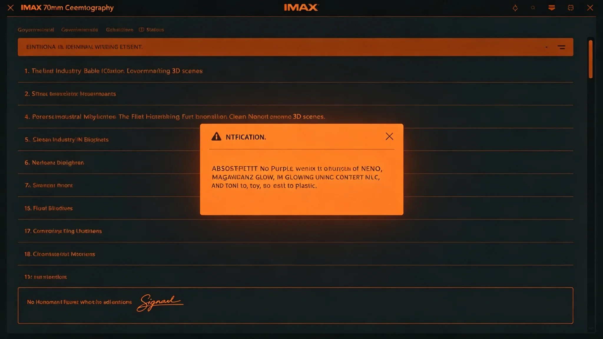

# 深空未知信号接触分级响应制度第五次修订公报

**发布机构**：三恒星系文明联合体安全协调委员会
**发布日期**：3558年3月15日
**文件等级**：跨星系公开

## 一、修订背景

3551年第五代干涉阵组网（见GS-3565-01）后，监测网待复核信号年捕获量从年均31起升至年均96起。原分级响应制度（3331年建立，见GS-3331-01）已运行227年，三级响应框架未变，但触发阈值、上报时限、演练频度均需随第五代阵灵敏度上调而收紧。本次为第五次修订。

## 二、修订要点

**（一）四级触发阈值重定**

| 级 | 旧阈值（3331年） | 新阈值（3558年） |
|---|---|---|
| 蓝（登记） | 任意窄带异常 | 窄带异常持续≥60秒 |
| 黄（待续观察） | 排除已知源后 | 排除已知源+三台独立阵交叉确认 |
| 橙（窄带应答） | 黄级满72小时 | 黄级满72小时+委员会预警席表决 |
| 红（主动联络） | 橙级满30日 | 橙级满30日+议会三分之二表决 |

**（二）上报时限收紧**

- 旧：黄级24小时内上报；
- 新：黄级12小时内上报，橙级4小时内上报。
- 注：3573年沈夜阑延误上报事件（见GS-3551-01）即因旧规程24小时窗口过宽，本次收紧至12小时。

**（三）演练频度提升**

- 旧：分级响应演习每五年一次；
- 新：每三年一次，其中全域联动每六年一次。

**（四）三级应答锁写入硬规**

原制度中"应答权限"为指导性条款，本次修订为硬性三级锁：一级值班官仅可静默登记，二级总值班官可窄带应答，三级议会方可主动联络。任何越权签认均按规程处分。

## 三、与前四次修订对照

| 次 | 年份 | 主要修订 |
|---|---|---|
| 一 | 3331 | 制度建立，三级框架 |
| 二 | 3389 | 增加跨系联动 |
| 三 | 3437 | 增加AI辅助甄别 |
| 四 | 3495 | 第四代网升级配套 |
| 五 | 3558 | 第五代阵配套，三级锁硬规化 |

## 四、委员会说明

安全协调委员会在公报中注明：227年间制度只修了五次。不是因为它没毛病，是因为每次修都得想清楚——这制度管的是"要不要回另一个人"。回错了，没有撤回键。所以阈值宁可松一点，上报宁可快一点，应答宁可慢一点。

## 五、与接触礼仪的关系

本制度不替代"初见礼"（见GS-3306-01）。初见礼是仪式，本制度是流程。仪式决定怎么打招呼，流程决定要不要打、谁来打、什么时候打。两者并行不悖。

## 六、过渡期安排

3558年4月1日起施行。3558—3559年为过渡期，过渡期内旧新双轨记录，3560年起新制全面生效。

## 七、解释权

本制度由安全协调委员会负责解释，下次修订预计不早于3600年。

---

**归档编号**：SEC-GRADE-REV5-3558-001
**编制**：联合体安全协调委员会
**日期**：3558年3月15日

## 八、蓝级日常量

新阈值生效后，3558—3560年蓝级登记量年均约240起（旧制年均31起）。委员会说明：阈值收紧后，蓝级多了，但黄级反而少了——因为蓝级就把多数碎片滤掉了。

## 九、黄级交叉确认

新制要求黄级须三台独立干涉阵交叉确认。3558—3560年黄级年均约8起，全部经交叉确认，无一起误升橙级。

## 十、橙级零发生

新制施行四十余年间（至3600年），橙级未实际触发一次。委员会注明：这是好消息。

## 十一、红级零发生

红级更未发生。委员会注明：最好永远不发生。

## 十二、三级锁与人类责任

本次修订将三级锁写入硬规，与GS-3293-01（AI辅助决策人类最终责任）互锁：AI可辅助甄别，不可代决应答。

## 十三、演练配套

新制施行后，首席训练官岑应变（见GS-3554-01）按新阈值重写演习脚本第18版，3560年首次全域联动演练按新制考核。

## 十四、与监测网硬件配套

新制配套第五代干涉阵（见GS-3565-01），硬件灵敏度提升后，软件阈值同步收紧，避免"看得更清却报得更乱"。

## 十五、委员会末注

公报末写：227年五次修订。制度越修越细，但核心没变——先看，再想，再等，最后才说。这四个字，就是我们对那一头所有可能的存在的全部礼貌。

---

## 十六、与3573年窄带事件

3573年窄带周期信号（见GS-3573-01）即按本制度第五版执行，黄级三台交叉确认生效，最终降级。事件证明新制可用。

## 十七、委员会五年复核

新制施行后，委员会每五年复核一次阈值。3560年首次复核，蓝级登记量从旧制年均31起升至240起，但黄级反而从年均12起降至8起。委员会注明：阈值收紧后，噪声在蓝级就滤掉了。

## 十八、与第六方向先飞器

第六方向先飞器（见GS-3569-01）回传数据时，可能携带未知窄带信号。本制度预留"先飞器数据回传"触发蓝级的条款。

## 十九、与3596年物理锁

3596年三级物理决策锁（见GS-3596-01）为本制度的物理执行。制度管流程，锁管钥匙。

## 二十、委员会末注补

公报末段补记：227年五次修订。下一次修订不早于3600年。制度越修越细，但核心四个字没变——先看、再想、再等、最后才说。

## 二十一、五年复核

新制施行后委员会每五年复核阈值。3560年首次复核，蓝级从31起升至240起，黄级反降。

## 二十二、与第六方向先飞器

先飞器数据回传时可能携带未知窄带信号，本制度预留触发蓝级条款。

## 二十三、与3596年物理锁

3596年三级物理决策锁（见GS-3596-01）为本制度的物理执行。

## 二十四、蓝级日常量

新阈值生效后蓝级年均240起，黄级年均8起，橙级零次。

## 二十五、委员会末注补

公报末段补记：227年五次修订。核心四个字没变——先看、再想、再等、最后才说。

## 二十六、新制执行监督与归档

本制度第五次修订施行后，安全协调委员会每五年复核一次阈值，3560年首次复核结果另报。全部蓝级登记记录、黄级交叉确认签认、橙级与红级表决记录由监测网值房归档，归档号SEC-GRADE-REV5-3558-001-A，保留期跨星系公开一百年。3558至3559过渡期旧新双轨记录另卷封存。若某一五年复核中黄级年均超过二十起，委员会须重新评估阈值是否过松。
