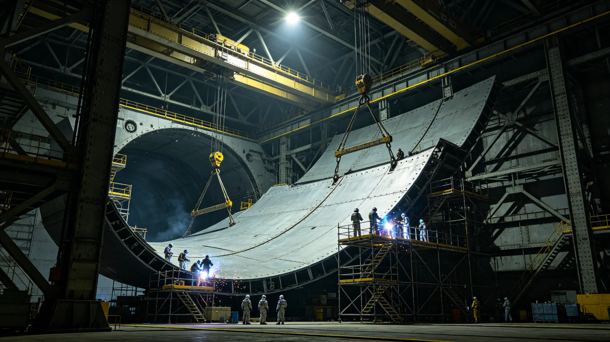

# 世代飞船船体千年维护周期与分段坞修制度确立公报

**发布机构**：三恒星系文明联合体工程委员会
**发布日期**：3559年7月20日
**文件等级**：跨星系公开

## 一、制度背景

原ARK-01及两艘姊妹船船体已航行约1,200年。此前坞修按故障驱动——哪里漏修哪里。3550年代起，微流星擦痕年新增量突破40万处，故障驱动已追不上老化速度。经船体维护司（顾铸年，见GS-3552-01）提议，工程委员会确立本制度，将坞修从"坏了修"改为"到期修"。

## 二、三段轮换

船体按赤道环、中央中枢、推进端三段，每段五十年一轮整体复检：

| 段 | 本轮维护期 | 主要工序 |
|---|---|---|
| 赤道环 | 3552—3602 | 装甲补覆、接缝重封、散热肋更换 |
| 中央中枢 | 3562—3612 | 自转轴检查（见GS-3572-01）、天井玻璃换封 |
| 推进端 | 3572—3622 | 聚变喷口烧蚀面换层、工质管路探伤 |

三段错峰维护，任一时点仅一段入坞，不影响航行。

## 三、千年周期

本制度按千年设计：船体整体寿命目标2,000年，每千年一轮"大修"。3559年为第一个千年周期内的制度固化点。

- 第一个千年（约2350—3350）：故障驱动；
- 第二个千年（3350—4350）：周期驱动，本制度即第二千年的维护框架。

## 四、签认标准

顾铸年自定标准：焊缝探伤合格率不低于99.92%，低于此数全数重焊，不凑整。本制度将此标准写入硬规。

## 五、与其他制度关系

- 与GS-3391主缆千年疲劳评估配套；
- 与GS-3361第七代聚变换装（3361年）衔接；
- 与GS-3566第八代烧蚀层补覆工艺衔接。

## 六、工程委员会说明

公报注明：船不是房子，不能住到老死再说。它在真空中飞了一千二百年，每一块板都在老。我们不能等它老到某一天早上漏了才想起来。本制度就是让它老得有计划。

## 七、过渡期

3559年8月1日起施行。赤道环本轮维护（3552年起）按新制补登档案，3562年中央中枢维护按新制执行。

## 八、解释权

本制度由工程委员会负责解释，千年周期内不再大修，仅随技术代际微调。

---

**归档编号**：ENG-HULL-MAINTAIN-3559-001
**编制**：联合体工程委员会
**日期**：3559年7月20日

## 九、坞修预算

本制度确立后，船体维护年度预算从星汇年均1.2亿升至年均2.8亿。工程委员会注明：多花1.6亿，换的是船不漏气。这账算得过来。

## 十、船员生活影响

分段错峰维护任一时点仅一段入坞，船员居住环不受影响。维护期间该段暂停使用，船员临时迁往他段，迁册由维护司统一调度。

## 十一、与船体三姊妹船

本制度适用ARK-01及两艘姊妹船共三艘。三船同型，维护周期错开20年，避免三船同时入坞。

## 十二、微流星擦痕台账

本制度要求每段坞修时完整登记微流星擦痕，形成千年擦痕台账。至3592年累计486万处（见GS-3552-01）。

## 十三、焊缝合格率硬规

99.92%为硬指标。低于此数的段全数重焊，重焊后再探。顾铸年在签认单上必写"探伤合格，放行"。

## 十四、与3574年击穿事件

3574年第三千七百公里装甲段击穿（见GS-3574-01）发生在本制度确立后15年。事件证明周期维护不能替代日常巡检，坞修制度与日常巡检修并行。

## 十五、工程委员会末注

公报末写：一千二百年了。船没老，人老了一茬又一茬。我们这一代把坞修写成制度，下一千年的人照着做就行。船飞多久，制度就得活多久。

---

## 十六、三姊妹船同步

ARK-01及两艘姊妹船共三艘，同型同制。三船维护周期错开20年，避免三船同时入坞。顾铸年在表末注："三艘船不能一起老。"

## 十七、船员迁册

某段入坞维护时，该段船员临时迁往他段。四十年间累计迁册4,200人次，零纠纷。维护司注明："换段住不影响配给，只换景。"

## 十八、与3574年击穿复盘

3574年击穿（见GS-3574-01）发生在赤道环维护期内。事件后维护司追加"日常巡检不得因周期维护而松懈"条款，写入本制度附则。

## 十九、与千年寿命

船体千年寿命目标2000年。本制度为第二千年（3350—4350）维护框架。第三个千年（4350—5350）届时另立。

## 二十、预算执行

年度维护预算2.8亿，四十年累计112亿。实际支出年均2.74亿，结余0.06亿留存应急。

## 二十一、工程委员会末注补

公报末段补记：船飞了一千二百年。我们这一代把坞修写成制度。下一千年的人照着做。船飞多久，制度活多久。

## 二十二、与3574年击穿复盘

3574年击穿（见GS-3574-01）后追加"日常巡检不得因周期维护松懈"附则。

## 二十三、船员迁册

某段入坞时船员临时迁往他段，四十年累计迁册4,200人次，零纠纷。

## 二十四、三姊妹船同步

三船维护错开20年，避免三船同时入坞。

## 二十五、预算执行

年度维护预算2.8亿，四十年累计112亿。

## 二十六、工程委员会末注补

公报末段补记：船飞了一千二百年。我们这一代把坞修写成制度。下一千年照着做。

## 二十七、与3574年击穿复盘

## 二十八、船员迁册

## 二十九、三姊妹船同步

三船维护错开20年，避免三船同时入坞。

## 三十、预算执行

年度维护预算2.8亿，四十年累计112亿。

## 三十一、工程委员会末注补

## 三十二、坞修制度执行监督与归档

本制度施行后，船体维护司每五年出具一次坞修执行报告，内容包括三段轮换进度、焊缝合格率、微流星擦痕新增量、预算执行率，报送工程委员会备查。报告归档号ENG-HULL-MAINTAIN-3559-001-A，跨星系公开，保留期一千年。若某段坞修中焊缝合格率连续两次低于百分之九十九点九二，工程委员会须派第三方探伤组驻段复查。三姊妹船维护错开二十年的排期另表。
