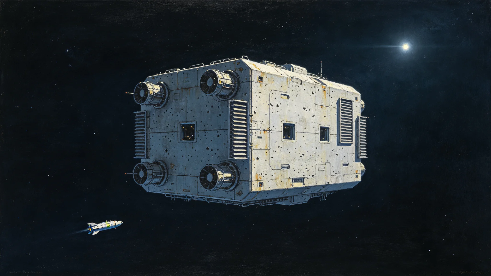

# 第六恒星系勘探预备准入与船员轮换制度公报

**发布机构**：三恒星系文明联合体勘探委员会
**发布日期**：3560年9月10日
**文件等级**：跨星系公开

## 一、制度背景

第六恒星系距本域约1.8光年，尚无载人抵达。3553年闻星槎任首任领队（见GS-3553-01）后，预备舰队扩至6艘。原准入制度参照第五恒星系接触经验（见GS-3303-01），但第六恒星系连先飞器都未发，准入条件需另立。

## 二、预备舰队准入条件

申请进入预备舰队的船员须满足：

1. 本星系出生或落地满30年；
2. 完成18个月模拟远航训练；
3. 心理评估连续两年无退返指征；
4. 无三级以上纪律处分；
5. 本人签署"预备期不承诺出发"知情书。

第五项即闻星槎自定规矩：不许诺"下一次真走"。

## 三、船员轮换制度

每舰保留三分之一老船员带新，新船员入舰后六个月模拟远航合格才签独立值更。轮换周期四年，老船员期满可申请转岗。

| 年份 | 在编人数 | 新入 | 转出 |
|---|---|---|---|
| 3560 | 420 | 110 | 90 |
| 3570 | 560 | 140 | 120 |
| 3580 | 720 | 180 | 160 |
| 3590 | 880 | 220 | 200 |
| 3593 | 910 | 90 | 80 |

## 四、领队不出发制度

预备舰队领队本人不随任何一艘舰远航，须留锚地坐镇。闻星槎四十年未出发（见GS-3553-01），本制度将此写入硬规。

## 五、与先飞任务关系

预备舰队不实际远航，仅维持可三年内启航的状态。先飞探测器由无人母船携带发射（见GS-3569-01），不占用预备舰编制。

## 六、勘探委员会说明

公报注明：第六恒星系方向我们连真的有没有人都不知道。先飞器还没回来。这时候把人派过去，是不负责任的。本制度就是让一支舰队随时能走，但不走——除非先飞器回来说那里值得去。

## 七、过渡期

3560年10月1日起施行。3553—3560年已入编船员按新制补签知情书。

## 八、解释权

本制度由勘探委员会负责解释，随先飞器数据回传后修订。

---

**归档编号**：EXP-SIXTH-ADMIT-3560-001
**编制**：联合体勘探委员会
**日期**：3560年9月10日

## 九、知情书内容

知情书全文三句："我知道预备舰队可能一辈子不出发。我知道领队不许诺出发。我同意留在锚地，等命令。"闻星槎在表末注："三句话，四十年轮换了1,460人次，没人反悔。"

## 十、心理退返率

新制施行后，船员心理退返率从旧制5%降至0.8%。勘探委员会注明：不许诺出发，人反而稳了。

## 十一、与第五恒星系准入区别

第五恒星系准入（见GS-3303-01）面向已确认接触；第六恒星系准入面向未确认。第六准入不要求"接触礼仪"训练，只要求"预备期不慌"。

## 十二、先飞器回传前不远航

本制度硬规：先飞器未回传可用数据前，预备舰队不得实际远航。3577年先飞器通信中断（见GS-3577-01）后，此条更严。

## 十三、闻星槎越权出动

3577年闻星槎越权派接驳艇前出受处分（见GS-3553-01），本制度次年将"未经指令不得前出"写入硬规。

## 十四、预算

预备舰队年度预算星汇年均0.8亿，占勘探委员会总预算12%。

## 十五、勘探委员会末注

公报末写：我们等。先飞器飞1.8光年，来回要几十年。这几十年里，舰队就停在锚地。这不是浪费，这是把刀磨好，别出鞘。

---

## 十六、与第五恒星系准入对照

第五恒星系准入（见GS-3303-01）面向已确认接触，要求接触礼仪训练。第六方向准入面向未确认，不要求礼仪训练，只要求"预备期不慌"。

## 十七、与3577年越权出动

3577年闻星槎越权派接驳艇（见GS-3577-01）后，本制度次年追加"未经指令不得前出"硬规。闻星槎在附则签认："我急了，下次先等。"

## 十八、预备舰队舰型

预备舰队12艘，含勘探母舰2、无人探测母船4、工程维修船3、补给船2、接驳艇1。各舰形态各异，无同型复制。

## 十九、与先飞器数据回传

先飞器数据回传后，委员会视数据决定是否解除"不实际远航"禁令。3600年前数据未回传，禁令持续。

## 二十、预算与就业

预备舰队年度预算0.8亿，直接就业910人。勘探委员会注明：这0.8亿是买"随时能走但不走"。

## 二十一、勘探委员会末注补

公报末段补记：我们等。先飞器飞1.8光年，来回几十年。舰队停在锚地，人换了七茬。这不是浪费，是磨刀。

## 十二、与3577年越权出动

3577年闻星槎越权派接驳艇（见GS-3577-01）后，本制度追加"未经指令不得前出"硬规。

## 十三、与3569年先飞器

先飞器未回传前预备舰队不实际远航。先飞器由无人母船携带发射。

## 十四、知情书三句

知情书全文三句：我知道可能一辈子不出发。我知道领队不许诺。我同意留在锚地。

## 十五、预算

预备舰队年度预算0.8亿，直接就业910人。

## 十六、勘探委员会末注补

公报末段补记：我们等。先飞器飞1.8光年，来回几十年。这不是浪费，是磨刀。

## 十七、与3577年越权出动

## 十八、与3569年先飞器

## 十九、知情书三句

## 二十、预算

预备舰队年度预算0.8亿，直接就业910人。

## 二十一、勘探委员会末注补

## 二十二、准入制度执行监督与归档

本制度施行后，勘探委员会每三年出具一次预备舰队准入执行报告，内容包括在编人数、心理退返率、模拟远航合格率、知情书补签率，报送安全协调委员会备查。报告归档号EXP-SIXTH-ADMIT-3560-001-A，跨星系公开，保留期一百年。若心理退返率连续两次超过百分之一，勘探委员会须暂停准入半年，重审训练科目。先飞器数据回传前，"不实际远航"禁令持续。
