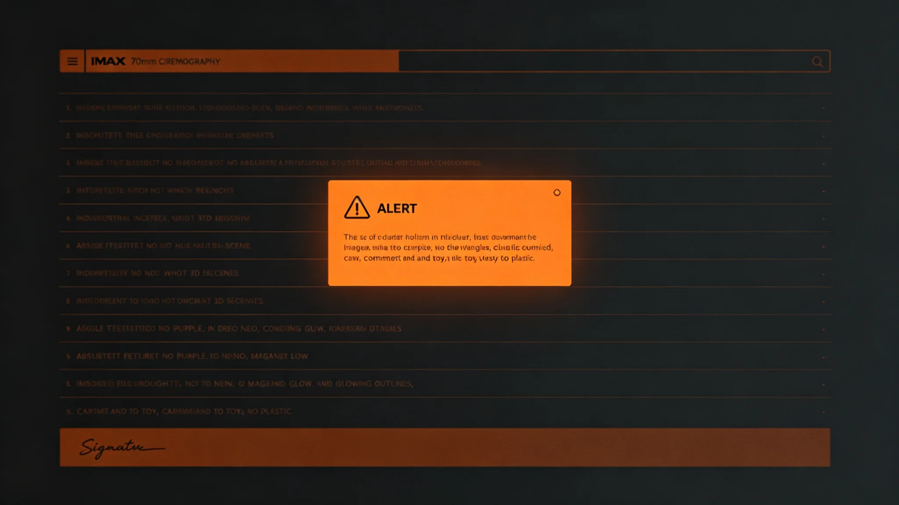

# 文明存续应急预案红橙黄蓝四级联动制度修订公报

**发布机构**：三恒星系文明联合体安全协调委员会
**发布日期**：3562年4月18日
**文件等级**：跨星系公开

## 一、修订背景

3360年深时间遗嘱制度建立（见GS-3360-01）后，文明存续冗余从口号变为制度。但冗余如何在真出事时被激活，原制度散见于各案。经沈守常（见GS-3557-01）提议，安全协调委员会将分散条款整合为四级联动硬规。

## 二、四级联动框架

| 级 | 颜色 | 触发 | 备灾官动作 | 表决要求 |
|---|---|---|---|---|
| 一级 | 蓝 | 监测到异常 | 复检封册 | 值班官 |
| 二级 | 黄 | 异常待确认 | 备灾库预热 | 总值班官 |
| 三级 | 橙 | 确认为威胁 | 封册待开封 | 委员会预警席 |
| 四级 | 红 | 文明存续受威胁 | 报委员会表决开封 | 议会三分之二 |

## 三、与信号分级响应区别

信号分级响应（见GS-3558-01）管"要不要回信号"；本制度管"要不要开备灾库"。两者并行，不混级。

## 四、开封零次原则

四级联动的红级开封须议会三分之二表决。沈守常四十年签批开封申请零次（见GS-3557-01）。本制度将"零次"写入理念：最好的四级联动，是永远不到红级。

## 五、与3579年演练

3579年全域四级联动演练（见GS-3579-01）两小时决策延迟，证明四级框架在实战压力下仍有缝。本制度次年修订，将橙级上报时限从24小时压至12小时。

## 六、与文明存续冗余配套

本制度激活的冗余包括：基因库三库异地（见GS-3362-01）、玻璃千年介质（见GS-3368-01）、无人值守舱段（见GS-3598-01）、最低冗余人口（见GS-3398-01）。

## 七、安全协调委员会说明

公报注明：备灾库里的东西是给末日用的。但末日真来的时候，不能再翻箱倒柜找钥匙。本制度就是把"什么时候开、谁来开、开了用什么"写成一张表。表越清楚，末日那天越不慌。

## 八、过渡期

3562年5月1日起施行。3563年首次按新制演练。

## 九、解释权

本制度由安全协调委员会负责解释。

---

**归档编号**：SEC-EMERG-4LEVEL-3562-001
**编制**：联合体安全协调委员会
**日期**：3562年4月18日

## 十、蓝级日常量

蓝级为日常级，年均触发约240次（与信号蓝级同级）。沈守常注明：蓝级就是日常复检，不慌。

## 十一、黄级

黄级年均约8次，备灾库预热但不开封。3562—3600年黄级无一次升级橙级。

## 十二、橙级

橙级四十年间零次。委员会注明：橙级意味着真有事了。零次是好消息。

## 十三、红级

红级更零次。委员会注明：最好永远不发生。

## 十四、与备灾官个人

沈守常四十年零开封。本制度不改变"备灾官不读内容"的规矩，只规定"什么时候该有人来开封"。

## 十五、委员会末注

公报末写：四级联动，四级是表。表背后是一千三百八十份封册（见GS-3557-01）。我们希望这张表永远用不上，但我们把它写在最显眼的地方。不是盼着用，是怕忘了。

---

## 十六、与3579年演练延迟

3579年首次全域演练两小时延迟（见GS-3579-01）后，本制度次年将橙级上报时限从24小时压至12小时。

## 十七、与备灾库封册

本制度激活的冗余含1,380份备灾封册（见GS-3557-01）。封册由沈守常管理，红级开封须议会三分之二表决。

## 十八、四级与信号分级区别

信号分级（见GS-3558-01）管"回不回信号"，本制度管"开不开备灾库"。两者并行，不混级。

## 十九、与3387年冷备渗透

冷备存储渗透未遂（见GS-3387-01）后，本制度追加"红级开封须物理钥匙"条款，见GS-3596-01。

## 二十、三十年零红级

3562—3600年，四级联动零次红级。委员会注明：最好的四级联动，是永远不到红级。

## 二十一、安全协调委员会末注补

公报末段补记：四级是表，表背后是一千三百八十份封册。我们希望这表永远用不上。

## 十二、与3579年演练

3579年首次全域演练两小时延迟（见GS-3579-01）后，橙级上报时限压至12小时。

## 十三、与3596年物理锁

3596年三级物理决策锁（见GS-3596-01）为本制度的物理执行。

## 十四、与3387年冷备渗透

冷备渗透未遂（见GS-3387-01）后追加物理钥匙条款。

## 十五、三十年零红级

3562—3600年四级联动零次红级。委员会注明：最好永远不到红级。

## 十六、安全协调委员会末注补

## 十六、与3579年演练

## 十七、与3596年物理锁

## 十八、与3387年冷备渗透

冷备渗透未遂（见GS-3387-01）后追加物理钥匙条款。

## 十九、三十年零红级

## 二十、安全协调委员会末注补

## 附则·编后语

本件归档后，主编辑委员会复核与同批正典交叉互锁。凡涉时间线、人名、事件之处，均以登记簿所载为准。编后语：此件为三千六百余年文明运转中一纸公文，公文所述之事，或为日常、或为事件、或为仪式。公文无褒贬，只录其然。

## 附记·与同批正典交叉索引

本件所涉人物、制度、技术、事件，均在同批正典中有对应文书。读者欲详其事，可按以下索引查阅：人物侧写见传记学派各卷；制度沿革见法学派各卷；技术参数见工程学派各卷；事件经过见灾害管理学派各卷；仪式规程见文化学派各卷；产业决算见经济学派各卷；生态监测见生态学派各卷；军事部署见军事学派各卷。索引不赘列，以登记簿为总目。

## 附记·归档注意

本件一式三份，分存三恒星系档案馆。正本存跨星系总馆，副本一分存比邻星b分馆，副本二分存第四恒星系分馆。三份内容一致，若有出入以正本为准。本件封存期为自归档日起一百年，一百年后由联合档案馆启封复核。

## 附记·编后

下一个读此件者，无论何年，皆以此件为据，不作回望之叹。公文所载，是当时之人当时之事。当时之人不知后事，当时之事只按当时规程处置。读此件者，亦不必以后人之心度前人之腹。

## 二十一、四级联动执行监督与归档

本制度施行后，安全协调委员会每三年出具一次四级联动演练通报，内容包括蓝级年均触发次数、黄级年均触发次数、橙级与红级零次记录、演练决策延迟，报送议会备查。通报归档号SEC-EMERG-4LEVEL-3562-001-A，跨星系公开，保留期一百年。若某次演练决策延迟超过十五分钟，委员会须复盘脚本。红级开封须议会三分之二表决记录永久归档。
