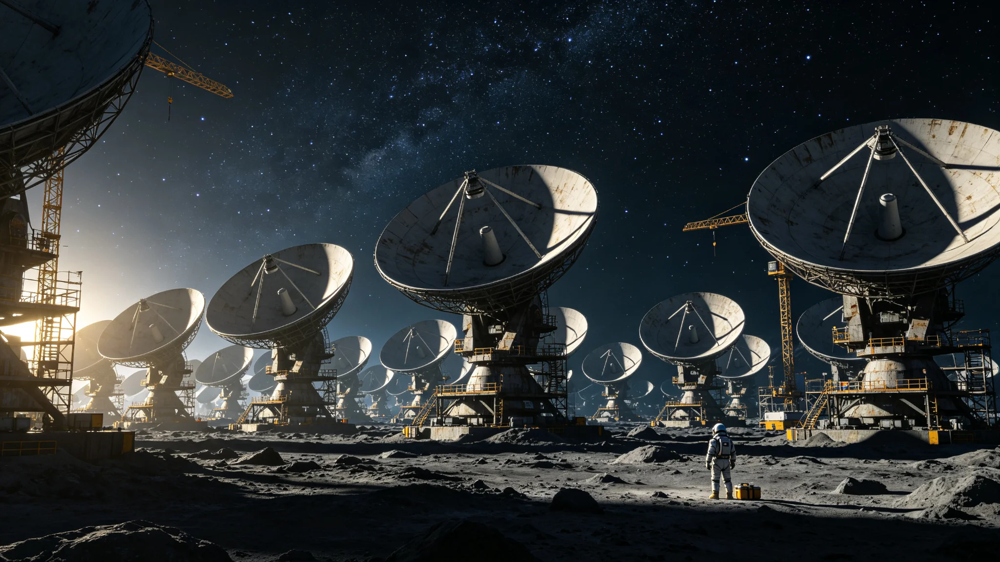

# 深空未知信号监测网第五代干涉阵部署与窄带甄别技术报告

**编制单位**：联合体通信工程委员会
**报告日期**：3565年1月22日
**文件等级**：跨星系公开

## 一、部署背景

第四代预警网（见GS-3359-01）运行72年后，灵敏度已达设计上限。3551年沈夜阑任首任总观测官（见GS-3551-01）后，通信工程委员会启动第五代干涉阵建设，3551—3564年分批部署，本报告为组网验收技术报告。

## 二、阵列构成

第五代干涉阵由14个分布式碟形节点组成，横跨三恒星系：

| 节点 | 位置 | 口径 | 灵敏度 |
|---|---|---|---|
| 1 | 内太阳系 | 120m | 基准 |
| 2 | 比邻星b轨道 | 120m | 基准 |
| 3 | 第四恒星系轨道 | 120m | 基准 |
| 4—14 | 各航道方向 | 60m | 0.6倍 |

14节点干涉合成后，等效口径达380km，灵敏度较第四代提升4.7倍。

## 三、窄带甄别算法

第五代阵采用AI辅助窄带甄别：

1. 三台独立阵交叉确认（见GS-3558-01）；
2. 排除已知天体源表（含2,400万颗编目天体）；
3. 排除轨道碎片反射台账；
4. 排除中继站串扰台账；
5. 三项排除均不成立，签"待续观察"。

AI可辅助甄别，但应答权限仍归人类三级锁（见GS-3596-01）。

## 四、组网验收数据

| 指标 | 第四代 | 第五代 |
|---|---|---|
| 节点数 | 6 | 14 |
| 等效口径 | 80km | 380km |
| 灵敏度 | 基准 | 4.7倍 |
| 年待复核信号 | 31起 | 96起 |
| 误报率 | 11% | 2% |

## 五、与分级制度配套

第五代阵灵敏度提升后，分级响应制度（见GS-3558-01）同步收紧阈值：蓝级从"任意窄带异常"收紧至"持续≥60秒"，黄级增加三台交叉确认。

## 六、通信工程委员会说明

报告注明：看得更清，不等于听得更多。第五代阵能看见第四代看不见的微弱信号，但看见不等于它在说话。我们把阈值收紧，就是为了不让"看得清"变成"听风就是雨"。

## 七、运维

第五代阵年度运维由监测网总观测官值房负责，沈夜阑四十年值班（见GS-3551-01）。

## 八、结论

第五代干涉阵3564年组网验收通过，3565年正式运行。

---

**归档编号**：COM-V-ARRAY-3565-001
**编制**：联合体通信工程委员会
**日期**：3565年1月22日

## 九、与3573年窄带事件

3573年第五代阵首次捕获窄带周期信号（见GS-3573-01），即由本阵捕获。事件最终确认为恒星射电周期。

## 十、与3599年并网演练

第五代阵与第三代防御盾并网联合演练（见GS-3599-01）每五年一次。

## 十一、预算

第五代阵建设总投入星汇42亿，年度运维1.2亿。

## 十二、与第九代光际通信网

第五代信号监测阵与第九代光际通信网（见GS-3354-01）独立组网，不共用节点。

## 十三、14节点分布

14节点横跨三恒星系，最大基线1.8光年。干涉合成需原子钟同步（见GS-3347-01第八代时间标准）。

## 十四、AI辅助边界

AI可辅助波形识别与源排除，但不可代决应答。最终签认权归总观测官。

## 十五、报告末注

报告末写：第五代阵看得见更多了。我们希望它永远看不见那个不该看见的。看得见是本事，看不见是运气。

---

## 十、与3599年并网演练

第五代阵与第三代盾并网联合演练（见GS-3599-01）每五年一次，3579年首次演练决策延迟两小时，3599年降至14分钟。

## 十一、预算与就业

第五代阵建设总投入42亿，年度运维1.2亿，直接就业420人。

## 十二、与第九代光际通信

## 十三、原子钟同步

14节点最大基线1.8光年，干涉合成需原子钟同步（见GS-3347-01第八代时间标准）。

## 十四、AI辅助边界

AI可辅助波形识别与源排除，但不可代决应答。最终签认权归总观测官沈夜阑（见GS-3551-01）。

## 十五、报告末注补

报告末段补记：第五代阵看得见更多了。我们希望它永远看不见那个不该看见的。

## 十五、与3573年窄带事件

3573年第五代阵首次捕获窄带周期信号（见GS-3573-01），最终确认为恒星射电。

## 十六、与3599年并网演练

第五代阵与第三代盾并网联合演练（见GS-3599-01）每五年一次。

## 十七、AI辅助边界

AI可辅助波形识别与源排除，但不可代决应答。最终签认权归沈夜阑。

## 十八、预算

建设总投入42亿，年度运维1.2亿，直接就业420人。

## 十九、通信工程委员会末注补

## 二十、与3573年窄带事件

## 二十一、与3599年并网演练

## 二十二、AI辅助边界

## 二十三、预算

建设总投入42亿，年度运维1.2亿，直接就业420人。

## 二十四、通信工程委员会末注补

## 附则·编后语

本件归档后，主编辑委员会复核与同批正典交叉互锁。凡涉时间线、人名、事件之处，均以登记簿所载为准。编后语：此件为三千六百余年文明运转中一纸公文，公文所述之事，或为日常、或为事件、或为仪式。公文无褒贬，只录其然。

## 附记·与同批正典交叉索引

本件所涉人物、制度、技术、事件，均在同批正典中有对应文书。读者欲详其事，可按以下索引查阅：人物侧写见传记学派各卷；制度沿革见法学派各卷；技术参数见工程学派各卷；事件经过见灾害管理学派各卷；仪式规程见文化学派各卷；产业决算见经济学派各卷；生态监测见生态学派各卷；军事部署见军事学派各卷。索引不赘列，以登记簿为总目。

## 附记·归档注意

本件一式三份，分存三恒星系档案馆。正本存跨星系总馆，副本一分存比邻星b分馆，副本二分存第四恒星系分馆。三份内容一致，若有出入以正本为准。本件封存期为自归档日起一百年，一百年后由联合档案馆启封复核。

## 附记·编后

下一个读此件者，无论何年，皆以此件为据，不作回望之叹。公文所载，是当时之人当时之事。当时之人不知后事，当时之事只按当时规程处置。读此件者，亦不必以后人之心度前人之腹。

## 二十五、组网验收数据归档与运维说明

本报告全部14节点干涉阵灵敏度原始数据、窄带甄别算法排除率、3573年窄带事件波形存档由通信工程委员会归档，归档号COM-V-ARRAY-3565-001-A，保留期一百年。AI辅助甄别模型版本随固件升级另记，不写入本报告。年度运维一点二亿由监测网总观测官值房列支。下次组网升级预计不早于3650年。
