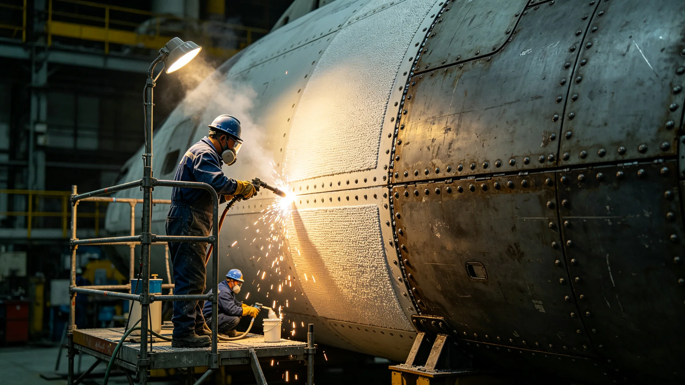

# 世代飞船船体千年微陨石烧蚀层第八代补覆工艺技术报告

**编制单位**：联合体材料工程委员会
**报告日期**：3566年5月19日
**文件等级**：跨星系公开

## 一、工艺背景

船体烧蚀层已运行千年，经历七代补覆。第七代（约3350年代）补覆层在3550年代出现微裂纹扩展。顾铸年任总工程师（见GS-3552-01）后，材料工程委员会启动第八代工艺研发，3566年定型。

## 二、第八代工艺要点

| 项 | 第七代 | 第八代 |
|---|---|---|
| 基材 | 钛合金蜂窝 | 钛合金蜂窝+陶瓷复合层 |
| 涂层 | 单层防辐射漆 | 三层梯度涂层 |
| 寿命 | 80年 | 120年 |
| 微陨石擦痕耐受 | 基准 | 提升2.3倍 |
| 补覆工时 | 段均6日 | 段均8日 |

## 三、补覆方法

1. 旧层喷砂清除至基底；
2. 蜂窝探伤，微裂纹超0.1毫米段整体更换；
3. 三层梯度涂层喷涂，每层固化48小时；
4. 成品探伤合格率≥99.92%（见GS-3559-01）；
5. 签认入卷。

## 四、与3574年击穿事件

3574年第三千七百公里装甲段击穿（见GS-3574-01）发生在第七代补覆层上。事件证明第七代层在超高速撞击下分层剥离。第八代工艺即针对此设计陶瓷复合层。

## 五、材料工程委员会说明

报告注明：烧蚀层是船的皮。皮老了会裂。我们换了八代，每一代都比上一代厚一点、韧一点。但再厚的皮也挡不住一切——3574年那次就是例子。我们能做的，是让下次击穿后别漏。

## 六、部署计划

第八代工艺随赤道环本轮维护（3552—3602）分批补覆，预计3602年完成赤道环全段。

## 七、结论

第八代补覆工艺3566年定型，材料工程委员会验收通过。

---

**归档编号**：MAT-LAYER-VIII-3566-001
**编制**：联合体材料工程委员会
**日期**：3566年5月19日

## 八、与焊缝签认

顾铸年签认标准99.92%（见GS-3552-01），第八代层探伤合格率实测99.94%，达标。

## 九、预算

第八代工艺赤道环全段补覆预算星汇18亿，分50年分摊。

## 十、与中央中枢、推进端

中央中枢（3562—3612）与推进端（3572—3622）维护时按第八代工艺执行。

## 十一、微陨石擦痕台账

第八代层部署后，年新增擦痕增量预计从40万处降至18万处（顾铸年台账，见GS-3552-01）。

## 十二、与防辐射涂层

第八代三层梯度涂层中，外层防辐射、中层缓冲、内层密封。

## 十三、退役层回收

旧层喷砂清除后回收钛合金，再生率87%。

## 十四、与千年寿命

船体千年寿命目标2000年。第八代层设计寿命120年，可覆盖至约3686年。

## 十五、报告末注

报告末写：八代了。船的皮换了八次。下一次换皮，是一百二十年后的人。我们这一代把皮换厚一点，他们那一代就少慌一点。

---

## 九、与焊缝签认标准

## 十、预算与分摊

赤道环全段补覆预算18亿，分50年分摊。

## 十一、旧层回收

旧层喷砂清除后回收钛合金，再生率87%。

## 十二、三船同步

第八代工艺随赤道环维护（见GS-3559-01）分批补覆，三姊妹船错开20年。

## 十三、与3574年击穿

3574年击穿（见GS-3574-01）发生在第七代层上，第八代陶瓷复合层即针对此设计。

## 十四、报告末注补

报告末段补记：八代了。船的皮换了八次。下一次换皮是一百二十年后的人。我们这一代把皮换厚一点。

## 十五、与3574年击穿

## 十六、旧层回收

旧层喷砂清除后回收钛合金，再生率87%。

## 十七、三船同步

## 十八、预算

赤道环全段补覆预算18亿，分50年分摊。

## 十九、材料工程委员会末注补

报告末段补记：八代了。船的皮换了八次。下一次换皮是一百二十年后的人。

## 十九、与3574年击穿

## 二十、旧层回收

旧层喷砂清除后回收钛合金，再生率87%。

## 二十一、三船同步

## 二十二、预算

赤道环全段补覆预算18亿，分50年分摊。

## 二十三、材料工程委员会末注补

## 附则·编后语

本件归档后，主编辑委员会复核与同批正典交叉互锁。凡涉时间线、人名、事件之处，均以登记簿所载为准。编后语：此件为三千六百余年文明运转中一纸公文，公文所述之事，或为日常、或为事件、或为仪式。公文无褒贬，只录其然。

## 附记·与同批正典交叉索引

本件所涉人物、制度、技术、事件，均在同批正典中有对应文书。读者欲详其事，可按以下索引查阅：人物侧写见传记学派各卷；制度沿革见法学派各卷；技术参数见工程学派各卷；事件经过见灾害管理学派各卷；仪式规程见文化学派各卷；产业决算见经济学派各卷；生态监测见生态学派各卷；军事部署见军事学派各卷。索引不赘列，以登记簿为总目。

## 附记·归档注意

本件一式三份，分存三恒星系档案馆。正本存跨星系总馆，副本一分存比邻星b分馆，副本二分存第四恒星系分馆。三份内容一致，若有出入以正本为准。本件封存期为自归档日起一百年，一百年后由联合档案馆启封复核。

## 附记·编后

下一个读此件者，无论何年，皆以此件为据，不作回望之叹。公文所载，是当时之人当时之事。当时之人不知后事，当时之事只按当时规程处置。读此件者，亦不必以后人之心度前人之腹。

## 二十四、补覆工艺数据归档与验收说明

本报告全部第八代工艺试样探伤数据、三层梯度涂层固化曲线、3574年击穿断口对照照片由材料工程委员会归档，归档号MAT-LAYER-VIII-3566-001-A，保留期一千年。赤道环全段补覆3602年完成后另文发布验收公报。旧层钛合金再生率百分之八十七的回收记录每季度报材料委员会。第八代层设计寿命一百二十年，至3686年前不换第九代。
