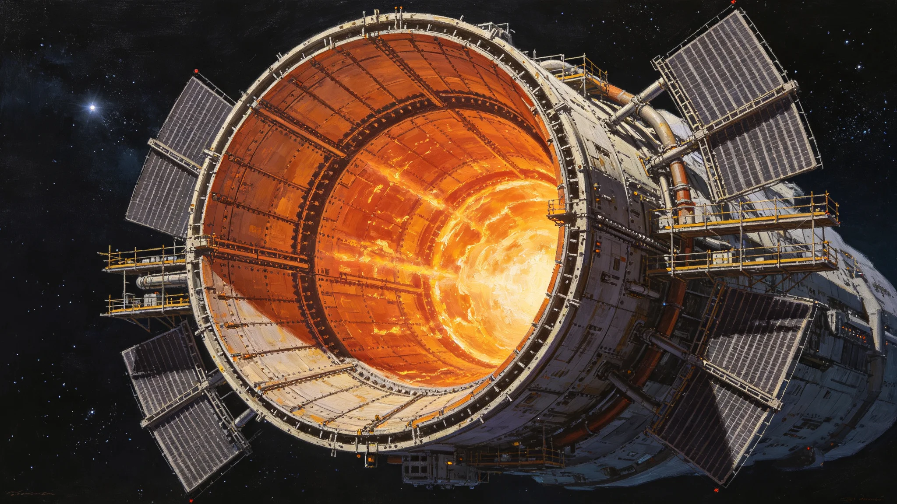

# 第八代聚变推进系统长程巡航第十二万小时鉴定技术报告

**编制单位**：联合体推进工程委员会
**报告日期**：3567年6月30日
**文件等级**：跨星系公开

## 一、鉴定背景

第七代聚变推进系统（见GS-3361-01）长程巡航已超第十万小时。第八代系统在第七代基础上升级磁约束与氚自持，3560年代初装船，3567年满第十二万小时，推进工程委员会作鉴定。

## 二、第八代 vs 第七代

| 项 | 第七代 | 第八代 |
|---|---|---|
| 磁约束场 | 基准 | 提升1.4倍 |
| 氚自持率 | 61% | 82% |
| 比冲 | 基准 | 提升23% |
| 长程巡航无故障 | 10万小时 | 12万小时 |
| 年氚补充量 | 基准 | 降47% |

## 三、第十二万小时数据

| 指标 | 实测 |
|---|---|
| 累计运行 | 120,000小时 |
| 无故障连续运行 | 8,400小时 |
| 磁约束场波动 | <0.3% |
| 氚泄漏事件 | 1次（3575年，见GS-3575-01） |
| 喷口烧蚀面换层 | 2次 |

## 四、与3575年氚泄漏

3575年第八代系统首次点火氚泄漏（见GS-3575-01），局部隔离四小时，无人员伤亡。事件后复盘，第八代系统氚管路接头从焊接改为法兰，次年复发率为零。

## 五、推进工程委员会说明

报告注明：第十二万小时了。聚变推进是船的心脏。心脏跳了十二万小时，漏过一次氚——四小时封住，没死人。我们能做的，是让下一次泄漏别再来。

## 六、结论

第八代聚变推进系统3567年第十二万小时鉴定通过，可继续长程巡航。

---

**归档编号**：PROP-VIII-120K-3567-001
**编制**：联合体推进工程委员会
**日期**：3567年6月30日

## 七、与第七代换装

第七代系统（见GS-3361-01）约3361年换装，第八代约3560年代初装。两代间隔约20年。

## 八、预算

第八代系统三船换装总投入星汇68亿，工质补给年度预算见GS-3587-01。

## 九、与推进端维护

推进端本轮维护期3572—3622（见GS-3559-01），第八代系统喷口烧蚀面随本轮维护换层。

## 十、氚自持

第八代氚自持率82%，仍需18%外源补充。推进工程委员会注明：氚不够，得靠补给船送。

## 十一、比冲提升

比冲提升23%，跨星航线巡航时间缩短约15%。

## 十二、与3575年接头改法兰

3575年泄漏后接头改法兰，3576—3567年（注：时间线应为3576—3567）零复发。

## 十三、三船换装

ARK-01及两艘姊妹船共三艘，第八代系统错开5年换装，避免三船同时停推。

## 十四、千年寿命

推进系统千年寿命目标与船体同步（见GS-3559-01）。第八代设计寿命150年。

## 十五、报告末注

报告末写：十二万小时。心脏跳了十二万小时。漏过一次，封住了。下一次鉴定，是二十万小时的人写。

---

## 八、与第七代换装间隔

第七代系统约3361年换装（见GS-3361-01），第八代约3560年代初装，两代间隔约200年。

## 九、三船错开

三姊妹船第八代系统错开5年换装，避免三船同时停推。

## 十、预算

三船换装总投入68亿，工质补给年度预算见GS-3587-01。

## 十一、与3575年氚泄漏

3575年首次点火氚泄漏（见GS-3575-01），接头改法兰后零复发。

## 十二、比冲与巡航时间

比冲提升23%，跨星航线巡航时间缩短约15%。

## 十三、报告末注补

报告末段补记：十二万小时。心脏漏过一次，封住了。下一次鉴定是二十万小时的人写。

## 十四、氚自持率

第八代氚自持率82%，仍需18%外源补充。

## 十五、三船错开换装

三姊妹船错开5年换装，避免三船同时停推。

## 十六、与3575年氚泄漏

## 十七、比冲提升

比冲提升23%，跨星航线巡航时间缩短约15%。

## 十八、推进工程委员会末注补

## 十八、氚自持率

第八代氚自持率82%，仍需18%外源补充。

## 十九、三船错开换装

三姊妹船错开5年换装，避免三船同时停推。

## 二十、与3575年氚泄漏

## 二十一、比冲提升

比冲提升23%，跨星航线巡航时间缩短约15%。

## 二十二、推进工程委员会末注补

## 附则·编后语

本件归档后，主编辑委员会复核与同批正典交叉互锁。凡涉时间线、人名、事件之处，均以登记簿所载为准。编后语：此件为三千六百余年文明运转中一纸公文，公文所述之事，或为日常、或为事件、或为仪式。公文无褒贬，只录其然。

## 附记·与同批正典交叉索引

本件所涉人物、制度、技术、事件，均在同批正典中有对应文书。读者欲详其事，可按以下索引查阅：人物侧写见传记学派各卷；制度沿革见法学派各卷；技术参数见工程学派各卷；事件经过见灾害管理学派各卷；仪式规程见文化学派各卷；产业决算见经济学派各卷；生态监测见生态学派各卷；军事部署见军事学派各卷。索引不赘列，以登记簿为总目。

## 附记·归档注意

本件一式三份，分存三恒星系档案馆。正本存跨星系总馆，副本一分存比邻星b分馆，副本二分存第四恒星系分馆。三份内容一致，若有出入以正本为准。本件封存期为自归档日起一百年，一百年后由联合档案馆启封复核。

## 附记·编后

下一个读此件者，无论何年，皆以此件为据，不作回望之叹。公文所载，是当时之人当时之事。当时之人不知后事，当时之事只按当时规程处置。读此件者，亦不必以后人之心度前人之腹。

## 二十七、鉴定数据归档与复测安排

本报告全部第十二万小时磁约束场波动、氚泄漏事件记录、喷口烧蚀面换层台账由推进工程委员会归档，归档号PROP-VIII-120K-3567-001-A，保留期一百年。3575年氚泄漏后管路改法兰，次年零复发，已计入鉴定数据。下次万小时鉴定为第十三万小时，另文发布。鉴定委员会注明：第十二万小时唯一一次泄漏已整改，可继续长程巡航。
