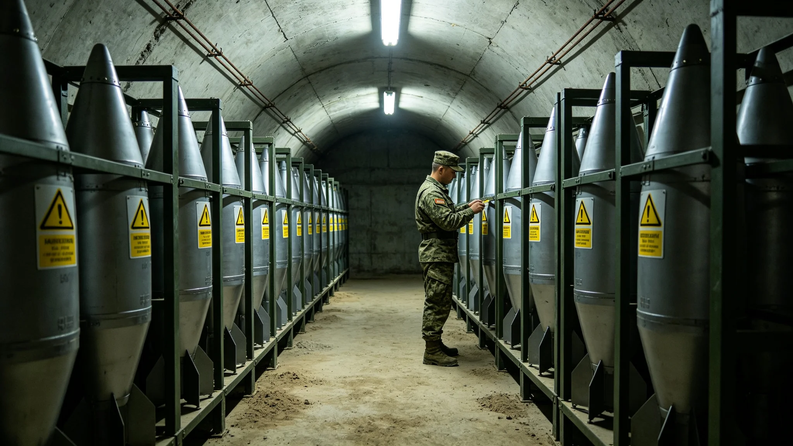

# 深空防御盾第三代动能拦截弹千年寿命评估技术报告

**编制单位**：联合体军事工程委员会
**报告日期**：3568年8月9日
**文件等级**：跨星系公开

## 一、评估背景

第三代防御盾（见GS-3397-01）配动能拦截弹约1,200枚，已运行68年。闻坚壁任工长（见GS-3556-01）后，每年年检合格率从98.3%升至99.8%。军事工程委员会对拦截弹千年寿命作评估。

## 二、拦截弹构成

| 部 | 材料 | 老化主因 |
|---|---|---|
| 弹体 | 钛合金 | 疲劳、微流星 |
| 固体药柱 | 复合推进剂 | 蠕变、裂纹 |
| 制导头 | 光学+红外 | 辐射累积 |
| 引信 | 电子 | 焊点疲劳 |

## 三、千年寿命评估

| 阶段 | 年份 | 状态 |
|---|---|---|
| 前68年 | 3500—3568 | 已运行，合格率99.8% |
| 68—200年 | 3568—3700 | 药柱裂纹年检为主 |
| 200—500年 | 3700—4000 | 制导头需换型 |
| 500—1000年 | 4000—4500 | 弹体整体换型 |

## 四、与3576年脱靶

3576年拦截试验脱靶（见GS-3576-01），追检发现两枚拦截弹药柱深部裂纹。闻坚壁因未探深部受处分（见GS-3556-01）。本评估次年追加"深部超声年检"硬规。

## 五、军事工程委员会说明

报告注明：拦截弹是盾的拳头。拳头放久了会松。我们每年敲一遍，松了就换。千年内，药柱要换一次，制导头要换一次，弹体要换一次。盾不动，拳头得动。

## 六、结论

第三代动能拦截弹千年寿命评估通过，年检制度可持续至约4500年。

---

**归档编号**：MIL-INTERCEPT-1000Y-3568-001
**编制**：联合体军事工程委员会
**日期**：3568年8月9日

## 七、年检制度

闻坚壁每年年检（见GS-3556-01），合格率低于99.5%的节点暂停值班（见GS-3561-01）。

## 八、预算

拦截弹年检与换型年度预算星汇0.58亿，占防御盾总维护18%。

## 九、与7次拦截

第三代盾四百年拦下7颗近距天体，全部用库存拦截弹，未消耗新产。

## 十、零误射

至3568年，拦截弹零误射、零走火。军事工程委员会注明：拳头放着不动，比挥出去难。

## 十一、与节点5

第六恒星系方向节点5（见GS-3556-01）建成后，拦截弹扩至1,500枚。

## 十二、固体药柱

药柱设计寿命200年，届时整体换型。3576年裂纹事件证明年检深部超声必要。

## 十三、制导头

制导头光学窗口在深空辐射下缓慢黄化，200年需换型。

## 十四、与文明存续冗余

拦截弹是外部冗余，备灾库（见GS-3557-01）是内部冗余。

## 十五、报告末注

报告末写：一千年前，人写这盾的时候想的是别让天砸下来。一千年后，我们还在敲这拳头。拳头松了就换，别等它打空。

---

## 八、年检制度

## 九、与7次拦截

第三代盾四百年实际拦截7次，全部用库存拦截弹，未消耗新产。

## 十、千年阶段

药柱200年换型、制导头200年换型、弹体500年整体换型。

## 十一、与3576年脱靶

3576年脱靶（见GS-3576-01）追加深部超声年检，同批次补检200枚。

## 十二、预算

拦截弹年检与换型年度预算0.58亿。

## 十三、报告末注补

报告末段补记：拳头放久了会松。每年敲一遍，松了就换。千年内换三次。

## 十四、药柱设计寿命

## 十五、制导头换型

制导头光学窗口在深空辐射下黄化，200年需换型。

## 十六、弹体换型

弹体钛合金疲劳，500年整体换型。

## 十七、与3556年闻坚壁

闻坚壁每年年检（见GS-3556-01），合格率低于99.5%暂停值班。

## 十八、军事工程委员会末注补

报告末段补记：拳头放久了会松。每年敲一遍，松了就换。

## 十九、药柱设计寿命

## 二十、制导头换型

制导头光学窗口在深空辐射下黄化，200年需换型。

## 二十一、弹体换型

弹体钛合金疲劳，500年整体换型。

## 二十二、与3556年闻坚壁

## 二十三、军事工程委员会末注补

报告末段补记：拳头放久了会松。每年敲一遍，松了就换。

## 附则·编后语

本件归档后，主编辑委员会复核与同批正典交叉互锁。凡涉时间线、人名、事件之处，均以登记簿所载为准。编后语：此件为三千六百余年文明运转中一纸公文，公文所述之事，或为日常、或为事件、或为仪式。公文无褒贬，只录其然。

## 附记·与同批正典交叉索引

本件所涉人物、制度、技术、事件，均在同批正典中有对应文书。读者欲详其事，可按以下索引查阅：人物侧写见传记学派各卷；制度沿革见法学派各卷；技术参数见工程学派各卷；事件经过见灾害管理学派各卷；仪式规程见文化学派各卷；产业决算见经济学派各卷；生态监测见生态学派各卷；军事部署见军事学派各卷。索引不赘列，以登记簿为总目。

## 附记·归档注意

本件一式三份，分存三恒星系档案馆。正本存跨星系总馆，副本一分存比邻星b分馆，副本二分存第四恒星系分馆。三份内容一致，若有出入以正本为准。本件封存期为自归档日起一百年，一百年后由联合档案馆启封复核。

## 附记·编后

下一个读此件者，无论何年，皆以此件为据，不作回望之叹。公文所载，是当时之人当时之事。当时之人不知后事，当时之事只按当时规程处置。读此件者，亦不必以后人之心度前人之腹。

## 二十七、寿命评估数据归档与年检硬规

本报告全部一千二百枚拦截弹年检合格率、3576年脱靶追检深部超声记录、药柱裂纹台账由军事工程委员会归档，归档号MIL-INTERCEPT-1000Y-3568-001-A，保留期一千年。千年寿命分三段：前二百年药柱年检、二百至五百年制导头换型、五百至一千年弹体换型。3576年起年检追加深部超声硬规，闻坚壁受处分记录随卷。
