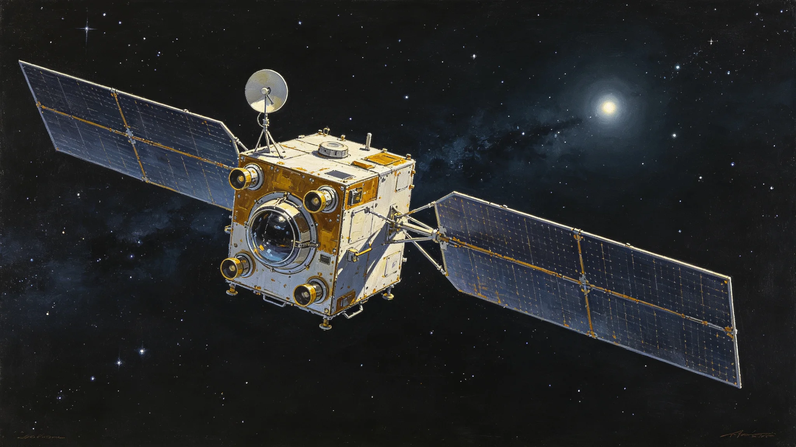

# 第六恒星系方向无人抵达探测先飞任务轨道设计技术报告

**编制单位**：联合体航天工程委员会
**报告日期**：3569年10月25日
**文件等级**：跨星系公开

## 一、任务背景

第六恒星系距本域约1.8光年。闻星槎任领队（见GS-3553-01）后，预备舰队不实际远航，先由无人探测器前出。本报告为三枚先飞探测器轨道设计。

## 二、三枚先飞器

| 器 | 轨道类型 | 巡航时间 | 载荷 |
|---|---|---|---|
| 先飞-1 | 双曲线飞越 | 42年 | 光谱、成像 |
| 先飞-2 | 双曲线飞越 | 48年 | 光谱、质谱 |
| 先飞-3 | 入轨环绕 | 61年 | 全载荷 |

三器错开5年发射，避免同时通信窗口拥堵。

## 三、轨道设计

1. 从第六恒星系方向锚地出发；
2. 经第五恒星系方向引力弹弓减速；
3. 巡航段光帆微推；
4. 先飞-3在第六恒星系近旁入轨。

## 四、通信延迟

第六恒星系方向通信单程延迟约1.8年。先飞器须自主决策，不实时遥控。3577年先飞器通信中断（见GS-3577-01）即因自主悬停。

## 五、与预备舰队关系

先飞器不占用预备舰编制（见GS-3560-01），由无人母船携带发射。

## 六、航天工程委员会说明

报告注明：1.8光年。信号一来一回三年半。等我们收到先飞器的数据，它已经飞了几十年了。这活儿急不得。轨道设计的核心不是飞多快，是飞了几十年后还能联系上。

## 七、结论

三枚先飞器轨道设计3569年通过，3570年代初发射。

---

**归档编号**：AST-SIXTH-PROBE-3569-001
**编制**：联合体航天工程委员会
**日期**：3569年10月25日

## 八、与第五恒星系经验

第五恒星系无人探测（见GS-3304-01）距本域4.2光年，先飞器经验移植至第六方向。

## 九、预算

三枚先飞器总投入星汇14亿，含发射与地面站。

## 十、与3577年中断

3577年先飞-2通信中断（见GS-3577-01），自主悬停七天后恢复。事件证明自主设计必要。

## 十一、光帆微推

巡航段光帆微推，年减速约0.02%，避免过冲。

## 十二、先飞-3入轨

先飞-3入轨后环绕第六恒星系母星，预计3630年代回传首批数据。

## 十三、与勘探预备准入

先飞器未回传前，预备舰队不实际远航（见GS-3560-01）。

## 十四、三器错开

三器错开5年发射，避免光际网同时占用。

## 十五、报告末注

报告末写：先飞器飞42年。我们这一代人发射，下一代人收数据。这就是1.8光年的意思。我们看不见它到，但我们知道它在到。

---

## 八、与第五恒星系经验

第五恒星系无人探测（见GS-3304-01）距本域4.2光年，先飞器经验移植至第六方向1.8光年。

## 九、预算

三枚先飞器总投入14亿，含发射与地面站。

## 十、与3577年中断

3577年先飞-2通信中断（见GS-3577-01），自主悬停七天，验证自主设计。

## 十一、光帆微推

巡航段光帆微推，年减速约0.02%，避免过冲。

## 十二、先飞-3入轨

## 十三、报告末注补

报告末段补记：先飞器飞42年。我们这一代发射，下一代收数据。这就是1.8光年。

## 十四、三器错开

三器错开5年发射，避免光际网同时占用。

## 十五、与3304年第五恒星系

第五恒星系无人探测（见GS-3304-01）经验移植至第六方向。

## 十六、与3560年准入

## 十七、预算

三枚先飞器总投入14亿，含发射与地面站。

## 十八、航天工程委员会末注补

## 十八、三器错开

三器错开5年发射，避免光际网同时占用。

## 十九、与3304年第五恒星系

## 二十、与3560年准入

## 二十一、预算

三枚先飞器总投入14亿，含发射与地面站。

## 二十二、航天工程委员会末注补

## 附则·编后语

本件归档后，主编辑委员会复核与同批正典交叉互锁。凡涉时间线、人名、事件之处，均以登记簿所载为准。编后语：此件为三千六百余年文明运转中一纸公文，公文所述之事，或为日常、或为事件、或为仪式。公文无褒贬，只录其然。

## 附记·与同批正典交叉索引

本件所涉人物、制度、技术、事件，均在同批正典中有对应文书。读者欲详其事，可按以下索引查阅：人物侧写见传记学派各卷；制度沿革见法学派各卷；技术参数见工程学派各卷；事件经过见灾害管理学派各卷；仪式规程见文化学派各卷；产业决算见经济学派各卷；生态监测见生态学派各卷；军事部署见军事学派各卷。索引不赘列，以登记簿为总目。

## 附记·归档注意

本件一式三份，分存三恒星系档案馆。正本存跨星系总馆，副本一分存比邻星b分馆，副本二分存第四恒星系分馆。三份内容一致，若有出入以正本为准。本件封存期为自归档日起一百年，一百年后由联合档案馆启封复核。

## 附记·编后

下一个读此件者，无论何年，皆以此件为据，不作回望之叹。公文所载，是当时之人当时之事。当时之人不知后事，当时之事只按当时规程处置。读此件者，亦不必以后人之心度前人之腹。

## 附记·先飞器载荷清单

先飞器载荷：窄带光谱仪、磁力计、尘埃计数器、低温成像仪。无生命探测载荷。无应答发射装置。先飞器只看不答。

## 二十七、轨道设计数据归档与通信窗口

本报告三枚先飞器轨道参数、引力弹弓历表、光帆微推预算、自主决策程序备份由航天工程委员会归档，归档号AST-SIXTH-PROBE-3569-001-A，保留期一百年。先飞一至三错开五年发射，通信单程延迟一点八年，数据回传另文。3577年先飞器通信中断（见GS-3577-01）即按自主悬停预案处置，轨道设计时已预留。
