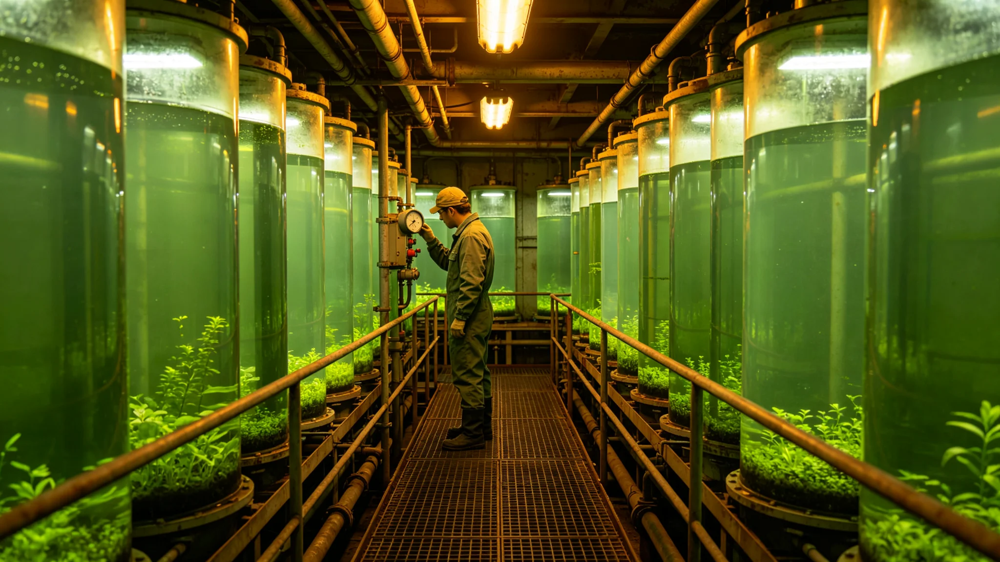

# 世代飞船生态系统第九代闭环菌剂轮换与酶系更新技术报告

**编制单位**：联合体生态工程委员会
**报告日期**：3570年3月11日
**文件等级**：跨星系公开

## 一、技术背景

船上闭环菌剂已历八代。第八代（约3490年代）分解链氨氮波动仍在±12%。叶归根任首席生保工程师（见GS-3555-01）后，生态工程委员会研发第九代菌剂与酶系，3570年定型。

## 二、第九代 vs 第八代

| 项 | 第八代 | 第九代 |
|---|---|---|
| 分解菌活性 | 基准 | 提升1.8倍 |
| 氨氮波动 | ±12% | ±6% |
| 观察期 | 4周 | 6周（硬规，见GS-3563-01） |
| 当季减产 | 基准 | 降50% |
| 本土菌驯化率 | 62% | 78% |

## 三、轮换方法

1. 新菌剂观察舱培养满六周；
2. 三个试验舱小批量入舱两周；
3. 氨氮回稳后批量入舱；
4. 连续四周巡检，签认稳产；
5. 入卷。

## 四、与3578年减产

3578年第5轮轮换减产两成（见GS-3578-01），因叶归根缩短观察期。本报告次年将六周观察期写入硬规（见GS-3563-01）。

## 五、生态工程委员会说明

报告注明：菌看不见，但管着一舱菜。第九代菌活性高了，氨氮稳了。但菌急不得——3578年那次就是急出来的。六周观察期，是用减产两成换来的。

## 六、结论

第九代菌剂3570年定型，随第3轮轮换批量入舱。

---

**归档编号**：ECO-STRAIN-IX-3570-001
**编制**：联合体生态工程委员会
**日期**：3570年3月11日

## 七、预算

第九代菌剂研发与首轮轮换投入星汇2.4亿。

## 八、与水循环膜

水循环膜（见GS-3594-01）与菌剂轮换错开，避免全舱停工。

## 九、与垂直森林

垂直森林冠层（见GS-3592-01）百年大换，菌剂每四年小换。

## 十、授粉群落

授粉昆虫重建（见GS-3593-01）配套第九代伴生菌。

## 十一、本土菌驯化

第九代菌剂中本土菌（异星驯化）占比从22%升至38%，与地球驯化菌混合。

## 十二、与第六恒星系预备

第六方向地球化预备光合藻类（见GS-3591-01）参照第九代菌剂观察期流程。

## 十三、零污染

第九代菌剂3570—3600年零生态位冲突、零污染。

## 十四、分解链稳态

第九代部署后，分解链氨氮波动从±12%收窄至±6%（见GS-3590-01十年监测）。

## 十五、报告末注

报告末写：第九代菌。看不见的东西，换了九次。每一次换，都减产一点——3578年减得多了点。下次换，慢一点。

---

## 七、预算

第九代菌剂研发与首轮轮换投入2.4亿。

## 八、与水循环膜

## 九、与垂直森林

垂直森林冠层百年大换（见GS-3592-01），菌剂每四年小换。

## 十、授粉群落

授粉昆虫重建（见GS-3593-01）配套第九代伴生菌。

## 十一、本土菌驯化

第九代菌剂中本土菌占比从22%升至38%。

## 十二、与3590年十年监测

第九代部署后分解链氨氮波动十年监测（见GS-3590-01）。

## 十三、报告末注补

报告末段补记：第九代菌。看不见的东西换了九次。下次换，慢一点。

## 十四、与3578年减产

## 十五、与3590年十年监测

第九代部署后分解链氨氮波动十年监测（见GS-3590-01），从±12%收窄至±5%。

## 十六、与3594年水循环膜

水循环膜第十代（见GS-3594-01）与菌剂轮换错开，避免全舱停工。

## 十七、本土菌占比

第九代菌剂中本土菌占比38%，地球驯化菌62%。

## 十八、生态工程委员会末注补

## 十九、与3578年减产

## 二十、与3590年十年监测

## 二十一、与3594年水循环膜

## 二十二、本土菌占比

第九代菌剂中本土菌占比38%，地球驯化菌62%。

## 二十三、生态工程委员会末注补

## 附则·编后语

本件归档后，主编辑委员会复核与同批正典交叉互锁。凡涉时间线、人名、事件之处，均以登记簿所载为准。编后语：此件为三千六百余年文明运转中一纸公文，公文所述之事，或为日常、或为事件、或为仪式。公文无褒贬，只录其然。

## 附记·与同批正典交叉索引

本件所涉人物、制度、技术、事件，均在同批正典中有对应文书。读者欲详其事，可按以下索引查阅：人物侧写见传记学派各卷；制度沿革见法学派各卷；技术参数见工程学派各卷；事件经过见灾害管理学派各卷；仪式规程见文化学派各卷；产业决算见经济学派各卷；生态监测见生态学派各卷；军事部署见军事学派各卷。索引不赘列，以登记簿为总目。

## 附记·归档注意

本件一式三份，分存三恒星系档案馆。正本存跨星系总馆，副本一分存比邻星b分馆，副本二分存第四恒星系分馆。三份内容一致，若有出入以正本为准。本件封存期为自归档日起一百年，一百年后由联合档案馆启封复核。

## 附记·编后

下一个读此件者，无论何年，皆以此件为据，不作回望之叹。公文所载，是当时之人当时之事。当时之人不知后事，当时之事只按当时规程处置。读此件者，亦不必以后人之心度前人之腹。

## 附记·菌剂封存备份

第九代菌剂封存备份三份，分存三恒星系档案馆。备份菌剂不经冷藏，经冻干处理，可存放200年。届时启用需重新驯化。

本件归档完毕，与同批正典互锁。
归档编号见登记簿。

## 二十七、第九代菌剂数据归档与观察期硬规

本报告全部第九代菌剂活性测试、氨氮波动记录、试验舱两周观察数据由生态工程委员会归档，归档号ECO-STRAIN-IX-3570-001-A，保留期一百年。六周观察期为硬规（见GS-3563-01），3578年缩短观察期致减产两成事件即按此对照。第九代菌随第三轮轮换批量入舱，稳产签认另卷。本土菌驯化率百分之七十八为基准，不构成后续预期。
