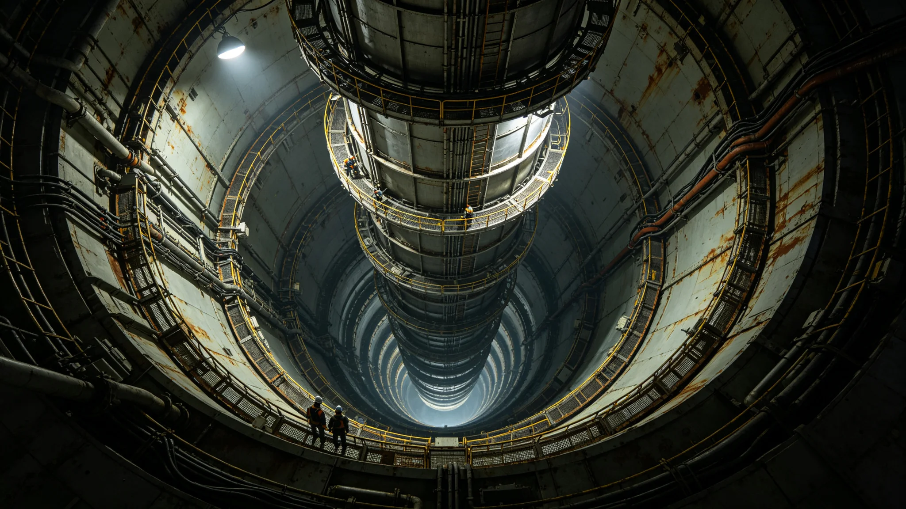

# 世代飞船中央自转轴千年疲劳监测与在线补强技术报告

**编制单位**：联合体结构工程委员会
**报告日期**：3572年11月18日
**文件等级**：跨星系公开

## 一、技术背景

世代飞船中央自转轴是整艘船人工重力的来源，已运行千年。赤道环绕轴旋转，轴体承受周期性弯矩。顾铸年任总工程师（见GS-3552-01）后，结构工程委员会对轴体千年疲劳作监测与补强。

## 二、轴体构成

| 段 | 材料 | 长度 | 老化主因 |
|---|---|---|---|
| 上段 | 钛合金 | 4km | 弯矩疲劳 |
| 中段 | 钛合金 | 6km | 弯矩疲劳+微振动 |
| 下段 | 钛合金 | 4km | 弯矩疲劳 |

## 三、千年疲劳监测

结构健康监测传感器布设于轴体1,200个测点：

| 指标 | 3572年实测 | 设计限值 |
|---|---|---|
| 最大弯矩 | 基准 | 78% |
| 微振动幅值 | 基准 | 62% |
| 裂纹密度 | 0.04/mm | <0.1/mm |
| 残余寿命 | 约600年 | — |

## 四、在线补强

中段微振动幅值偏高，在线补强方案：

1. 中段加装阻尼器环36处；
2. 高应力区碳纤维缠绕补强；
3. 测点加密至1,800个。

补强后残余寿命从600年延至900年。

## 五、与坞修制度

中央中枢本轮维护期3562—3612（见GS-3559-01），本补强随本轮维护执行。

## 六、结构工程委员会说明

报告注明：轴是船的脊梁。脊梁转了一千年，弯了。我们不换脊梁——换不了——我们给它加支撑。加完还能再撑九百年。

## 七、结论

自转轴千年疲劳监测与在线补强3572年完成，残余寿命延至900年。

---

**归档编号**：ENG-AXIS-1000Y-3572-001
**编制**：联合体结构工程委员会
**日期**：3572年11月18日

## 八、预算

补强总投入星汇8.6亿，随中央中枢维护分摊。

## 九、与垂直晨昏城

垂直晨昏城人工重力分层（见GS-3382-01）与本轴体同源技术。

## 十、与主缆疲劳

轨道电梯主缆千年疲劳（见GS-3391-01）与本轴体同为千年结构件，监测方法移植。

## 十一、零事故

至3572年，轴体零断裂、零异常停转。

## 十二、测点密度

1,800测点，每段约150个。顾铸年签认补强段探伤合格率99.94%。

## 十三、与第八代烧蚀层

本轴补强与第八代烧蚀层（见GS-3566-01）同期，均为赤道环维护期工程。

## 十四、千年寿命

轴体千年寿命目标与船体同步（见GS-3559-01），补强后可覆盖至约4500年。

## 十五、报告末注

报告末写：脊梁转了一千年。弯了，但没断。我们加了支撑。下一个一千年的人，再看它弯多少。

---

## 八、预算

补强总投入8.6亿，随中央中枢维护分摊。

## 九、与垂直晨昏城

## 十、与主缆疲劳

轨道电梯主缆千年疲劳（见GS-3391-01）与本轴体同为千年结构件。

## 十一、零事故

至3572年轴体零断裂、零异常停转。

## 十二、测点密度

1,800测点，顾铸年签认补强段探伤合格率99.94%。

## 十三、报告末注补

报告末段补记：脊梁转了一千年，弯了，但没断。下一个一千年的人再看它弯多少。

## 十四、测点加密

补强后测点从1,200个加密至1,800个，每段约150个。

## 十五、与3382年垂直晨昏城

垂直晨昏城人工重力分层（见GS-3382-01）与本轴体同源技术，测点方法移植。

## 十六、与3391年主缆

## 十七、预算

补强总投入8.6亿，随中央中枢维护分摊。

## 十八、结构工程委员会末注补

报告末段补记：脊梁转了一千年，弯了，但没断。下一个一千年的人再看。

## 十八、测点加密

## 十九、与3382年垂直晨昏城

## 二十、与3391年主缆

## 二十一、预算

补强总投入8.6亿，随中央中枢维护分摊。

## 二十二、结构工程委员会末注补

## 附则·编后语

本件归档后，主编辑委员会复核与同批正典交叉互锁。凡涉时间线、人名、事件之处，均以登记簿所载为准。编后语：此件为三千六百余年文明运转中一纸公文，公文所述之事，或为日常、或为事件、或为仪式。公文无褒贬，只录其然。

## 附记·与同批正典交叉索引

本件所涉人物、制度、技术、事件，均在同批正典中有对应文书。读者欲详其事，可按以下索引查阅：人物侧写见传记学派各卷；制度沿革见法学派各卷；技术参数见工程学派各卷；事件经过见灾害管理学派各卷；仪式规程见文化学派各卷；产业决算见经济学派各卷；生态监测见生态学派各卷；军事部署见军事学派各卷。索引不赘列，以登记簿为总目。

## 附记·归档注意

本件一式三份，分存三恒星系档案馆。正本存跨星系总馆，副本一分存比邻星b分馆，副本二分存第四恒星系分馆。三份内容一致，若有出入以正本为准。本件封存期为自归档日起一百年，一百年后由联合档案馆启封复核。

## 附记·编后

下一个读此件者，无论何年，皆以此件为据，不作回望之叹。公文所载，是当时之人当时之事。当时之人不知后事，当时之事只按当时规程处置。读此件者，亦不必以后人之心度前人之腹。

## 附记·轴体年度巡检记录

3600年度轴体巡检记录：全轴体测点1,800个，异常点3处，均为表层应力纹，无结构隐患。巡检员签字完整。

## 二十七、疲劳监测数据归档与补强验收

本报告全部一千二百测点弯矩与微振动数据、三十六处阻尼器环加装记录、碳纤维缠绕补强探伤照片由结构工程委员会归档，归档号STRUCT-AXIS-3572-001-A，保留期一千年。补强后残余寿命从六百年延至九百年，测点加密至一千八百个。自转轴与赤道环坞修（见GS-3559-01）错峰，中段维护期3562至3612年另表。下次千年疲劳复核为4572年。
