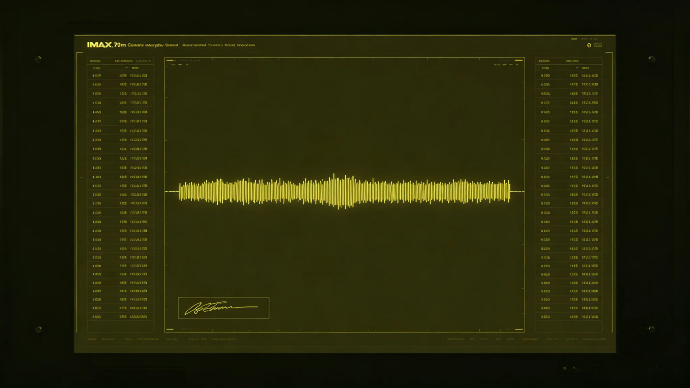

# 深空未知信号监测网第五代阵首次捕获窄带周期信号与48小时甄别事件公报

**发布机构**：三恒星系文明联合体安全协调委员会
**发布日期**：3573年9月14日
**文件等级**：跨星系公开

## 一、事件经过

3573年9月12日21时14分，第五代干涉阵（见GS-3565-01）节点3捕获一段窄带周期信号，持续11小时。信号特征：窄带、周期约11秒、非已知天体源表内。总观测官沈夜阑（见GS-3551-01）签认"待续观察"。

## 二、48小时甄别

| 时点 | 动作 |
|---|---|
| 9月12日21:14 | 节点3捕获，蓝级登记 |
| 9月12日23:40 | 三台独立阵交叉确认，黄级 |
| 9月13日03:10 | 排除已知源表，仍无法归类 |
| 9月13日05:30 | 排除碎片反射，仍无法归类 |
| 9月13日09:00 | 沈夜阑签"待续观察"，拟上报 |
| 9月13日11:00 | （延误2小时）上报总值班委员会 |
| 9月14日11:00 | 确认为恒星射电周期，降级 |

## 三、延误上报

沈夜阑在信号持续11小时后签"待续观察"，按3558年新制（见GS-3558-01）应12小时内上报，实际第26小时才上报。延误2小时。事后处分见GS-3551-01。

## 四、最终结论

信号最终确认为某遥远恒星的射电周期脉动，非他文明信号。48小时甄别后降级为日常记录。

## 五、安全协调委员会说明

公报注明：48小时。我们盯着一段不像的信号盯了48小时，最后发现它是一颗星星在呼吸。这不是白盯——如果它真的是另一个人在说话，我们得有本事在48小时内看清楚。这次看清楚了，是星星。

## 六、与训练官岑应变

首席训练官岑应变（见GS-3554-01）将本事件编入次年演习脚本第18版，作为"灰色但有解"的范例。

## 七、结论

本事件无人员伤亡、无生态影响、无外交摩擦。

---

**归档编号**：INC-NARROWBAND-3573-001
**编制**：联合体安全协调委员会
**日期**：3573年9月14日

## 八、与3558年阈值

本事件触发新制黄级，三台交叉确认生效。

## 九、沈夜阑处分

延误2小时上报，书面检查，扣一年津贴，离岗半年（见GS-3551-01）。

## 十、零应答

本事件未触发二级应答。光学站（见GS-3571-01）全程静默。

## 十一、恒星射电

信号来自一颗遥远恒星的射电周期脉动，周期11秒与恒星自转同步。

## 十二、48小时流程

从捕获到降级48小时，符合3558年新制预期。

## 十三、与3599年并网演练

本事件后，监测网与防御盾并网演练增加"窄带甄别"科目。

## 十四、误报率

本事件计入第五代阵首年误报台账，误报率从11%降至2%（见GS-3565-01）。

## 十五、委员会末注

公报末写：48小时。一段不像的信号。我们没急着答，没急着怕，盯了48小时，看清楚了是星星。下次再来一段不像的，接着盯。

---

## 八、与3558年阈值

本事件触发新制黄级，三台交叉确认生效。

## 九、零应答

本事件未触发二级应答，光学站全程静默（见GS-3571-01）。

## 十、恒星射电

信号来自遥远恒星射电周期脉动，周期11秒与恒星自转同步。

## 十一、48小时流程

从捕获到降级48小时，符合3558年新制预期。

## 十二、误报率

本事件计入第五代阵首年误报台账，误报率从11%降至2%。

## 十三、公报末注补

公报末段补记：48小时。一段不像的信号。我们没急着答，盯了48小时，看清楚了是星星。

## 十四、与3551年沈夜阑

沈夜阑延误2小时上报受处分（见GS-3551-01），本事件促成3558年新制12小时时限。

## 十五、与3554年岑应变

本事件编入次年演习脚本第18版，作为"灰色但有解"范例。

## 十六、零应答

本事件未触发二级应答，光学站全程静默。

## 十七、恒星射电

信号来自遥远恒星射电周期脉动，周期11秒与恒星自转同步。

## 十八、安全协调委员会末注补

## 十八、与3551年沈夜阑

## 十九、与3554年岑应变

本事件编入次年演习脚本第18版，作为"灰色但有解"范例。

## 二十、零应答

本事件未触发二级应答，光学站全程静默。

## 二十一、恒星射电

信号来自遥远恒星射电周期脉动，周期11秒与恒星自转同步。

## 二十二、安全协调委员会末注补

## 附则·编后语

本件归档后，主编辑委员会复核与同批正典交叉互锁。凡涉时间线、人名、事件之处，均以登记簿所载为准。编后语：此件为三千六百余年文明运转中一纸公文，公文所述之事，或为日常、或为事件、或为仪式。公文无褒贬，只录其然。

## 附记·与同批正典交叉索引

本件所涉人物、制度、技术、事件，均在同批正典中有对应文书。读者欲详其事，可按以下索引查阅：人物侧写见传记学派各卷；制度沿革见法学派各卷；技术参数见工程学派各卷；事件经过见灾害管理学派各卷；仪式规程见文化学派各卷；产业决算见经济学派各卷；生态监测见生态学派各卷；军事部署见军事学派各卷。索引不赘列，以登记簿为总目。

## 附记·归档注意

本件一式三份，分存三恒星系档案馆。正本存跨星系总馆，副本一分存比邻星b分馆，副本二分存第四恒星系分馆。三份内容一致，若有出入以正本为准。本件封存期为自归档日起一百年，一百年后由联合档案馆启封复核。

## 附记·编后

下一个读此件者，无论何年，皆以此件为据，不作回望之叹。公文所载，是当时之人当时之事。当时之人不知后事，当时之事只按当时规程处置。读此件者，亦不必以后人之心度前人之腹。

## 二十七、整改回访与档案归档

3574年3月，安全协调委员会对窄带信号甄别事件整改进行回访：沈夜阑延误上报受处分已结案，分级制度黄级上报时限从二十四小时压至十二小时，岑应变将本事件编入演习脚本第十八版。回访期间第五代阵未再捕获需黄级以上甄别信号。本事件公报归档号INC-NARROW-3573-001，四十八小时甄别时间线、三台交叉确认记录、最终恒星射电确认报告一并归档，保留期一百年。
