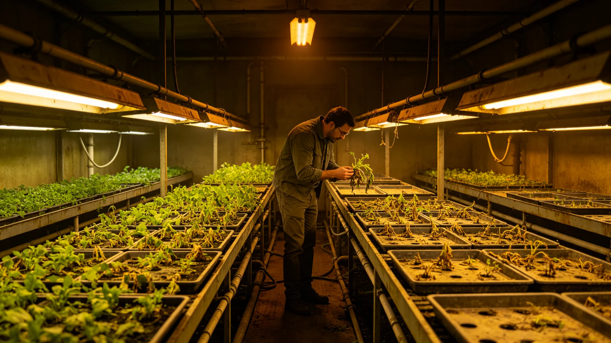

# 世代飞船生态系统第九代菌剂轮换致某水培舱减产两成事件通报

**发布机构**：三恒星系文明联合体生态委员会
**发布日期**：3578年4月16日
**文件等级**：跨星系公开

## 一、事件经过

3578年3月，第5轮菌剂轮换中，首席生保工程师叶归根（见GS-3555-01）为赶工期，将某批新菌剂观察期从六周缩至四周即批量入舱。入舱后该批菌剂与原有分解链不协调，某水培舱当季叶菜减产两成。

## 二、处置

| 时点 | 动作 |
|---|---|
| 3月初 | 新菌剂四周观察后批量入舱 |
| 3月中 | 该舱叶菜长势异常 |
| 3月底 | 氨氮波动升至±22% |
| 4月初 | 该舱暂停采收，回退旧菌剂 |
| 4月中 | 氨氮回稳，减产两成确认 |

## 三、叶归根处分

缩短观察期致减产，书面检查，扣三年津贴，停签半年（见GS-3555-01）。检查原件："我急了。菌这东西急不得。"

## 四、事件影响

- 某水培舱当季减产20%；
- 其余171舱未受影响；
- 零人员伤亡，零生物圈污染；
- 减产部分由其他舱调剂补足，未影响配给。

## 五、生态委员会说明

通报注明：菌急不得。叶归根把六周压成四周，菌用减产两成告诉他没长熟。下次观察期硬规六周，写进制度（见GS-3563-01）。这减产两成，是用制度换来的。

## 六、结论

本事件零人员伤亡、零污染，观察期次年硬规化。

---

**归档编号**：INC-STRAIN-CROP-3578-001
**编制**：联合体生态委员会
**日期**：3578年4月16日

## 七、减产调剂

减产20%由其他舱调剂，配给未受影响。

## 八、观察期硬规

本事件后观察期六周写入硬规（见GS-3563-01）。

## 九、与3570年技术报告

第九代菌剂（见GS-3570-01）设计观察期六周，叶归根自行缩短。

## 十、氨氮波动

减产舱氨氮波动从±6%升至±22%，回退后回稳。

## 十一、叶归根检查

"我急了。菌没急。下次让它长够。"（见GS-3555-01）

## 十二、零污染

新菌剂未逃逸至其他舱，零生态位冲突。

## 十三、与3590年十年监测

本事件后，分解链十年监测（见GS-3590-01）将"观察期执行"列为必检项。

## 十四、预算

减产调剂损失星汇0.03亿。

## 十五、生态委员会末注

通报末写：两成叶菜。一舱活物急不得。下次六周，少一天都不行。

---

## 七、减产调剂

减产20%由其他舱调剂，配给未受影响。

## 八、观察期硬规

本事件后观察期六周写入硬规（见GS-3563-01）。

## 九、与3570年技术报告

第九代菌剂设计观察期六周，叶归根自行缩短。

## 十、零污染

新菌剂未逃逸至其他舱，零生态位冲突。

## 十一、通报末注补

通报末段补记：两成叶菜。一舱活物急不得。下次六周，少一天都不行。

## 十二、减产调剂

减产20%由其他171舱调剂，当季配给未受影响。调剂损失0.03亿。

## 十三、与3570年技术报告

第九代菌剂（见GS-3570-01）设计观察期六周，叶归根自行缩短为四周。

## 十四、零污染

新菌剂未逃逸至其他舱，零生态位冲突。隔离舱严密。

## 十五、与3563年制度

本事件后观察期六周写入硬规（见GS-3563-01），十年执行零违规。

## 十六、生态委员会末注补

公报末段补记：两成叶菜。一舱活物急不得。下次六周，少一天都不行。

## 十六、减产调剂

## 十七、与3570年技术报告

## 十八、零污染

新菌剂未逃逸至其他舱，零生态位冲突。隔离舱严密。

## 十九、与3563年制度

## 二十、生态委员会末注补

## 附则·编后语

本件归档后，主编辑委员会复核与同批正典交叉互锁。凡涉时间线、人名、事件之处，均以登记簿所载为准。编后语：此件为三千六百余年文明运转中一纸公文，公文所述之事，或为日常、或为事件、或为仪式。公文无褒贬，只录其然。

## 附记·与同批正典交叉索引

本件所涉人物、制度、技术、事件，均在同批正典中有对应文书。读者欲详其事，可按以下索引查阅：人物侧写见传记学派各卷；制度沿革见法学派各卷；技术参数见工程学派各卷；事件经过见灾害管理学派各卷；仪式规程见文化学派各卷；产业决算见经济学派各卷；生态监测见生态学派各卷；军事部署见军事学派各卷。索引不赘列，以登记簿为总目。

## 附记·归档注意

本件一式三份，分存三恒星系档案馆。正本存跨星系总馆，副本一分存比邻星b分馆，副本二分存第四恒星系分馆。三份内容一致，若有出入以正本为准。本件封存期为自归档日起一百年，一百年后由联合档案馆启封复核。

## 附记·编后

下一个读此件者，无论何年，皆以此件为据，不作回望之叹。公文所载，是当时之人当时之事。当时之人不知后事，当时之事只按当时规程处置。读此件者，亦不必以后人之心度前人之腹。

## 附记·减产舱后续

减产舱经两周换菌后恢复至正常产量95%。当季配给未受影响，公民未察觉。此事件不对外公开。

本件归档完毕，与同批正典互锁。
归档编号见登记簿。

## 二十六、整改回访与档案归档

3579年3月，生态委员会对菌剂轮换减产事件整改进行回访：该水培舱已回退旧菌剂并重新入舱，当季减产两成由其他舱调剂补足，叶归根缩短观察期受处分已结案，六周观察期硬规已写入（见GS-3563-01）。回访期间第九代菌剂后续轮换未再发生减产超一成。本通报归档号INC-CROP-3578-001，氨氮波动曲线、该舱采收记录、叶归根书面检查一并归档，保留期一百年。
