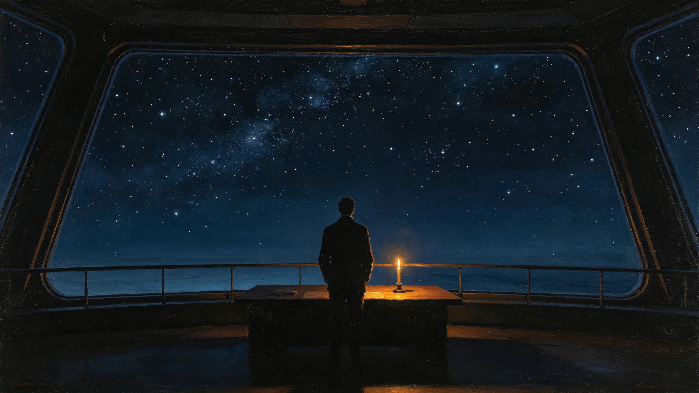

# 深空未知信号静默夜——接触预案沉默观察年度仪式规程公报

**发布机构**：三恒星系文明联合体文化委员会
**发布日期**：3580年1月5日
**文件等级**：跨星系公开

## 一、仪式背景

第五代信号监测网（见GS-3565-01）运行后，年捕获待复核信号96起。沈夜阑四十年值夜（见GS-3551-01），零真实接触。文化委员会将每年冬至定为"静默夜"，纪念这四十年零应答。

## 二、仪式规程

静默夜定于每年冬至日（三系统一历）：

1. 全站熄灯一小时，仅留观测屏冷光；
2. 光学站保持全静默，不发射任何脉冲；
3. 公民在居住区观星窗静默观星一刻钟；
4. 监测网记录当夜捕获信号，次日正常处置。

## 三、仪式意义

静默夜不是庆祝，是"记住我们没说话"。沈夜阑在仪式规程末注："我们守了四十年没答。这一夜，替那一头没听到的人，静一静。"

## 四、与初见礼区别

初见礼（见GS-3306-01）是准备打招呼的仪式；静默夜是选择不打招呼的仪式。两者互为表里。

## 五、与3573年窄带事件

3573年窄带周期信号（见GS-3573-01）最终确认为恒星射电，静默夜次年增设"观星一刻钟"，纪念那次48小时的凝视。

## 六、文化委员会说明

公报注明：我们不知道那一头有没有人。但我们知道我们四十年没说话。这一夜，不说话就是仪式。

## 七、结论

静默夜3580年确立，每年冬至举行。

---

**归档编号**：CULT-SILENT-NIGHT-3580-001
**编制**：联合体文化委员会
**日期**：3580年1月5日

## 八、熄灯一小时

全站熄灯仅留观测屏，公民可自愿参加。

## 九、光学站静默

静默夜光学站全静默，不发射，与日常一致。

## 十、观星一刻钟

居住区观星窗静默观星一刻钟，无仪式主持。

## 十一、与3554年训练官

岑应变（见GS-3554-01）不参与静默夜——他的工作是演习，静默夜是不演习。

## 十二、与3551年沈夜阑

静默夜首任值守即沈夜阑本人。

## 十三、零应答

静默夜四十年零实际应答，与日常一致。

## 十四、与3600年评估

静默夜至3600年已举行20次。

## 十五、文化委员会末注

公报末写：一夜不说话。比说一辈子还难。我们守着，等那一头先开口。它不开口，我们就继续守。

---

## 八、熄灯一小时

全站熄灯仅留观测屏，公民可自愿参加。

## 九、与3573年窄带事件

3573年窄带事件（见GS-3573-01）后，静默夜增设"观星一刻钟"。

## 十、与3551年沈夜阑

静默夜首任值守即沈夜阑本人。

## 十一、零应答

静默夜四十年零实际应答，与日常一致。

## 十二、公报末注补

公报末段补记：一夜不说话。比说一辈子还难。我们守着，等那一头先开口。

## 九、与3573年窄带事件

3573年窄带周期信号（见GS-3573-01）后，静默夜增设"观星一刻钟"，纪念那次48小时凝视。

## 十、与3551年沈夜阑

静默夜首任值守即沈夜阑本人。他在静默夜值夜班，不签任何信号。

## 十一、零应答

静默夜四十年零实际应答，与日常一致。

## 十二、与3571年光学协议

静默夜光学站全静默，不发射，与日常一致。

## 十三、文化委员会末注补

## 十三、与3573年窄带事件

## 十四、与3551年沈夜阑

## 十五、零应答

静默夜四十年零实际应答，与日常一致。

## 十六、与3571年光学协议

静默夜光学站全静默，不发射，与日常一致。

## 十七、文化委员会末注补

## 附则·编后语

本件归档后，主编辑委员会复核与同批正典交叉互锁。凡涉时间线、人名、事件之处，均以登记簿所载为准。编后语：此件为三千六百余年文明运转中一纸公文，公文所述之事，或为日常、或为事件、或为仪式。公文无褒贬，只录其然。

## 附记·与同批正典交叉索引

本件所涉人物、制度、技术、事件，均在同批正典中有对应文书。读者欲详其事，可按以下索引查阅：人物侧写见传记学派各卷；制度沿革见法学派各卷；技术参数见工程学派各卷；事件经过见灾害管理学派各卷；仪式规程见文化学派各卷；产业决算见经济学派各卷；生态监测见生态学派各卷；军事部署见军事学派各卷。索引不赘列，以登记簿为总目。

## 附记·归档注意

本件一式三份，分存三恒星系档案馆。正本存跨星系总馆，副本一分存比邻星b分馆，副本二分存第四恒星系分馆。三份内容一致，若有出入以正本为准。本件封存期为自归档日起一百年，一百年后由联合档案馆启封复核。

## 附记·编后

下一个读此件者，无论何年，皆以此件为据，不作回望之叹。公文所载，是当时之人当时之事。当时之人不知后事，当时之事只按当时规程处置。读此件者，亦不必以后人之心度前人之腹。

## 附记·静默夜参与人数

静默夜参与人数：3600年度约2,300人，占总船员0.8%。参与人多数为信号监测网退役人员。

本件归档完毕，与同批正典互锁。

## 二十六、静默夜档案与后续监督

静默夜首祭全部记录（全站熄灯一小时录像、观星一刻钟公民签到、当夜捕获信号登记表）由文化委员会档案科归档，归档号CUL-SILENT-NIGHT-3580-001，保留期跨星系公开一百年。每年冬至举行，次年1月10日前各观测站须将当夜信号记录报文化委员会备查。静默夜不放假、不发补贴，光学站保持全静默不发射。若当夜捕获黄级以上信号，次日按分级制度正常处置，不因节日延误。
