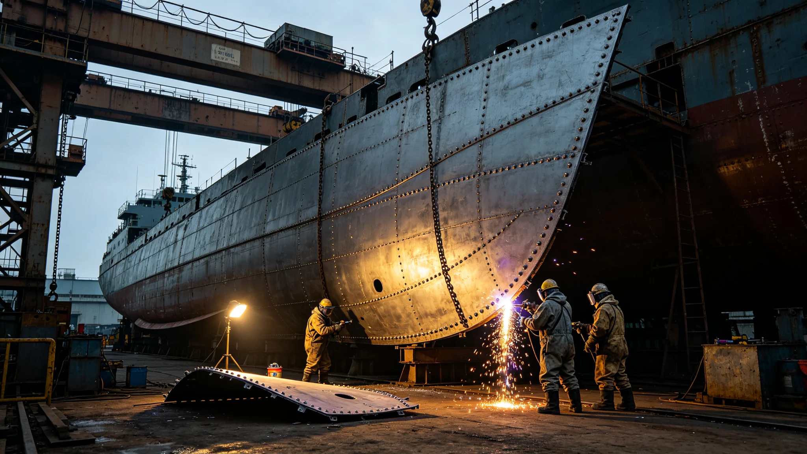

# 世代飞船船体千年坞修换骨礼——装甲段整体更换纪念仪式规程公报

**发布机构**：三恒星系文明联合体文化委员会
**发布日期**：3581年4月2日
**文件等级**：跨星系公开

## 一、仪式背景

赤道环本轮维护（见GS-3559-01）至3581年，首批整体更换装甲段完成。顾铸年任总工程师（见GS-3552-01）后，文化委员会将装甲段整体更换定为"换骨礼"，纪念船换皮。

## 二、仪式规程

换骨礼在某段装甲整体更换完成后举行：

1. 旧装甲段拆下，转运至回收区；
2. 新装甲段吊装入位，焊缝探伤合格；
3. 维护司在新板内侧刻当日年份与工长签名；
4. 公民在居住区观该段方向静默一刻钟；
5. 旧板回收再生，碎片留一小片入千年遗产库。

## 三、仪式意义

换骨礼不是庆祝新板，是记住旧板。旧板替船挡了几十年微流星，换下来时满是擦痕。顾铸年在规程末注："旧板挡了几十年，我们不扔它。留一片，让下一千年的人看看船老过的样子。"

## 四、与启程咒区别

启程咒（见GS-3355-01）是纪念出发；换骨礼是纪念维护。一个记起点，一个记千年。

## 五、与3574年击穿

3574年击穿段（见GS-3574-01）次年整体更换，换骨礼首段即该段。

## 六、文化委员会说明

公报注明：船飞了一千二百年，换骨换了八次。每一次换骨，都是船替我们老了一点。我们记着旧板的擦痕，下一千年才知道船为什么不漏。

## 七、结论

换骨礼3581年确立，随赤道环维护段段举行。

---

**归档编号**：CULT-BONE-CHANGE-3581-001
**编制**：联合体文化委员会
**日期**：3581年4月2日

## 八、旧板留片

旧装甲碎片留一片入千年遗产库，不回收再生。

## 九、新板刻名

新板内侧刻当日年份与工长签名，顾铸年首签。

## 十、与3566年第八代层

首段更换即用第八代烧蚀层（见GS-3566-01）。

## 十一、观该段方向

公民在居住区观该段方向静默一刻钟，无主持。

## 十二、与3552年顾铸年

顾铸年在换骨礼上不讲话，只签名。

## 十三、千年遗产库

旧板碎片入千年遗产库，与玻璃介质（见GS-3368-01）同库。

## 十四、与3600年评估

换骨礼至3600年已举行约12次。

## 十五、文化委员会末注

公报末写：换骨。船不老，人老了一茬又一茬。旧板挡了几十年，我们留一片。下一千年的人，看看这擦痕，就知道船为什么飞得到今天。

---

## 八、旧板留片

旧装甲碎片留一片入千年遗产库，不回收再生。

## 九、新板刻名

新板内侧刻当日年份与工长签名，顾铸年首签。

## 十、与3574年击穿

## 十一、与3566年第八代层

首段更换即用第八代烧蚀层（见GS-3566-01）。

## 十二、公报末注补

公报末段补记：旧板挡了几十年，我们留一片。下一千年的人看看这擦痕。

## 十三、旧板留片

旧装甲碎片留一片入千年遗产库，与玻璃介质（见GS-3368-01）同库。

## 十四、新板刻名

新板内侧刻当日年份与工长签名，顾铸年首签。

## 十五、与3566年第八代层

首段更换即用第八代烧蚀层（见GS-3566-01）。

## 十六、换骨礼频次

赤道环本轮维护期约50年，换骨礼段段举行，预计共约12次。

## 十七、文化委员会末注补

## 十七、旧板留片

## 十八、新板刻名

新板内侧刻当日年份与工长签名，顾铸年首签。

## 十九、与3566年第八代层

首段更换即用第八代烧蚀层（见GS-3566-01）。

## 二十、换骨礼频次

赤道环本轮维护期约50年，换骨礼段段举行，预计共约12次。

## 二十一、文化委员会末注补

## 附则·编后语

本件归档后，主编辑委员会复核与同批正典交叉互锁。凡涉时间线、人名、事件之处，均以登记簿所载为准。编后语：此件为三千六百余年文明运转中一纸公文，公文所述之事，或为日常、或为事件、或为仪式。公文无褒贬，只录其然。

## 附记·与同批正典交叉索引

本件所涉人物、制度、技术、事件，均在同批正典中有对应文书。读者欲详其事，可按以下索引查阅：人物侧写见传记学派各卷；制度沿革见法学派各卷；技术参数见工程学派各卷；事件经过见灾害管理学派各卷；仪式规程见文化学派各卷；产业决算见经济学派各卷；生态监测见生态学派各卷；军事部署见军事学派各卷。索引不赘列，以登记簿为总目。

## 附记·归档注意

本件一式三份，分存三恒星系档案馆。正本存跨星系总馆，副本一分存比邻星b分馆，副本二分存第四恒星系分馆。三份内容一致，若有出入以正本为准。本件封存期为自归档日起一百年，一百年后由联合档案馆启封复核。

## 附记·编后

下一个读此件者，无论何年，皆以此件为据，不作回望之叹。公文所载，是当时之人当时之事。当时之人不知后事，当时之事只按当时规程处置。读此件者，亦不必以后人之心度前人之腹。

## 附记·换骨礼预算

换骨礼单次预算0.003亿，含新板刻名、旧片封存、茶点。不铺张。

## 二十六、换骨礼档案与后续监督

换骨礼首段（3574年击穿段）全部记录（旧板拆下照片、新板刻年份与工长签名拓片、旧板碎片入千年遗产库清单）由文化委员会档案科归档，归档号CUL-BONE-3581-001，保留期一千年。换骨礼随赤道环维护段段举行，每段更换完成后十日内须将刻板拓片报文化委员会备查。旧板钛合金再生率百分之八十七记录另表，碎片入遗产库不展出。下一千年换骨礼随第三千年维护另立。
