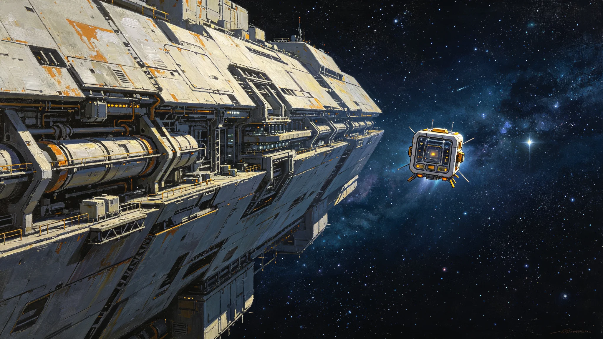

# 第六恒星系方向先飞探测器启航望星礼仪式规程公报

**发布机构**：三恒星系文明联合体文化委员会
**发布日期**：3582年10月20日
**文件等级**：跨星系公开

## 一、仪式背景

先飞-1探测器（见GS-3569-01）定于3583年初发射。闻星槎任领队（见GS-3553-01）后，预备舰队不实际远航，先飞器无人出发。文化委员会将先飞器发射定为"望星礼"，纪念无人先行。

## 二、仪式规程

望星礼在先飞器发射日举行：

1. 无人母船载先飞器离锚；
2. 预备舰队在编人员在锚地观该方向静默；
3. 母船释放先飞器，光帆展开；
4. 公民在居住区观该方向一刻钟；
5. 母船返航，先飞器独自巡航。

## 三、仪式意义

望星礼不是庆祝出发，是目送无人。闻星槎在规程末注："先飞器没人。我们送的是一个不会说话的东西。但它替我们去看那一头。我们看着它走，就当我们也去了。"

## 四、与归航节区别

归航节（见GS-3395-01）是遥祭老地球方向；望星礼是目送新方向。一个回望，一个远望。

## 五、与3577年中断

先飞-2通信中断（见GS-3577-01）后，望星礼次年增设"不许愿"环节——不许诺先飞器一定回来。

## 六、文化委员会说明

公报注明：1.8光年。先飞器飞42年。我们这一代送，下一代收数据。望星礼就是目送它走。不挥手，因为它看不见。

## 七、结论

望星礼3582年确立，随先飞器发射举行。

---

**归档编号**：CULT-STAR-GAZE-3582-001
**编制**：联合体文化委员会
**日期**：3582年10月20日

## 八、无人母船

母船释放先飞器后返航，不随航。

## 九、观该方向

在编人员与公民在居住区观第六恒星系方向一刻钟。

## 十、不挥手

先飞器无人，不挥手，不讲话。

## 十一、与3553年闻星槎

闻星槎在望星礼上不讲话，只看。

## 十二、与3577年中断

3577年后增设"不许愿"环节。

## 十三、三器发射

先飞-1（3583）、先飞-2（3588）、先飞-3（3593），各举行一次望星礼。

## 十四、与3600年评估

望星礼至3600年已举行3次。

## 十五、文化委员会末注

公报末写：目送一个不会说话的东西去1.8光年外。它42年后才回消息。我们这一代，等不到。下一代等。望星礼就是替下一代目送。

---

## 八、无人母船

母船释放先飞器后返航，不随航。

## 九、观该方向

在编人员与公民在居住区观第六恒星系方向一刻钟。

## 十、不挥手

先飞器无人，不挥手，不讲话。

## 十一、三器发射

## 十二、公报末注补

公报末段补记：目送一个不会说话的东西去1.8光年外。我们这一代等不到下一代等。

## 十二、三器发射日程

先飞-1于3583年发射，先飞-2于3588年，先飞-3于3593年。各举行一次望星礼。

## 十三、与3577年中断

先飞-2通信中断（见GS-3577-01）后，望星礼增设"不许愿"环节——不许诺先飞器一定回来。

## 十四、观星窗

公民在居住区观第六恒星系方向一刻钟，该方向仅一颗暗星，肉眼难见。

## 十五、与3553年闻星槎

闻星槎在望星礼上不讲话，只看。四十年目送三器出发。

## 十六、文化委员会末注补

公报末段补记：目送一个不会说话的东西去1.8光年外。我们这一代等不到，下一代等。

## 十六、三器发射日程

## 十七、与3577年中断

## 十八、观星窗

## 十九、与3553年闻星槎

闻星槎在望星礼上不讲话，只看。四十年目送三器出发。

## 二十、文化委员会末注补

## 附则·编后语

本件归档后，主编辑委员会复核与同批正典交叉互锁。凡涉时间线、人名、事件之处，均以登记簿所载为准。编后语：此件为三千六百余年文明运转中一纸公文，公文所述之事，或为日常、或为事件、或为仪式。公文无褒贬，只录其然。

## 附记·与同批正典交叉索引

本件所涉人物、制度、技术、事件，均在同批正典中有对应文书。读者欲详其事，可按以下索引查阅：人物侧写见传记学派各卷；制度沿革见法学派各卷；技术参数见工程学派各卷；事件经过见灾害管理学派各卷；仪式规程见文化学派各卷；产业决算见经济学派各卷；生态监测见生态学派各卷；军事部署见军事学派各卷。索引不赘列，以登记簿为总目。

## 附记·归档注意

本件一式三份，分存三恒星系档案馆。正本存跨星系总馆，副本一分存比邻星b分馆，副本二分存第四恒星系分馆。三份内容一致，若有出入以正本为准。本件封存期为自归档日起一百年，一百年后由联合档案馆启封复核。

## 附记·编后

下一个读此件者，无论何年，皆以此件为据，不作回望之叹。公文所载，是当时之人当时之事。当时之人不知后事，当时之事只按当时规程处置。读此件者，亦不必以后人之心度前人之腹。

## 附记·望星礼预算

望星礼单次预算0.002亿，含观星窗开放、茶点、纪念品卡片。纪念品为印制先飞器剪影卡片。

## 二十六、望星礼档案与后续监督

望星礼首祭全部记录（先飞-1发射日无人母船离锚录像、光帆展开照片、公民观星签到表、"不许愿"环节签到）由文化委员会档案科归档，归档号CUL-STARGAZE-3582-001，保留期跨星系公开一百年。先飞-2、先飞-3发射日沿用本规程，另文发布。望星礼不挥手、不发放行词，公民在居住区观该方向一刻钟。先飞器数据回传前，每年发射纪念日遥祭另表。
