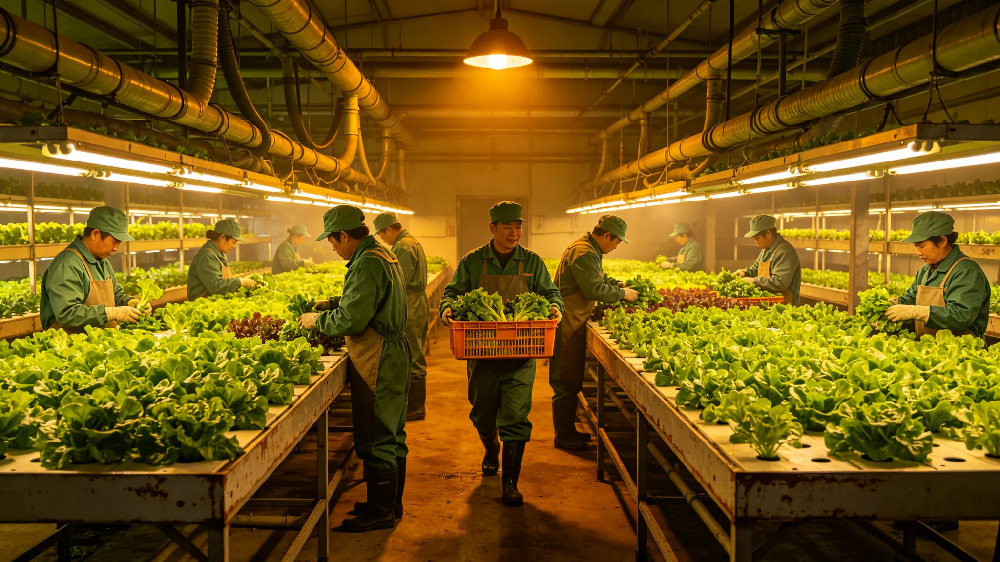

# 世代飞船生态系统百年轮换播种节——菌剂轮换纪念仪式规程公报

**发布机构**：三恒星系文明联合体文化委员会
**发布日期**：3584年9月9日
**文件等级**：跨星系公开

## 一、仪式背景

第九代菌剂（见GS-3570-01）轮换后，分解链氨氮波动从±12%收窄至±6%。叶归根任首席生保工程师（见GS-3555-01）后，文化委员会将每轮菌剂轮换完成定为"播种节"，纪念看不见的菌换了一茬。

## 二、仪式规程

播种节在每轮菌剂轮换稳产签认后举行：

1. 新菌剂入舱满六周，叶归根签认稳产；
2. 水培舱当日采收当季第一茬叶菜，分送各居住区；
3. 公民在各水培舱观新菌剂入舱一周年；
4. 叶归根在轮换记录上签名，不讲话。

## 三、仪式意义

播种节不是庆祝新菜，是记住菌换了。叶归根在规程末注："菜是人看得见的，菌是看不见的。播种节让吃菜的人知道，这菜是看不见的菌替他们长出来的。"

## 四、与传灯节区别

传灯节（见GS-3364-01）是代际交接；播种节是菌际交接。一个交人，一个交菌。

## 五、与3578年减产

3578年减产两成（见GS-3578-01）后，播种节次年增设"让它长够"环节——公民在舱外观新菌剂观察舱，知道六周从哪来。

## 六、文化委员会说明

公报注明：菌看不见。但一舱菜是它分解出来的。播种节就是让吃菜的人，谢一谢看不见的东西。

## 七、结论

播种节3584年确立，随每轮菌剂轮换举行。

---

**归档编号**：CULT-SOWING-3584-001
**编制**：联合体文化委员会
**日期**：3584年9月9日

## 八、第一茬叶菜

轮换稳产当季第一茬采收分送，公民自愿领取。

## 九、观观察舱

公民在水培舱外观新菌剂观察舱，知六周观察期。

## 十、叶归根签名

叶归根在轮换记录上签名，不讲话。

## 十一、与3578年减产

次年增设"让它长够"环节。

## 十二、与3590年十年监测

播种节配套分解链十年监测（见GS-3590-01）。

## 十三、与3563年百年轮换

播种节随每四年小轮举行，百年大换另举行"大播种"。

## 十四、与3600年评估

播种节至3600年已举行4次。

## 十五、文化委员会末注

公报末写：吃菜。谢菌。菌看不见，但菜是它长的。播种节就是让吃菜的人，知道自己靠什么活着。

---

## 八、第一茬叶菜

轮换稳产当季第一茬采收分送，公民自愿领取。

## 九、观观察舱

公民在水培舱外观新菌剂观察舱，知六周观察期。

## 十、与3578年减产

次年增设"让它长够"环节。

## 十一、与3563年百年轮换

播种节随每四年小轮举行，百年大换另举行"大播种"。

## 十二、公报末注补

公报末段补记：吃菜。谢菌。菌看不见，但菜是它长的。

## 十、第一茬叶菜采收

轮换稳产当季第一茬采收分送各居住区，公民自愿领取。3584年首届播种节领取率61%。

## 十一、观观察舱

公民在水培舱外观新菌剂观察舱，知六周观察期从哪来。

## 十二、与3578年减产

次年增设"让它长够"环节，公民观观察舱知观察期为何六周。

## 十三、与3563年百年大换

百年大换另举行"大播种"，小播种随每四年轮换。

## 十四、文化委员会末注补

公报末段补记：吃菜。谢菌。菌看不见，但菜是它长的。

## 十四、第一茬叶菜采收

## 十五、观观察舱

公民在水培舱外观新菌剂观察舱，知六周观察期从哪来。

## 十六、与3578年减产

次年增设"让它长够"环节，公民观观察舱知观察期为何六周。

## 十七、与3563年百年大换

百年大换另举行"大播种"，小播种随每四年轮换。

## 十八、文化委员会末注补

公报末段补记：吃菜。谢菌。菌看不见，但菜是它长的。

## 附则·编后语

本件归档后，主编辑委员会复核与同批正典交叉互锁。凡涉时间线、人名、事件之处，均以登记簿所载为准。编后语：此件为三千六百余年文明运转中一纸公文，公文所述之事，或为日常、或为事件、或为仪式。公文无褒贬，只录其然。

## 附记·与同批正典交叉索引

本件所涉人物、制度、技术、事件，均在同批正典中有对应文书。读者欲详其事，可按以下索引查阅：人物侧写见传记学派各卷；制度沿革见法学派各卷；技术参数见工程学派各卷；事件经过见灾害管理学派各卷；仪式规程见文化学派各卷；产业决算见经济学派各卷；生态监测见生态学派各卷；军事部署见军事学派各卷。索引不赘列，以登记簿为总目。

## 附记·归档注意

本件一式三份，分存三恒星系档案馆。正本存跨星系总馆，副本一分存比邻星b分馆，副本二分存第四恒星系分馆。三份内容一致，若有出入以正本为准。本件封存期为自归档日起一百年，一百年后由联合档案馆启封复核。

## 附记·编后

下一个读此件者，无论何年，皆以此件为据，不作回望之叹。公文所载，是当时之人当时之事。当时之人不知后事，当时之事只按当时规程处置。读此件者，亦不必以后人之心度前人之腹。

## 二十六、播种节档案与后续监督

播种节首祭全部记录（新菌剂入舱六周稳产签认、当季第一茬叶菜分送记录、公民观观察舱签到表）由文化委员会档案科归档，归档号CUL-SOWING-3584-001，保留期跨星系公开一百年。每轮菌剂轮换稳产签认后举行，叶归根签名不讲话。"让它长够"环节公民在舱外观观察舱记录随节归档。播种节不放假，水培舱当日照常运转。下一轮轮换播种节另表。
