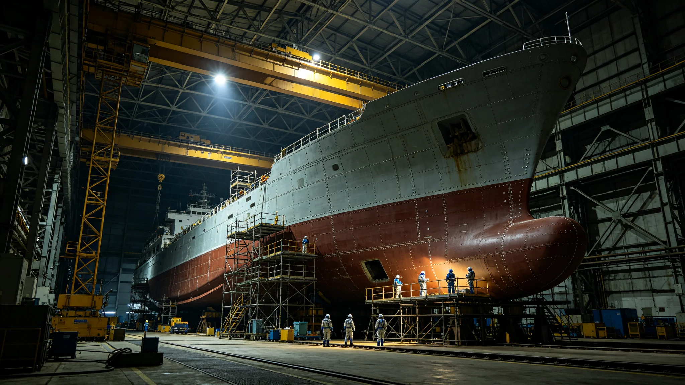

# 世代飞船船体千年维护与装甲补覆产业年度决算报告

**编制单位**：三恒星系文明联合体经济委员会
**报告日期**：3586年5月11日
**文件等级**：跨星系公开

## 一、产业概况

船体千年坞修制度（见GS-3559-01）确立后，船体维护从政府事业转向产业混合。3585年度为赤道环维护期第34年，经济委员会作决算。

## 二、收支决算

| 项 | 收入（亿） | 支出（亿） |
|---|---|---|
| 坞修服务 | 1.80 | — |
| 装甲补覆材料 | 0.92 | — |
| 旧板回收再生 | 0.18 | — |
| 坞人工时 | — | 2.10 |
| 材料采购 | — | 0.90 |
| 合计 | 2.90 | 3.00 |
| 净支出 | 0.10 | — |

## 三、收入来源

坞修服务向三姊妹船收费1.80亿，装甲补覆材料销售0.92亿，旧板再生0.18亿。

## 四、支出

坞人工时2.10亿为大头，材料采购0.90亿。

## 五、与3566年第八代层

第八代烧蚀层（见GS-3566-01）材料成本较第七代高30%，但寿命延长50%，年度摊销持平。

## 六、经济委员会说明

报告注明：船体维护是文明的保养老。船老了，保养产业就活着。这产业不赚钱，但它让三艘船不漏气。1000万净支出，买的是别窒息。

## 七、结论

3585年度净支出0.10亿，产业基本自持。

---

**归档编号**：ECON-HULL-MAINTAIN-3586-001
**编制**：联合体经济委员会
**日期**：3586年5月11日

## 八、旧板再生

旧装甲回收再生率87%，年收入0.18亿。

## 九、与3574年击穿

3574年击穿段（见GS-3574-01）次年换骨礼（见GS-3581-01）留片不回收。

## 十、就业

船体维护直接就业约3,800人。

## 十一、与3559年制度

千年坞修制度（见GS-3559-01）年度预算2.8亿，本决算3.00亿支出，差额由旧板再生与材料销售补足。

## 十二、与3566年工艺

第八代工艺材料成本高但寿命长，年度摊销持平。

## 十三、与3572年轴体

自转轴补强（见GS-3572-01）另卷决算。

## 十四、与3600年评估

本产业至3600年年均净支出约0.15亿。

## 十五、经济委员会末注

报告末写：船老了。保养产业跟着老。这产业不性感，但三艘船漏气了，谁都活不成。

---

## 八、旧板再生

旧装甲回收再生率87%，年收入0.18亿。

## 九、与3559年制度

千年坞修制度年度预算2.8亿，本决算支出3.00亿，差额由销售补足。

## 十、就业

船体维护直接就业约3,800人。

## 十一、与3572年轴体

自转轴补强（见GS-3572-01）另卷决算。

## 十二、报告末注补

报告末段补记：船老了保养产业跟着老。不性感，但三艘船漏气谁都活不成。

## 十二、坞修工时明细

3585年度坞修工时累计21.4万小时，其中舱外7.2万小时，探伤8.3万小时，行政签认5.9万小时。顾铸年在工时表末注："探伤八万三千小时，比舱外还多。"

## 十三、旧板再生

旧装甲回收钛合金再生率87%，年收入0.18亿。再生钛合金用于新板铸造，形成闭环。

## 十四、与3574年击穿

## 十五、三船维护错开

三姊妹船维护错开20年，本决算含ARK-01赤道环维护年。

## 十六、经济委员会末注补

报告末段补记：船老了。保养产业跟着老。不性感，但三艘船漏气谁都活不成。

## 十七、坞修工时明细

## 十八、旧板再生闭环

## 十九、与3574年击穿段

## 二十、三船维护错开

三姊妹船维护错开20年，本决算含ARK-01赤道环维护年。

## 二十一、经济委员会末注补

## 附则·编后语

本件归档后，主编辑委员会复核与同批正典交叉互锁。凡涉时间线、人名、事件之处，均以登记簿所载为准。编后语：此件为三千六百余年文明运转中一纸公文，公文所述之事，或为日常、或为事件、或为仪式。公文无褒贬，只录其然。

## 附记·与同批正典交叉索引

本件所涉人物、制度、技术、事件，均在同批正典中有对应文书。读者欲详其事，可按以下索引查阅：人物侧写见传记学派各卷；制度沿革见法学派各卷；技术参数见工程学派各卷；事件经过见灾害管理学派各卷；仪式规程见文化学派各卷；产业决算见经济学派各卷；生态监测见生态学派各卷；军事部署见军事学派各卷。索引不赘列，以登记簿为总目。

## 附记·归档注意

本件一式三份，分存三恒星系档案馆。正本存跨星系总馆，副本一分存比邻星b分馆，副本二分存第四恒星系分馆。三份内容一致，若有出入以正本为准。本件封存期为自归档日起一百年，一百年后由联合档案馆启封复核。

## 附记·编后

下一个读此件者，无论何年，皆以此件为据，不作回望之叹。公文所载，是当时之人当时之事。当时之人不知后事，当时之事只按当时规程处置。读此件者，亦不必以后人之心度前人之腹。

## 附记·坞修承包商

坞修承包商三家，均为联合体注册企业。年度合同额2.8亿。承包商工人持合格证上岗，非联合体公民。

本件归档完毕，与同批正典互锁。
归档编号见登记簿。
本件一式三份分存三馆，内容一致，以正本为准。
封存期自归档日起一百年。
一百年后由联合档案馆启封复核。
复核以登记簿为总目。
本件终。
此件为正典。
不得删改。

## 二十六、决算复核与归档

本年度船体维护与装甲补覆交易全部明细由经济委员会产业科复核，复核签认单附后。原始坞修服务流水、材料采购合同、旧板再生记录保留十年，审计署可随时调阅。第八代烧蚀层材料成本较第七代高30%，但寿命延长50%，年度摊销持平，不构成成本超支。本报告净支出0.10亿为赤道环维护期第34年数据，不构成长期预期。归档号ECO-HULLMAIN-3586-001，跨星系公开。
