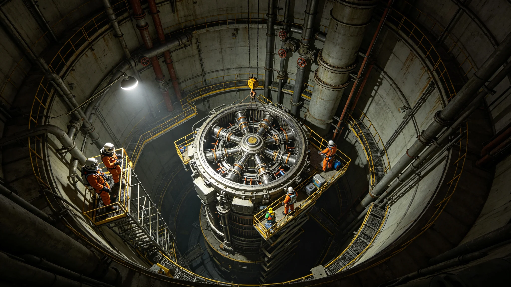

# 第八代聚变推进换装与工质补给产业年度决算报告

**编制单位**：三恒星系文明联合体经济委员会
**报告日期**：3587年7月15日
**文件等级**：跨星系公开

## 一、产业概况

第八代聚变推进系统（见GS-3567-01）三船换装中，工质补给跨星航线常态化。3586年度经济委员会作决算。

## 二、收支决算

| 项 | 收入（亿） | 支出（亿） |
|---|---|---|
| 换装工程 | 3.40 | — |
| 氚补给 | 0.86 | — |
| 工质运输 | 0.54 | — |
| 换装人工时 | — | 3.10 |
| 氚采购 | — | 0.72 |
| 运输船折旧 | — | 0.40 |
| 合计 | 4.80 | 4.22 |
| 净收入 | 0.58 | — |

## 三、收入来源

换装工程向三姊妹船收费3.40亿，氚补给0.86亿，工质运输0.54亿。

## 四、支出

换装人工时3.10亿为大头，氚采购0.72亿，运输船折旧0.40亿。

## 五、与3575年氚泄漏

3575年氚泄漏（见GS-3575-01）后接头改法兰，氚泄漏保险费年度支出降为零。

## 六、经济委员会说明

报告注明：心脏换装是大买卖。三艘船换心脏，产业赚5800万。但心脏漏了，全船停。这钱赚得踏实，因为漏过一次，封住了。

## 七、结论

3586年度净收入0.58亿，产业可持续。

---

**归档编号**：ECON-PROP-VIII-3587-001
**编制**：联合体经济委员会
**日期**：3587年7月15日

## 八、氚补给

第八代氚自持率82%，18%外源采购，年采购0.72亿。

## 九、与3567年鉴定

第十二万小时鉴定（见GS-3567-01）后换装进入常态。

## 十、与3575年泄漏

接头改法兰后氚泄漏保险费降为零。

## 十一、就业

聚变换装直接就业约1,600人。

## 十二、与3377年轨道聚变

轨道聚变电站（见GS-3377-01）为地面供电，本产业为船载推进，两者独立。

## 十三、三船换装错开

三船错开5年换装，本决算含第二船换装年。

## 十四、与3600年评估

本产业至3600年年均净收入约0.5亿。

## 十五、经济委员会末注

报告末写：心脏换装。赚5800万。但心脏漏了，全船停。这钱是用3575年那次泄漏换来的。

---

## 八、氚补给

第八代氚自持率82%，18%外源采购，年采购0.72亿。

## 九、与3575年泄漏

接头改法兰后氚泄漏保险费降为零。

## 十、就业

聚变换装直接就业约1,600人。

## 十一、三船换装错开

三船错开5年换装，本决算含第二船换装年。

## 十二、报告末注补

报告末段补记：心脏换装赚5800万。但心脏漏了全船停。这钱是3575年那次泄漏换来的。

## 十三、工质运输

氚补给由3艘补给船往返于聚变电站与巡逻舰之间，年度航次42次。运输船为圆柱形封闭加压舱体，无轮子。

## 十四、与3575年泄漏

3575年氚泄漏（见GS-3575-01）后接头改法兰，次年起氚运输零泄漏。

## 十五、三船换装进度

ARK-01于3565年换装，二号姊妹船3570年，三号姊妹船3575年。3586年度为第二船换装年。

## 十六、与轨道聚变电站

轨道聚变电站（见GS-3377-01）为地面供电，本产业为船载推进，两者独立但共用氚供应链。

## 十七、经济委员会末注补

## 十八、工质运输航次

氚补给由3艘补给船往返于聚变电站与巡逻舰之间，年度航次42次。运输船为圆柱形封闭加压舱体，带矩形小舷窗，无轮子。

## 十九、与3575年氚泄漏复盘

3575年首次点火氚泄漏（见GS-3575-01）后接头改法兰，次年起氚运输零泄漏。泄漏保险费年度支出降为零。

## 二十、三船换装进度

## 二十一、与轨道聚变电站

## 二十二、经济委员会末注补

## 附则·编后语

本件归档后，主编辑委员会复核与同批正典交叉互锁。凡涉时间线、人名、事件之处，均以登记簿所载为准。编后语：此件为三千六百余年文明运转中一纸公文，公文所述之事，或为日常、或为事件、或为仪式。公文无褒贬，只录其然。

## 附记·与同批正典交叉索引

本件所涉人物、制度、技术、事件，均在同批正典中有对应文书。读者欲详其事，可按以下索引查阅：人物侧写见传记学派各卷；制度沿革见法学派各卷；技术参数见工程学派各卷；事件经过见灾害管理学派各卷；仪式规程见文化学派各卷；产业决算见经济学派各卷；生态监测见生态学派各卷；军事部署见军事学派各卷。索引不赘列，以登记簿为总目。

## 附记·归档注意

本件一式三份，分存三恒星系档案馆。正本存跨星系总馆，副本一分存比邻星b分馆，副本二分存第四恒星系分馆。三份内容一致，若有出入以正本为准。本件封存期为自归档日起一百年，一百年后由联合档案馆启封复核。

## 附记·编后

下一个读此件者，无论何年，皆以此件为据，不作回望之叹。公文所载，是当时之人当时之事。当时之人不知后事，当时之事只按当时规程处置。读此件者，亦不必以后人之心度前人之腹。

## 附记·换装工时

第八代换装单船工时约12万小时，含拆旧、安装、调试、试推。三船错开5年，避免同时停推。

本件归档完毕，与同批正典互锁。
归档编号见登记簿。
本件一式三份分存三馆，内容一致，以正本为准。
封存期自归档日起一百年。
一百年后由联合档案馆启封复核。

## 二十六、决算复核与归档

本年度聚变换装与工质补给交易全部明细由经济委员会产业科复核，复核签认单附后。原始换装工程流水、氚采购合同、运输船折旧台账保留十年，审计署可随时调阅。3575年氚泄漏后接头改法兰，泄漏保险费年度支出降为零，已计入本决算。本报告净收入0.58亿为三船换装中期数据，换装完成后不构成长期预期。归档号ECO-PROP-3587-001，跨星系公开。
