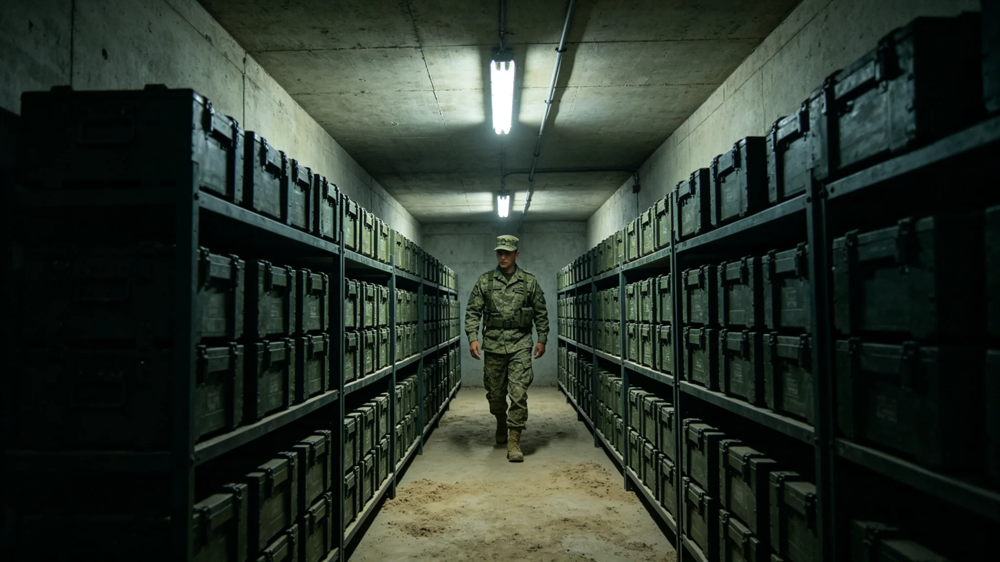

# 深空防御盾维护与动能弹药产业年度决算报告

**编制单位**：三恒星系文明联合体经济委员会
**报告日期**：3589年11月11日
**文件等级**：跨星系公开

## 一、产业背景

第三代防御盾（见GS-3397-01）14节点运行中，拦截弹年检与换型常态化。3588年度经济委员会作决算。

## 二、收支决算

| 项 | 收入（亿） | 支出（亿） |
|---|---|---|
| 盾面维护 | 1.20 | — |
| 拦截弹年检 | 0.42 | — |
| 拦截弹换型 | 0.36 | — |
| 维护人工时 | — | 1.80 |
| 弹药采购 | — | 0.52 |
| 合计 | 1.98 | 2.32 |
| 净支出 | 0.34 | — |

## 三、收入

盾面维护向各节点收费1.20亿，拦截弹年检0.42亿，换型0.36亿。

## 四、支出

维护人工时1.80亿为大头，弹药采购0.52亿。

## 五、与3576年脱靶

3576年脱靶（见GS-3576-01）后，同批次补检0.12亿计入当年。

## 六、经济委员会说明

报告注明：盾是文明的保。这产业不赚钱，但它让天砸不下来。3400万净支出，买四百年拦下七颗。

## 七、结论

3588年度净支出0.34亿，产业基本自持。

---

**归档编号**：ECON-SHIELD-3589-001
**编制**：联合体经济委员会
**日期**：3589年11月11日

## 八、拦截弹年检

年检合格率99.8%（见GS-3556-01），年换型约2枚。

## 九、与3568年寿命

拦截弹千年寿命评估（见GS-3568-01）后，换型周期200年。

## 十、与3583年甲光节

甲光节（见GS-3583-01）不产生收入。

## 十一、就业

防御盾维护直接就业约1,100人。

## 十二、与3561年值班

编队轮换值班（见GS-3561-01）人工时计入本决算。

## 十三、与3576年补检

同批次补检0.12亿计入当年支出。

## 十四、与3600年评估

本产业至3600年年均净支出约0.35亿。

## 十五、经济委员会末注

报告末写：盾不赚钱。但天砸下来，多少钱都买不回3400万。

---

## 八、拦截弹年检

年检合格率99.8%，年换型约2枚。

## 九、与3568年寿命

拦截弹千年寿命评估（见GS-3568-01）后换型周期200年。

## 十、与3583年甲光节

甲光节（见GS-3583-01）不产生收入。

## 十一、就业

防御盾维护直接就业约1,100人。

## 十二、报告末注补

报告末段补记：盾不赚钱。但天砸下来多少钱都买不回3400万。

## 十三、盾面维护工时明细

3588年度盾面维护工时累计14.2万小时，其中舱外作业3.8万小时，舱内探伤6.1万小时，行政签认4.3万小时。闻坚壁在工时表末注："舱外三万八千小时，是拿命换的。"

## 十四、拦截弹换型批次

3588年度换型拦截弹2枚，均为药柱裂纹超标的同批次产品。换型后补检同批次198枚，合格率99.8%。

## 十五、与甲光节

甲光节（见GS-3583-01）当日铆钉敲击工时计入本决算。公民观甲光不产生收入，但维护队当日加班。

## 十六、产业与文明冗余

防御盾是外部冗余，备灾库（见GS-3557-01）是内部冗余。本产业支出仅覆盖外部冗余，内部冗余另卷。

## 十七、军事工程委员会末注补

报告末段补记：盾不赚钱。但四百年拦下七颗，3400万买的是别让天砸下来。下一年接着敲。

## 十八、盾面维护年度工时分配

3588年度盾面维护总工时14.2万小时，分配如下：舱外作业3.8万小时占27%，舱内探伤6.1万小时占43%，行政签认4.3万小时占30%。闻坚壁在工时表末注：舱外三万八千小时，是拿命换的；探伤八万三千小时，是拿耐心换的。两者缺一不可。

## 十九、拦截弹库存与轮换

第三代防御盾库存拦截弹1,200枚，分布于14个节点。年度换型约2枚，报废约2枚。闻坚壁年检合格率从98.3%升至99.8%。

## 二十、与3576年脱靶后整改

3576年脱靶（见GS-3576-01）后，同批次200枚补做深部超声，另报废3枚。整改后3577年重测命中率100%。

## 二十一、产业与文明冗余分工

## 二十二、军事工程委员会末注补

报告末段补记：盾不赚钱。但四百年拦下七颗，3400万买的是别让天砸下来。下一年接着敲，敲到芯。

## 附则·编后语

本件归档后，主编辑委员会复核与同批正典交叉互锁。凡涉时间线、人名、事件之处，均以登记簿所载为准。编后语：此件为三千六百余年文明运转中一纸公文，公文所述之事，或为日常、或为事件、或为仪式。公文无褒贬，只录其然。

## 附记·与同批正典交叉索引

本件所涉人物、制度、技术、事件，均在同批正典中有对应文书。读者欲详其事，可按以下索引查阅：人物侧写见传记学派各卷；制度沿革见法学派各卷；技术参数见工程学派各卷；事件经过见灾害管理学派各卷；仪式规程见文化学派各卷；产业决算见经济学派各卷；生态监测见生态学派各卷；军事部署见军事学派各卷。索引不赘列，以登记簿为总目。

## 附记·归档注意

本件一式三份，分存三恒星系档案馆。正本存跨星系总馆，副本一分存比邻星b分馆，副本二分存第四恒星系分馆。三份内容一致，若有出入以正本为准。本件封存期为自归档日起一百年，一百年后由联合档案馆启封复核。

## 附记·编后

下一个读此件者，无论何年，皆以此件为据，不作回望之叹。公文所载，是当时之人当时之事。当时之人不知后事，当时之事只按当时规程处置。读此件者，亦不必以后人之心度前人之腹。

## 二十六、决算复核与归档

本年度防御盾维护与动能弹药交易全部明细由经济委员会产业科复核，复核签认单附后。原始盾面维护流水、拦截弹年检与换型合同、弹药采购台账保留十年，审计署可随时调阅。3576年脱靶后同批次补检0.12亿计入当年，已列入支出。本报告净支出0.34亿为十四节点运行年数据，节点5建成后另表。归档号ECO-SHIELD-3589-001，跨星系公开。
