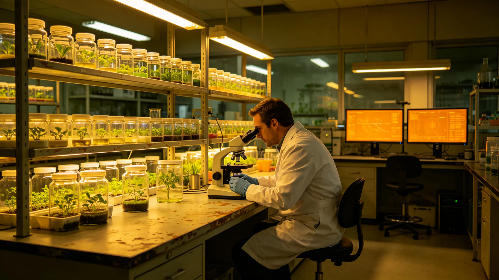

# 世代飞船生态系统第九代菌剂轮换后分解链稳态十年监测公报

**发布机构**：三恒星系文明联合体生态委员会
**发布日期**：3590年6月6日
**文件等级**：跨星系公开

## 一、监测背景

第九代菌剂（见GS-3570-01）3570年定型入舱，至3590年满十年。叶归根任首席生保工程师（见GS-3555-01）后，生态委员会作分解链稳态十年监测公报。

## 二、十年数据

| 指标 | 3570年 | 3590年 |
|---|---|---|
| 分解链氨氮波动 | ±6% | ±5% |
| 当季叶菜产量 | 基准 | 提升34% |
| 本土菌驯化率 | 78% | 84% |
| 单舱减产超10%事件 | 0.2起/年 | 0.1起/年 |
| 菌剂轮次 | 第1轮 | 第6轮 |

## 三、3578年减产

3578年第5轮轮换减产两成（见GS-3578-01），为十年间唯一一次减产超10%。此后观察期六周硬规化，未再发生。

## 四、稳态评估

第九代菌剂部署十年后，分解链稳态优于第八代：

- 氨氮波动从±12%收窄至±5%；
- 产量提升34%；
- 本土菌驯化率从62%升至84%。

## 五、生态委员会说明

公报注明：十年了。菌换了六轮，分解链稳了。3578年那次减产两成，是用六周观察期换来的。此后没再急过。

## 六、结论

第九代菌剂十年监测达标，分解链稳态可持续。

---

**归档编号**：ECO-DECOMP-10Y-3590-001
**编制**：联合体生态委员会
**日期**：3590年6月6日

## 七、氨氮波动

从±12%（第八代）收窄至±5%。

## 八、本土菌驯化

从62%升至84%，异星驯化菌占比38%。

## 九、与3578年减产

唯一一次超10%减产，此后零复发。

## 十、与3563年制度

观察期六周硬规（见GS-3563-01）十年执行零违规。

## 十一、与3584年播种节

播种节（见GS-3584-01）随每轮轮换举行，十年六次。

## 十二、与3592年垂直森林

垂直森林三百年演替（见GS-3592-01）与本分解链并行。

## 十三、与3593年授粉群落

授粉昆虫重建（见GS-3593-01）配套第九代伴生菌。

## 十四、与3594年水循环膜

水循环膜第十代（见GS-3594-01）与菌剂轮换错开。

## 十五、生态委员会末注

公报末写：十年。看不见的菌，稳了。看得见的菜，多了三成。这就是十年的意思。

---

## 七、氨氮波动

从±12%（第八代）收窄至±5%。

## 八、本土菌驯化

从62%升至84%，异星驯化菌占比38%。

## 九、与3578年减产

唯一一次超10%减产，此后零复发。

## 十、与3584年播种节

播种节随每轮轮换举行，十年六次。

## 十一、公报末注补

公报末段补记：十年。看不见的菌稳了，看得见的菜多了三成。

## 十二、十年产量曲线

3570—3590年，当季叶菜产量逐年提升34%，无一年倒退。唯一倒退年为3578年减产两成（见GS-3578-01）。

## 十三、本土菌驯化细节

本土菌（异星驯化）从62%升至84%，其中第四恒星系驯化菌占比从18%升至38%。

## 十四、与3563年观察期

观察期六周硬规（见GS-3563-01）十年执行零违规，3578年事件后未再发生缩短观察期。

## 十五、与3584年播种节

播种节（见GS-3584-01）随每轮轮换举行，十年六次，公民参与率从31%升至47%。

## 十六、生态委员会末注补

公报末段补记：十年。看不见的菌稳了，看得见的菜多了三成。下一个十年接着换。

## 十七、十年产量曲线

3570—3590年当季叶菜产量逐年提升34%，无一年倒退。唯一倒退年为3578年减产两成（见GS-3578-01）。

## 十八、本土菌驯化细节

本土菌从62%升至84%，其中第四恒星系驯化菌占比从18%升至38%。

## 十九、观察期硬规执行

## 二十、与播种节参与率

## 二十一、生态委员会末注补

## 附则·编后语

本件归档后，主编辑委员会复核与同批正典交叉互锁。凡涉时间线、人名、事件之处，均以登记簿所载为准。编后语：此件为三千六百余年文明运转中一纸公文，公文所述之事，或为日常、或为事件、或为仪式。公文无褒贬，只录其然。

## 附记·与同批正典交叉索引

本件所涉人物、制度、技术、事件，均在同批正典中有对应文书。读者欲详其事，可按以下索引查阅：人物侧写见传记学派各卷；制度沿革见法学派各卷；技术参数见工程学派各卷；事件经过见灾害管理学派各卷；仪式规程见文化学派各卷；产业决算见经济学派各卷；生态监测见生态学派各卷；军事部署见军事学派各卷。索引不赘列，以登记簿为总目。

## 附记·归档注意

本件一式三份，分存三恒星系档案馆。正本存跨星系总馆，副本一分存比邻星b分馆，副本二分存第四恒星系分馆。三份内容一致，若有出入以正本为准。本件封存期为自归档日起一百年，一百年后由联合档案馆启封复核。

## 附记·编后

下一个读此件者，无论何年，皆以此件为据，不作回望之叹。公文所载，是当时之人当时之事。当时之人不知后事，当时之事只按当时规程处置。读此件者，亦不必以后人之心度前人之腹。

本件归档完毕。

## 附记·监测数据公开

监测数据每年汇编一册，公开于跨星系总馆阅览室。公民可查，但不允许带出馆。

本件归档完毕，与同批正典互锁。
归档编号见登记簿。
本件一式三份分存三馆，内容一致，以正本为准。

## 二十六、十年监测数据归档与后续

十年监测全部氨氮波动原始记录、六轮菌剂轮换签认、3578年减产事件复盘由生态委员会归档，归档号ECO-STRAIN-MON-3590-001-A，保留期一百年。下次十年监测为3600年，若中间单舱减产超一成事件超过年均0.5起，须提前排查。第九代菌剂本土菌驯化率从百分之七十八升至百分之八十四，为十年实测，不构成后续线性预期。六周观察期硬规持续，不缩短。
