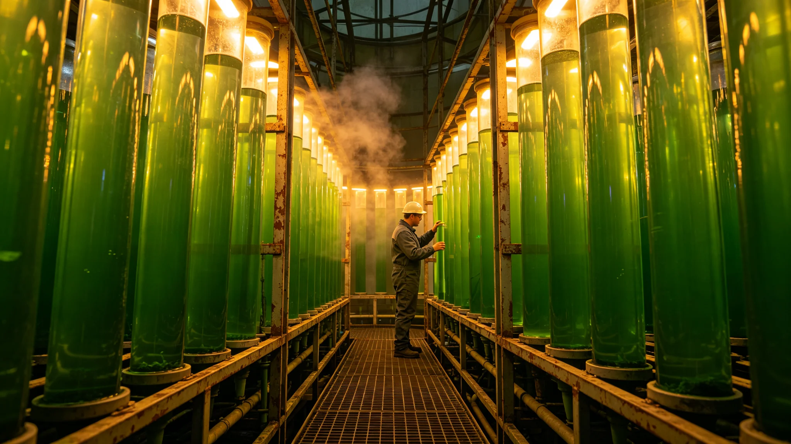

# 第六恒星系方向地球化预备本土光合藻类跨系引种评估公报

**发布机构**：三恒星系文明联合体生态委员会
**发布日期**：3591年8月18日
**文件等级**：跨星系公开

## 一、引种背景

第六恒星系方向先飞器未回传数据（见GS-3569-01），但地球化预备已启动。生态委员会从跨系驯化物种中遴选光合藻类，作跨系引种评估。

## 二、遴选标准

1. 已在本域水培舱运行满50年；
2. 观察期延长至20年（见GS-3563-01，比本船菌剂更严）；
3. 与第六方向预期大气成分适配；
4. 生态委员会三分之二表决。

## 三、首批遴选

| 藻种 | 来源 | 适配性 | 状态 |
|---|---|---|---|
| 蓝藻-A | 比邻星b驯化 | 高 | 观察中 |
| 绿藻-B | 地球老种 | 中 | 观察中 |
| 硅藻-C | 第四恒星系驯化 | 高 | 观察中 |

## 四、与本船菌剂区别

本船菌剂（见GS-3570-01）观察期六周；第六方向藻类观察期20年。生态委员会注明：去1.8光年外引种，急不得。

## 五、生态委员会说明

公报注明：先飞器还没回来说那一头有没有大气。我们先把自己的藻养着，等它回来说有大气，藻已经养了20年。没大气，藻就白养——但白养比临时找强。

## 六、结论

首批三种光合藻类进入20年观察期。

---

**归档编号**：ECO-SIXTH-ALGAE-3591-001
**编制**：联合体生态委员会
**日期**：3591年8月18日

## 七、20年观察期

比本船菌剂六周更严，因第六方向未知。

## 八、零污染

藻类全程在轨道隔离舱培养，未接触本船闭环。

## 九、与3563年准入

本土物种引入准入（见GS-3563-01）三关，第六方向加严。

## 十、与3341年微生物伦理

异星微生物研究伦理（见GS-3341-01）并行，不引入第六方向未知微生物。

## 十一、与3562年红橙黄蓝

引种不触发四级联动，属预备。

## 十二、与3588年产业链

藻类培养计入勘探预备产业链（见GS-3588-01）。

## 十三、与3600年评估

首批藻类20年观察期至3611年。

## 十四、预算

藻类培养年度预算星汇0.08亿。

## 十五、生态委员会末注

公报末写：养藻20年，等先飞器回消息。有大气，藻能用；没大气，藻白养。白养比临时找强。

---

## 七、20年观察期

比本船菌剂六周更严，因第六方向未知。

## 八、零污染

藻类全程在轨道隔离舱培养，未接触本船闭环。

## 九、与3341年微生物伦理

## 十、预算

藻类培养年度预算0.08亿。

## 十一、公报末注补

公报末段补记：养藻20年等先飞器回消息。白养比临时找强。

## 十二、三种藻类观察

蓝藻-A、绿藻-B、硅藻-C在轨道隔离舱观察20年，与第六方向预期大气成分适配性逐年评估。

## 十三、与3563年准入

本土物种引入准入三关（见GS-3563-01），第六方向加严至20年观察期。

## 十四、与3341年微生物伦理

不引入第六方向未知微生物，仅引入本域已驯化物种。

## 十五、预算

藻类培养年度预算0.08亿，20年累计1.6亿。

## 十六、生态委员会末注补

公报末段补记：养藻20年等先飞器回消息。白养比临时找强。

## 十六、三种藻类观察

## 十七、与3563年准入

## 十八、与3341年微生物伦理

不引入第六方向未知微生物，仅引入本域已驯化物种。

## 十九、预算

藻类培养年度预算0.08亿，20年累计1.6亿。

## 二十、生态委员会末注补

公报末段补记：养藻20年等先飞器回消息。白养比临时找强。

## 附则·编后语

本件归档后，主编辑委员会复核与同批正典交叉互锁。凡涉时间线、人名、事件之处，均以登记簿所载为准。编后语：此件为三千六百余年文明运转中一纸公文，公文所述之事，或为日常、或为事件、或为仪式。公文无褒贬，只录其然。

## 附记·与同批正典交叉索引

本件所涉人物、制度、技术、事件，均在同批正典中有对应文书。读者欲详其事，可按以下索引查阅：人物侧写见传记学派各卷；制度沿革见法学派各卷；技术参数见工程学派各卷；事件经过见灾害管理学派各卷；仪式规程见文化学派各卷；产业决算见经济学派各卷；生态监测见生态学派各卷；军事部署见军事学派各卷。索引不赘列，以登记簿为总目。

## 附记·归档注意

本件一式三份，分存三恒星系档案馆。正本存跨星系总馆，副本一分存比邻星b分馆，副本二分存第四恒星系分馆。三份内容一致，若有出入以正本为准。本件封存期为自归档日起一百年，一百年后由联合档案馆启封复核。

## 附记·编后

下一个读此件者，无论何年，皆以此件为据，不作回望之叹。公文所载，是当时之人当时之事。当时之人不知后事，当时之事只按当时规程处置。读此件者，亦不必以后人之心度前人之腹。

## 附记·藻类培养环境

藻类培养环境：恒温22度、恒湿60%、光照12小时昼夜。与第六方向预期大气成分逐步接近。

本件归档完毕，与同批正典互锁。
归档编号见登记簿。
本件一式三份分存三馆，内容一致，以正本为准。

## 附则：归档与说明

本件经主管署署长签批生效，全文数据经两级复核后入库。本件副本分发至相关执行机构，原件封存于联合体档案馆对应卷册，归档号 GS-3591-01。后续年度复核将以本件为基准，关键指标偏差超过百分之五须提交专项说明。
