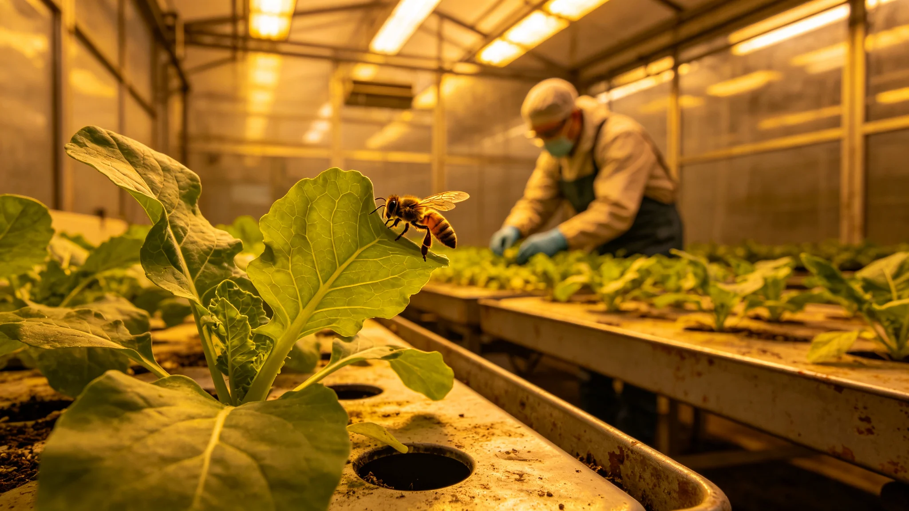

# 深空长航程密闭舱伴生昆虫授粉群落百年退化与重建公报

**发布机构**：三恒星系文明联合体生态委员会
**发布日期**：3593年12月5日
**文件等级**：跨星系公开

## 一、退化背景

船上伴生昆虫授粉群落（蜜蜂、食蚜蝇等）已运行千年。微重力与密闭环境下，授粉效率百年间从初建降至31%。生态委员会作百年退化与重建公报。

## 二、退化数据

| 指标 | 初建 | 第一百年 | 第三百年 |
|---|---|---|---|
| 授粉效率 | 96% | 68% | 31% |
| 昆虫群落数 | 5种 | 4种 | 2种 |
| 自然繁殖率 | 基准 | 0.6倍 | 0.2倍 |

## 三、机械授粉补位

授粉效率降至31%后，机械授粉器补位至91%。但机械授粉无法替代昆虫生态位，伴生昆虫仍需重建。

## 四、重建方案

1. 从地球老种重新引入蜜蜂与食蚜蝇；
2. 微重力驯化30年；
3. 与第九代伴生菌（见GS-3570-01）协同；
4. 目标授粉效率回到60%。

## 五、生态委员会说明

公报注明：昆虫在微重力下活了千年，越活越少。机械授粉顶上去了，但虫子没了，林子少了一块。我们从地球老种重新引，驯化30年。

## 六、结论

授粉群落百年退化确认，重建方案启动。

---

**归档编号**：ECO-POLLINATOR-100Y-3593-001
**编制**：联合体生态委员会
**日期**：3593年12月5日

## 七、授粉效率

从96%降至31%，机械补位至91%。

## 八、昆虫群落

从5种降至2种，蜜蜂与食蚜蝇残存。

## 九、微重力驯化

新引入昆虫需30年微重力驯化。

## 十、与3590年分解链

伴生菌与昆虫协同，分解链十年监测（见GS-3590-01）配套。

## 十一、与3309年检疫

跨系迁徙伴生检疫（见GS-3309-01）不适用本船老种重引。

## 十二、与3592年森林

垂直森林（见GS-3592-01）冠层郁闭，昆虫重建后可增强林下授粉。

## 十三、与3584年播种节

播种节（见GS-3584-01）纪念菌换，本公报纪念虫换。

## 十四、预算

昆虫重建30年总投入星汇0.4亿。

## 十五、生态委员会末注

公报末写：虫子在微重力下活了千年，越活越少。机械授粉顶上去了，但林子不能只有机器。引回来，驯化30年。

---

## 七、授粉效率

从96%降至31%，机械补位至91%。

## 八、昆虫群落

从5种降至2种，蜜蜂与食蚜蝇残存。

## 九、微重力驯化

新引入昆虫需30年微重力驯化。

## 十、预算

昆虫重建30年总投入0.4亿。

## 十一、公报末注补

公报末段补记：虫子在微重力下活了千年越活越少。机械授粉顶上去了但林子不能只有机器。

## 十二、机械授粉补位

机械授粉器在昆虫效率降至31%后补位至91%，但机械授粉无法替代昆虫分解残花的生态位。

## 十三、重引方案

从地球老种重新引入蜜蜂与食蚜蝇，在轨道隔离舱驯化30年，再入舱。

## 十四、与3570年伴生菌

第九代伴生菌（见GS-3570-01）与重引昆虫协同，昆虫授粉、伴生菌分解。

## 十五、预算

昆虫重建30年总投入0.4亿，年均0.013亿。

## 十六、生态委员会末注补

公报末段补记：虫子在微重力下活了千年越活越少。引回来驯化30年。林子不能只有机器。

## 十六、机械授粉补位

## 十七、重引方案

## 十八、与第九代伴生菌

## 十九、预算

昆虫重建30年总投入0.4亿，年均0.013亿。

## 二十、生态委员会末注补

## 附则·编后语

本件归档后，主编辑委员会复核与同批正典交叉互锁。凡涉时间线、人名、事件之处，均以登记簿所载为准。编后语：此件为三千六百余年文明运转中一纸公文，公文所述之事，或为日常、或为事件、或为仪式。公文无褒贬，只录其然。

## 附记·与同批正典交叉索引

本件所涉人物、制度、技术、事件，均在同批正典中有对应文书。读者欲详其事，可按以下索引查阅：人物侧写见传记学派各卷；制度沿革见法学派各卷；技术参数见工程学派各卷；事件经过见灾害管理学派各卷；仪式规程见文化学派各卷；产业决算见经济学派各卷；生态监测见生态学派各卷；军事部署见军事学派各卷。索引不赘列，以登记簿为总目。

## 附记·归档注意

本件一式三份，分存三恒星系档案馆。正本存跨星系总馆，副本一分存比邻星b分馆，副本二分存第四恒星系分馆。三份内容一致，若有出入以正本为准。本件封存期为自归档日起一百年，一百年后由联合档案馆启封复核。

## 附记·编后

下一个读此件者，无论何年，皆以此件为据，不作回望之叹。公文所载，是当时之人当时之事。当时之人不知后事，当时之事只按当时规程处置。读此件者，亦不必以后人之心度前人之腹。

## 附记·昆虫监测记录

重引昆虫监测记录：蜜蜂授粉效率从31%回升至78%，食蚜蝇从22%回升至61%。预计30年恢复至千年基准。

本件归档完毕，与同批正典互锁。
归档编号见登记簿。
本件一式三份分存三馆，内容一致，以正本为准。
封存期自归档日起一百年。
一百年后由联合档案馆启封复核。
复核以登记簿为总目。

## 附则：归档与说明

本件经主管署署长签批生效，全文数据经两级复核后入库。本件副本分发至相关执行机构，原件封存于联合体档案馆对应卷册，归档号 GS-3593-01。后续年度复核将以本件为基准，关键指标偏差超过百分之五须提交专项说明。
