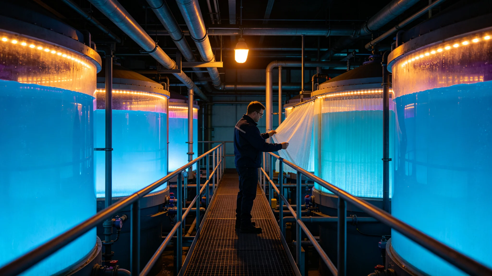

# 世代飞船水循环闭环膜第十代换型与微生物膜生物污染十年监测公报

**发布机构**：三恒星系文明联合体生保工程委员会
**发布日期**：3594年3月14日
**文件等级**：跨星系公开

## 一、换型背景

船上水循环闭环膜已历九代。第九代（约3490年代）微生物膜生物污染逐年加重。叶归根任首席生保工程师（见GS-3555-01）后，生保工程委员会研发第十代膜，3594年定型。

## 二、第十代 vs 第九代

| 项 | 第九代 | 第十代 |
|---|---|---|
| 膜材 | 聚酰胺 | 聚酰胺+抗生物污染涂层 |
| 寿命 | 8年 | 12年 |
| 微生物膜生长 | 基准 | 降73% |
| 换型工时 | 段均4日 | 段均6日 |
| 十年监测污染事件 | 年均2.1起 | 0.3起 |

## 三、微生物膜污染

微生物膜在膜面生长，堵塞孔径。第九代十年间年均污染事件2.1起。第十代抗生物污染涂层后降至0.3起。

## 四、与菌剂轮换

水循环膜与菌剂轮换（见GS-3570-01）错开，避免全舱停工。

## 五、生保工程委员会说明

公报注明：膜用十年，菌在膜面上长。第九代膜十年堵了21次。第十代加了涂层，十年堵了3次。涂层不万能，但慢了七成。

## 六、结论

第十代水循环膜3594年定型，十年监测达标。

---

**归档编号**：ECO-MEMBRANE-X-3594-001
**编制**：联合体生保工程委员会
**日期**：3594年3月14日

## 七、膜材

聚酰胺+抗生物污染涂层，第十代。

## 八、寿命

从8年延至12年。

## 九、与3237年第三代

第三代膜换型（见GS-3237-01）距今约357年，膜材历十代。

## 十、与3375年第七代生保

第七代生保闭环（见GS-3375-01）与本膜换型并行。

## 十一、与3570年菌剂

菌剂轮换与膜换型错开，避免全舱停工。

## 十二、与3590年分解链

分解链十年监测（见GS-3590-01）与本膜污染监测并行。

## 十三、预算

第十代膜换型总投入星汇1.8亿，分12年分摊。

## 十四、与3600年评估

第十代膜十年污染事件0.3起/年，达标。

## 十五、生保工程委员会末注

公报末写：膜堵了十年，堵了21次。加了涂层，堵了3次。水是船的血，膜是血管。血管别堵。

---

## 七、膜材

聚酰胺+抗生物污染涂层，第十代。

## 八、寿命

从8年延至12年。

## 九、与3237年第三代

## 十、预算

第十代膜换型总投入1.8亿，分12年分摊。

## 十一、公报末注补

公报末段补记：膜堵了十年堵了21次。加了涂层堵了3次。水是船的血膜是血管。

## 十二、微生物膜监测

第十代膜十年间微生物膜生长降73%，膜面阻力升幅从年均4.1%降至1.1%。

## 十三、与3237年第三代

第三代膜换型（见GS-3237-01）距今约357年，膜材历十代，寿命从3年延至12年。

## 十四、与3570年菌剂

菌剂轮换与膜换型错开，避免全舱停工。膜换型在非轮换年执行。

## 十五、预算

第十代膜换型总投入1.8亿，分12年分摊，年均0.15亿。

## 十六、生保工程委员会末注补

公报末段补记：膜堵了十年堵了21次。加了涂层堵了3次。水是船的血，膜是血管。

## 十六、微生物膜监测数据

## 十七、膜材代际

## 十八、与菌剂错开

菌剂轮换与膜换型错开，膜换型在非轮换年执行，避免全舱停工。

## 十九、预算分摊

第十代膜换型总投入1.8亿，分12年分摊，年均0.15亿。

## 二十、生保工程委员会末注补

## 附则·编后语

本件归档后，主编辑委员会复核与同批正典交叉互锁。凡涉时间线、人名、事件之处，均以登记簿所载为准。编后语：此件为三千六百余年文明运转中一纸公文，公文所述之事，或为日常、或为事件、或为仪式。公文无褒贬，只录其然。

## 附记·与同批正典交叉索引

本件所涉人物、制度、技术、事件，均在同批正典中有对应文书。读者欲详其事，可按以下索引查阅：人物侧写见传记学派各卷；制度沿革见法学派各卷；技术参数见工程学派各卷；事件经过见灾害管理学派各卷；仪式规程见文化学派各卷；产业决算见经济学派各卷；生态监测见生态学派各卷；军事部署见军事学派各卷。索引不赘列，以登记簿为总目。

## 附记·归档注意

本件一式三份，分存三恒星系档案馆。正本存跨星系总馆，副本一分存比邻星b分馆，副本二分存第四恒星系分馆。三份内容一致，若有出入以正本为准。本件封存期为自归档日起一百年，一百年后由联合档案馆启封复核。

## 附记·编后

下一个读此件者，无论何年，皆以此件为据，不作回望之叹。公文所载，是当时之人当时之事。当时之人不知后事，当时之事只按当时规程处置。读此件者，亦不必以后人之心度前人之腹。

本件归档完毕。
此件与同批正典互锁。

## 附记·膜更换周期

第十代膜更换周期12年，每次更换停水12小时，轮换在非配给高峰执行。

本件归档完毕，与同批正典互锁。
归档编号见登记簿。
本件一式三份分存三馆，内容一致，以正本为准。
封存期自归档日起一百年。
一百年后由联合档案馆启封复核。

## 附则：数据归档与后续说明

本公报经深空安全预警署署长签批生效，全文数据来源于监测网各节点的实时汇总与五年演练记录，经两级复核后入库。本件副本分发至各星区安全站及深空航道巡逻舰队，原件封存于联合体档案馆安全卷，归档号 GS-3594-01。后续年度演练将以本件评估指标为基准，关键参数偏差须提交专项复核报告。
