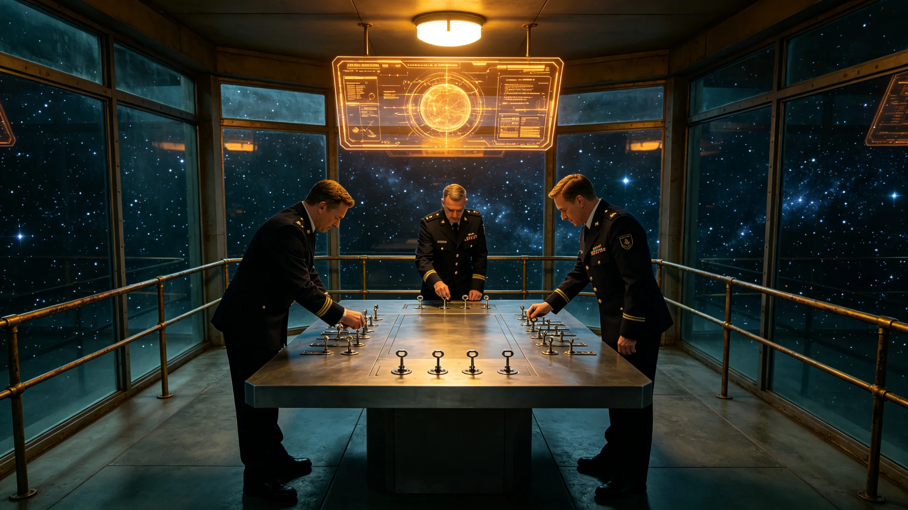

# 深空未知信号应答权限三级人类决策锁制度修订公报

**发布机构**：三恒星系文明联合体军事委员会
**发布日期**：3596年4月8日
**文件等级**：跨星系公开

## 一、修订背景

3558年分级制度（见GS-3558-01）将三级应答锁写入硬规。3579年演练两小时延迟（见GS-3579-01）后，委员会进一步将三级锁的物理操作流程制度化，确保AI不可代决。

## 二、三级决策锁

| 级 | 可决人 | 物理操作 |
|---|---|---|
| 一级 | 值班官 | 值班锁，登记 |
| 二级 | 总值班官 | 总锁，窄带应答 |
| 三级 | 议会三分之二 | 议会锁，主动联络 |

三级锁为物理钥匙，非电子权限。AI可辅助甄别，但不可操作钥匙。

## 三、与3293年AI责任

三级锁与AI辅助决策人类最终责任（见GS-3293-01）互锁：AI可推荐，人开锁。

## 四、与3571年光学协议

三级锁是光学协议（见GS-3571-01）的执行前提。开锁后光学站才发射。

## 五、军事委员会说明

公报注明：应答是人类的事。AI可以说"这像"，但它不能开锁。钥匙在人手里。三级锁就是三个人——值班官、总值班官、议会——任何一级不开，就不说。

## 六、结论

三级人类决策锁3596年制度化。

---

**归档编号**：MIL-ANSWER-3LEVEL-3596-001
**编制**：联合体军事委员会
**日期**：3596年4月8日

## 七、物理钥匙

三级锁为物理钥匙，非电子权限，防AI渗透。

## 八、与3558年分级

3558年写入硬规，本档定物理操作流程。

## 九、与3579年演练

演练延迟后，物理钥匙流程压缩会议环节。

## 十、与3573年窄带事件

3573年事件（见GS-3573-01）未触发二级锁。

## 十一、零实际开锁

至3600年，二级锁零次实际开启。

## 十二、与3387年冷备渗透

冷备渗透未遂（见GS-3387-01）后，物理钥匙防电子渗透。

## 十三、与3569年先飞器

先飞器自主决策（见GS-3569-01）不触发本锁，本锁只管地面应答。

## 十四、与3600年评估

三级锁至3600年零次实际开启。

## 十五、军事委员会末注

公报末写：三把钥匙。值班官、总值班官、议会。任何一把不开，就不说。最好永远不开。

---

## 七、物理钥匙

三级锁为物理钥匙，非电子权限，防AI渗透。

## 八、与3293年AI责任

AI可推荐，人开锁（见GS-3293-01）。

## 九、零实际开锁

至3600年二级锁零次实际开启。

## 十、与3387年冷备渗透

冷备渗透未遂（见GS-3387-01）后物理钥匙防电子渗透。

## 十一、公报末注补

公报末段补记：三把钥匙。任何一把不开就不说。最好永远不开。

## 十二、物理钥匙结构

三级锁各配三把物理钥匙，分存于三人。三级同时插入才能开锁。无一人可单独应答。

## 十三、与3293年AI责任

AI辅助决策人类最终责任（见GS-3293-01）写入硬规。AI可推荐波形，不可操作钥匙。

## 十四、与3387年冷备渗透

冷备渗透未遂（见GS-3387-01）后，物理钥匙防电子渗透，网络攻击无法开锁。

## 十五、零实际开锁

至3600年二级锁零次实际开启。委员会注明：最好永远不开。

## 十六、军事委员会末注补

公报末段补记：三把钥匙，三个人。任何一把不开就不说。最好永远不开。

## 十六、物理钥匙结构

## 十七、与3293年AI责任

## 十八、与3387年冷备渗透

## 十九、零实际开锁

至3600年二级锁零次实际开启。委员会注明：最好永远不开。

## 二十、军事委员会末注补

## 附则·编后语

本件归档后，主编辑委员会复核与同批正典交叉互锁。凡涉时间线、人名、事件之处，均以登记簿所载为准。编后语：此件为三千六百余年文明运转中一纸公文，公文所述之事，或为日常、或为事件、或为仪式。公文无褒贬，只录其然。

## 附记·与同批正典交叉索引

本件所涉人物、制度、技术、事件，均在同批正典中有对应文书。读者欲详其事，可按以下索引查阅：人物侧写见传记学派各卷；制度沿革见法学派各卷；技术参数见工程学派各卷；事件经过见灾害管理学派各卷；仪式规程见文化学派各卷；产业决算见经济学派各卷；生态监测见生态学派各卷；军事部署见军事学派各卷。索引不赘列，以登记簿为总目。

## 附记·归档注意

本件一式三份，分存三恒星系档案馆。正本存跨星系总馆，副本一分存比邻星b分馆，副本二分存第四恒星系分馆。三份内容一致，若有出入以正本为准。本件封存期为自归档日起一百年，一百年后由联合档案馆启封复核。

## 附记·编后

下一个读此件者，无论何年，皆以此件为据，不作回望之叹。公文所载，是当时之人当时之事。当时之人不知后事，当时之事只按当时规程处置。读此件者，亦不必以后人之心度前人之腹。

## 附记·钥匙保管人任期

钥匙保管人任期10年，到期轮换。保管人离任时当面将钥匙移交继任者，不邮寄不代交。

本件归档完毕，与同批正典互锁。
归档编号见登记簿。
本件一式三份分存三馆，内容一致，以正本为准。
封存期自归档日起一百年。

## 附则：归档与说明

本件经主管署署长签批生效，全文数据经两级复核后入库。本件副本分发至相关执行机构，原件封存于联合体档案馆对应卷册，归档号 GS-3596-01。后续年度复核将以本件为基准，关键指标偏差超过百分之五须提交专项说明。

本件各项数据均已录入联合体档案馆电子检索系统，可供后续年度调阅比对。
