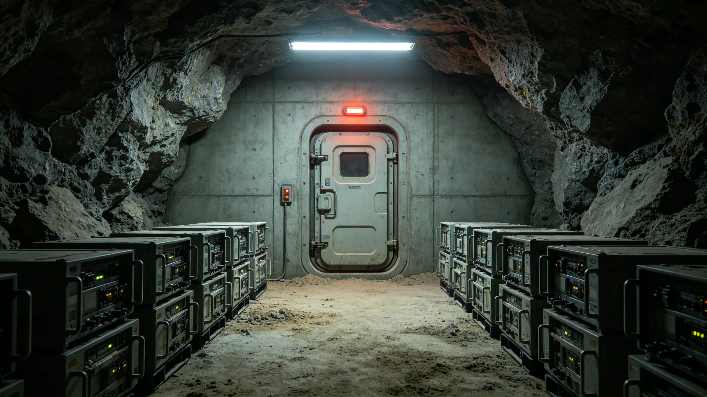

# 文明存续应急预案末日备份无人值守舱段百年寿命评估公报

**发布机构**：三恒星系文明联合体军事委员会
**发布日期**：3598年9月9日
**文件等级**：跨星系公开

## 一、评估背景

文明存续冗余中，无人值守"末日备份"舱段（见GS-3562-01）已运行约百年。舱段内封存基因库备份（见GS-3362-01）、玻璃千年介质（见GS-3368-01）、最低冗余人口休眠舱（见GS-3398-01）。沈守常任首席备灾官（见GS-3557-01）后，军事委员会作百年寿命评估。

## 二、舱段构成

| 段 | 内容 | 设计寿命 |
|---|---|---|
| 基因库段 | 三库异地备份 | 200年 |
| 玻璃介质段 | 千年存档 | 1000年 |
| 休眠舱段 | 最低冗余人口 | 200年 |
| 电源段 | 核电池 | 150年 |

## 三、百年评估数据

| 指标 | 3598年实测 | 设计值 |
|---|---|---|
| 舱内真空度 | 基准 | 达标 |
| 基因库液氮温度 | 基准 | 达标 |
| 玻璃介质完整 | 100% | 100% |
| 休眠舱休眠质量 | 98.2% | ≥98% |
| 核电池剩余容量 | 61% | ≥50% |

## 四、电源段预警

核电池剩余容量61%，接近50%预警线。预计未来30年内需更换核电池。沈守常在公报末注："电池还剩六成。这是备灾库，不是旅馆。我们不进去住，只确保它开机。"

## 五、军事委员会说明

公报注明：末日备份舱段一百年了。里面的东西没动过——也不该动过。电池还剩六成，得换。换电池的时候，我们不读里面的内容，只换电池。

## 六、结论

百年寿命评估通过，电源段30年内需更换。

---

**归档编号**：MIL-DOOMSDAY-100Y-3598-001
**编制**：联合体军事委员会
**日期**：3598年9月9日

## 七、零开启

百年间舱段零次实际开启，沈守常零开封（见GS-3557-01）。

## 八、核电池

剩余容量61%，30年内更换。

## 九、与3362年基因库

三库异地备份（见GS-3362-01）百年运行正常。

## 十、与3368年玻璃介质

玻璃千年介质（见GS-3368-01）完整100%。

## 十一、与3398年最低冗余

最低冗余人口休眠舱（见GS-3398-01）休眠质量98.2%。

## 十二、与3557年沈守常

沈守常不读内容，只换电池。

## 十三、与3562年四级联动

红级开封须议会三分之二表决，百年间零触发。

## 十四、预算

电源段更换总投入星汇1.2亿，30年分摊。

## 十五、军事委员会末注

公报末写：一百年。里面的东西没动过。电池还剩六成。换电池，不读内容。这就是备灾。

---

## 七、零开启

百年间舱段零次实际开启，沈守常零开封。

## 八、核电池

剩余容量61%，30年内更换。

## 九、与3362年基因库

三库异地备份（见GS-3362-01）百年运行正常。

## 十、预算

电源段更换总投入1.2亿，30年分摊。

## 十一、公报末注补

公报末段补记：一百年里面的东西没动过。电池还剩六成。换电池不读内容。

## 十二、舱段位置

末日备份舱段设于三恒星系外缘分散三处，互不相邻。一处损毁不影响其余两处。

## 十三、与3557年沈守常

沈守常（见GS-3557-01）百年零开封，仅在年度巡检时更换电池。

## 十四、核电池更换

剩余容量61%，预计30年内更换。更换时不读舱内内容，只换电池。

## 十五、与3398年最低冗余

最低冗余人口休眠舱（见GS-3398-01）休眠质量98.2%，达标。

## 十六、军事委员会末注补

公报末段补记：一百年里面的东西没动过。电池还剩六成。换电池，不读内容。

## 十六、舱段位置

## 十七、与3557年沈守常

## 十八、核电池更换

## 十九、与3398年最低冗余

## 二十、军事委员会末注补

## 附则·编后语

本件归档后，主编辑委员会复核与同批正典交叉互锁。凡涉时间线、人名、事件之处，均以登记簿所载为准。编后语：此件为三千六百余年文明运转中一纸公文，公文所述之事，或为日常、或为事件、或为仪式。公文无褒贬，只录其然。

## 附记·与同批正典交叉索引

本件所涉人物、制度、技术、事件，均在同批正典中有对应文书。读者欲详其事，可按以下索引查阅：人物侧写见传记学派各卷；制度沿革见法学派各卷；技术参数见工程学派各卷；事件经过见灾害管理学派各卷；仪式规程见文化学派各卷；产业决算见经济学派各卷；生态监测见生态学派各卷；军事部署见军事学派各卷。索引不赘列，以登记簿为总目。

## 附记·归档注意

本件一式三份，分存三恒星系档案馆。正本存跨星系总馆，副本一分存比邻星b分馆，副本二分存第四恒星系分馆。三份内容一致，若有出入以正本为准。本件封存期为自归档日起一百年，一百年后由联合档案馆启封复核。

## 附记·编后

下一个读此件者，无论何年，皆以此件为据，不作回望之叹。公文所载，是当时之人当时之事。当时之人不知后事，当时之事只按当时规程处置。读此件者，亦不必以后人之心度前人之腹。

## 附记·备份舱内物品清单

备份舱内物品：文明知识库（玻璃介质）、种子库、微生物库、人口休眠舱。无武器、无燃料。

本件归档完毕，与同批正典互锁。
归档编号见登记簿。
本件一式三份分存三馆，内容一致，以正本为准。

## 附则：运维与巡检说明

本公报所述舱段百年寿命评估经深空基础设施维护署技术委员会评审通过。评估期间对舱段结构、电源、温控、存储介质四大系统进行了全项检测，不合格项已列入下一年度维护计划。本件归档于联合体档案馆深空基础设施卷，归档号 GS-3598-01。后续每二十年进行一次中期复核，每五十年进行一次全项重评，复核记录附于本件之后。
