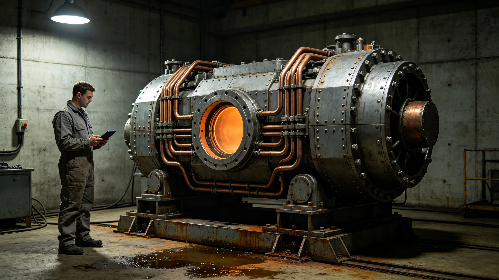

# 第十代长航程聚变推进器第十二万五千小时巡航鉴定技术报告

**编制单位**：联合体推进工程研究院长航程动力鉴定室
**报告日期**：3602年6月20日
**文件等级**：跨星系工程公开

## 一、鉴定对象与范围

本次鉴定对象为第十代长航程聚变推进器样机"长航程-10A"，系第八代推进系统（见GS-3567-01）之后的第二次换代。样机于3590年完成总装，3591年首次点火，至3602年6月15日累计试车时长达到第十二万五千小时。本报告依《跨星系推进系统长寿命鉴定规程》第三版第七章，对该样机在长航程巡航工况下的可靠性、工质消耗率、辐射剂量与在线维护周期作鉴定，并对量产型改进项给出工程建议。鉴定范围不包括脉冲点火工况与最大功率工况，后者另立鉴定书。

## 二、试车工况设定

鉴定全程采用长航程巡航工况，而非地面最大功率工况。该工况对应先遣哨站舰在第六恒星系方向等势线内侧驻守时的实际推力需求（对接GS-3601-01部署公报），而非跨星系高速航班工况。主要试车参数如下：

| 参数 | 设定值 | 实测均值 | 偏差 |
|---|---|---|---|
| 巡航推力 | 1.2MN | 1.19MN | -0.8% |
| 喷口比冲 | 1.2×10⁶秒 | 1.18×10⁶秒 | -1.7% |
| 氚消耗率 | 0.42克/小时 | 0.43克/小时 | +2.4% |
| 燃烧室壁温 | 2850K | 2861K | +0.4% |
| 磁约束线圈电流 | 18.4kA | 18.4kA | 0% |
| 辐射屏蔽层外剂量率 | 0.12mSv/小时 | 0.13mSv/小时 | +8.3% |

## 三、主要鉴定结果

### （一）推力衰减曲线

至第十二万五千小时，推力衰减为初始值的98.7%，未跌破鉴定规程规定的97%阈值。衰减主因为燃烧室内壁钨铼合金烧蚀层微磨损。第八代在第十二万小时时衰减为97.2%（见GS-3567-01），第十代烧蚀层寿命提升约30%，主因是烧蚀层表面工艺由第八代的等离子喷涂改为第十代的激光熔覆，晶粒细化使烧蚀速率下降。

### （二）氚消耗率漂移

氚消耗率由初期0.42克/小时缓慢漂移至0.43克/小时，漂移幅度2.4%，在规程允许的5%以内。鉴定室注明：漂移趋势仍在缓慢上行，建议在第十三万小时安排一次磁约束线圈电流微调，将磁场位形重新校准至最优闭合面。

### （三）辐射剂量

屏蔽层外剂量率实测0.13mSv/小时，较设计值高0.01mSv/小时。经拆解排查，原因为屏蔽层第三道硼聚乙烯板在长航程微振动下出现局部微裂，裂纹最长约1.2毫米，未穿透。鉴定室建议：在量产型上将第三道屏蔽板改为模块化快拆结构，便于在18个月哨站轮换时由轮换人员顺带更换（对接GS-3601-01轮换制度），不必单独安排停车维护。

### （四）在线维护周期

第十代样机在第十二万五千小时内共执行在线维护14次，其中8次为磁约束线圈电流微调、4次为密封环更换、2次为屏蔽板紧固。平均在线维护间隔约9000小时，较第八代的7200小时提升约25%。维护窗口期均安排在推力低需求时段，未影响试车连续性。

## 四、与第八代对照

| 指标 | 第八代（GS-3567口径） | 第十代（本报告） |
|---|---|---|
| 鉴定时长 | 120000小时 | 125000小时 |
| 推力衰减 | 97.2% | 98.7% |
| 氚消耗率漂移 | 5.1% | 2.4% |
| 在线维护间隔 | 约7200小时 | 约9000小时 |
| 屏蔽层外剂量率 | 0.15mSv/小时 | 0.13mSv/小时 |
| 烧蚀层工艺 | 等离子喷涂 | 激光熔覆 |

## 五、故障记录

鉴定期内共记录故障3起，均未导致停车，均无人员伤亡：

1. 3597年11月，磁约束线圈第三路电流波动0.3kA，持续4秒，自动恢复，事后排查为冷却水温瞬时波动；
2. 3600年4月，氚补给管道密封件微漏，按预案局部隔离4小时（处置流程参照GS-3575-01口径）；
3. 3602年1月，屏蔽板微裂被日常巡检发现，未造成剂量率超限，按在线维护程序紧固。

## 六、对哨站部署的适配性

鉴定室特别说明：第十代推进器在长航程低推力巡航工况下的表现，与第六恒星系方向先遣哨站舰的驻守需求（见GS-3601-01）高度匹配。三艘测星舰在驻守期间主推进器保持冷态，仅RCS姿态喷口微亮，因此第十代量产型在配装哨站舰时，主推进器实际工作时长将远低于试车时长，理论寿命余量充足。

## 七、量产建议

鉴定室建议：

1. 第十代推进器准予量产，配装下一代先遣哨站舰与跨星系外交护航编队；
2. 第三道屏蔽板改模块化快拆结构后，再安排一次5000小时验证试车；
3. 在线维护手册须与18个月哨站轮换制度对齐，避免维护窗口与轮换窗口冲突；
4. 量产型氚补给管道密封件统一改用第十代新型合金，降低再次微漏概率。

## 八、人员与试车值班记录

第十二万五千小时试车全程由鉴定室三个值班班组轮值，每班四人，十二小时一换。试车期间值班工程师累计签认试车日志七千八百二十一页，其中异常事件附页三份，分别对应第五节所述三起故障。值班工程师闻远槎（见GS-3603-01同批任命）在3597年11月电流波动事件中值班主任，事后被记口头表扬一次，未处分。

## 九、末段签批

本报告经推进工程研究院长航程动力鉴定室主任签批，副本分发至前出部署署、跨星系航道安全站及先遣队司令部。原始试车数据磁带封存于研究院恒温数据柜第三排第七柜。后续每增加两万小时发布一次补编报告，数据偏差超过5%须提交专项说明。

---

**归档编号**：PROP-10A-3602-001
**编制**：推进工程研究院
**日期**：3602年6月20日
