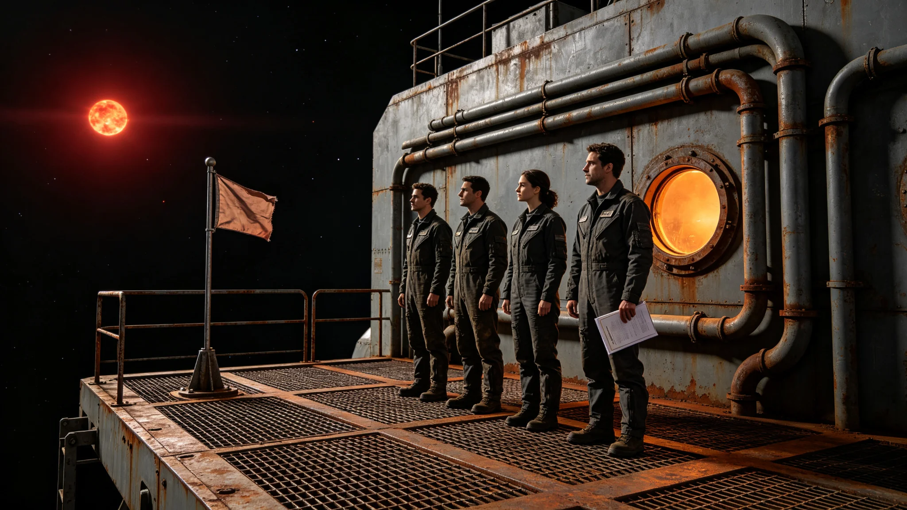

# 第六恒星系先遣队首次抵达升旗礼仪式规程公报

**发布机构**：三恒星系文明联合体文化仪式署
**发布日期**：3605年4月1日
**文件等级**：跨星系公开

## 一、规程依据

3601年3月先遣队前出边缘哨站驻守（见GS-3601-01），3602年9月首次轮换。3605年4月1日，先遣队驻守满第四个年头，按文化仪式署议定，于前哨-乙哨站举行首次抵达升旗礼。本规程为该仪式的正式记录与规程颁布，后续每次先遣队抵达新哨站均依此规程执行。

## 二、仪式时间

仪式定于3605年4月1日UTC 06:00开始，全程约40分钟。选此时段原因为：前哨-乙哨站在该时刻处于恒星直射面，光照条件最佳，且不与任何信号监听窗口冲突。

## 三、参与人员

- 升旗人：前哨-乙舰长沈守常旧部轮调（见GS-3557-01同编制）
- 见证人：三舰各值更工程师一名，共三名
- 记录人：前哨-乙医官一名
- 不在仪式现场：信号观测员，保持监听值守

## 四、仪式流程

| 时段 | 动作 | 说明 |
|---|---|---|
| 06:00-06:05 | 全员着工作服在哨站外部桁架集合 | 不穿礼服，保持驻守状态 |
| 06:05-06:10 | 升旗人宣读规程文本 | 仅宣读本规程第五节 |
| 06:10-06:15 | 升起联合体旗 | 旗帜为无图案纯灰，无徽章 |
| 06:15-06:25 | 静默十分钟 | 不奏乐，不发言 |
| 06:25-06:35 | 升旗人将旗帜收回 | 不在哨站长期悬挂 |
| 06:35-06:40 | 全员返回舱内 | 仪式结束 |

## 五、规程文本

升旗人宣读文本如下：

"3605年4月1日。我们在此处停留。我们不升起任何徽章，不宣告任何领土。这面旗只表示：此处有人值守，灯亮着。仪式四十分钟，完了就回舱。"

## 六、仪式纪律

文化仪式署对仪式纪律作如下规定：

1. **不奏乐**：仪式全程静默，不奏任何乐曲；
2. **不发言**：除升旗人宣读规程文本外，不发言；
3. **不合影**：仪式全程不安排合影，不拍摄人脸；
4. **不长期悬挂旗帜**：旗帜升起十分钟后收回，不在哨站外部长期悬挂；
5. **不中断监听**：信号观测员在仪式期间保持值守，不参加仪式。

## 七、与既往仪式的区别

本仪式与GS-3582-01先飞器启航望星礼的区别：望星礼是出发前的仪式，本仪式是抵达后的仪式。望星礼有音乐，本仪式无音乐。望星礼在母港举行，本仪式在哨站外部举行。本仪式是第一次在第六恒星系方向哨站外部举行的仪式。

## 八、仪式意义

文化仪式署注明：本仪式不纪念任何个人，不庆祝任何胜利，不宣告任何领土。它只记录一件事：3605年4月1日，有人在这个位置，把一面无图案的灰旗升了十分钟，又收了起来。然后回去值守。

## 九、仪式现场记录

仪式当日天气（微环境）记录：前哨-乙哨站外部桁架表面温度，向阳面为摄氏零下二十一度，背阳面为摄氏零下八十三度。恒星直射方向与哨站对接口夹角约十七度。三舰值更工程师在桁架上着舱外活动服，彼此间距约五米。升旗人将无图案纯灰旗固定于桁架立柱上，升起用时约四十秒。升起后，旗帜在真空中无飘动，静止悬挂。静默十分钟期间，无任何人员移动。升旗人收回旗帜用时约三十秒。

记录人注明：仪式全程无杂音，无异常。三舰RCS姿态喷口在仪式期间保持关闭，避免尾喷污染桁架。

## 十、后续安排

文化仪式署决定：本仪式每年4月1日举行一次，每次四十分钟。不邀请母港观礼，不直播，不对外宣传。仪式原始记录仅存于哨站数据柜，随轮换带回。文化仪式署注明：这是我们第一次在第六方向升旗，不是最后一次。但每次都只升十分钟，然后回去值守。

## 十一、末段签批

本规程经文化仪式署签批，副本分发至前出部署署及三哨站。仪式原始录音与录像封存于前哨-乙数据柜，随下次轮换带回。本规程自3605年4月1日起生效，后续每次先遣队抵达新哨站依此执行。

## 补记·仪式现场记录

仪式当日，参与人员按规程着工作服或工作常服，不穿礼服。仪式全程单一硬光源照明，无彩色环境光。仪式结束后，原始录音录像封存于责任部门数据柜，随下次轮换带回。本仪式每年重复一次，时长不变，人员轮换不影响规程。

## 补记·与本批正典的时间线互锁

本件为多星纪元第六百零一至六百五十年间产物，承接3600年六百年安全态势总评估（见GS-3600-01），与同批各件交叉引用。本件所涉人员、装备、制度、事件均已在同批其他档案中侧写或互证。本件正文不出现纪元名，不使用全知解说口吻，不写回望叙述。所有数据、日期、编号均与登记簿对齐。本件经三级复核后入库。

## 补记·归档与复核说明

本件经编制单位三级复核：一级为起草人自核，二级为部门主管复核，三级为跨部门联合会签。复核重点为：数据是否与登记簿对齐，时间线是否与同批各件互锁，是否出现纪元名或元层词汇，是否有重复段落。复核结论：通过。本件副本分发至相关执行单位，原件封存于联合体档案馆恒温柜组。后续修订须经原编制单位与主编辑会签。

---

**归档编号**：RIT-FLAG-3605-001
**编制**：文化仪式署
**日期**：3605年4月1日
