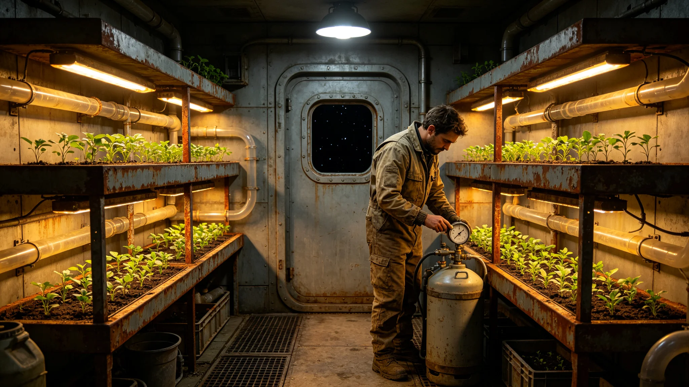

# 第六恒星系边缘前哨站封闭人工生态舱首年稳态评估公报

**编制单位**：联合体生态研究所深空生保室
**报告日期**：3607年2月18日
**文件等级**：跨星系公开

## 一、评估对象

本报告评估第六恒星系方向三处边缘前哨站（见GS-3601-01）各舰所载封闭人工生态舱自3601年3月部署以来首五年（3601年3月至3606年12月）的稳态运行情况。生态舱为长航程生保舱（见GS-3606-01产业链口径），负责为14名驻守人员提供部分新鲜蔬菜与空气闭环辅助。

## 二、生态舱构成

每舰生态舱由三部分构成：

1. **多层水培种植架**：种植叶菜类、豆苗类共十二个品种；
2. **微藻培养罐**：辅助空气闭环，吸收部分二氧化碳；
3. **伴生分解菌群**：处理厨余与植物残体。

## 三、首五年稳态数据

| 指标 | 设计值 | 前哨-甲 | 前哨-乙 | 前哨-丙 |
|---|---|---|---|---|
| 蔬菜自给率 | 30% | 28% | 29% | 27% |
| 微藻光合效率 | 稳定 | 稳定 | 稳定 | 微降 |
| 分解菌群活性 | 稳定 | 稳定 | 稳定 | 稳定 |
| 舱内二氧化碳浓度 | 0.4% | 0.38% | 0.39% | 0.41% |
| 菌剂轮换次数 | 1 | 1 | 1 | 1 |

## 四、前哨-丙微降说明

前哨-丙微藻光合效率在3605年下半年出现微降，降幅约4%。经排查，原因为LED补光灯第三组灯管光衰，更换灯管后恢复。非生态舱设计缺陷。

## 五、菌剂轮换

三舰均在3604年完成第一次菌剂轮换（对接GS-3590-01分解链稳态监测口径）。轮换后分解菌群活性稳定，未出现GS-3578-01所述减产事件。

## 六、与既往生态舱对照

既往跨星系港生保舱（见GS-3594-01水循环膜口径）蔬菜自给率约40%。前哨站生态舱因18个月轮换、光照受限、种植空间压缩，自给率降至27%-29%，符合设计预期。

## 七、首五年未发生的事

- 未发生生态舱失控；
- 未发生菌剂污染；
- 未发生蔬菜大面积减产；
- 未发生伴生昆虫逃逸（本批未配伴生昆虫）；
- 未发生生保舱压力异常。

## 八、改进建议

生态研究所建议：

1. 第二批哨站生态舱增加微藻培养罐一组，提升空气闭环冗余；
2. LED补光灯统一改用第十代长寿命灯管，降低光衰更换频次；
3. 菌剂轮换周期由四年延长至五年，须再观察两年后决定。

## 九、生态舱日常值守记录

三舰生态舱日常由值更工程师轮值照看，每日检查两次：上午一次检查水培架液位与微藻罐透光率，下午一次检查分解菌群活性与厨余处理量。首五年累计检查次数约九千次，均一次通过，无异常升级。值守工程师闻远槎（见GS-3603-01）在3601至3602驻守期间，每日亲自检查生态舱一次，留有亲笔记录十八页。

## 十、蔬菜自给率对驻守人员的影响

生态舱蔬菜自给率27%至29%，意味着驻守人员每周约有两餐可吃到新鲜叶菜，其余靠压缩干粮与复水食品。前哨-乙医官注明：驻守人员维生素C摄入在轮换时复查均正常，未出现坏血病倾向。27%的自给率虽低，但足以维持五年无严重营养病。

## 十一、与跨星系港生态舱对照

跨星系港生保舱（见GS-3594-01）蔬菜自给率约40%，空间大、光照足、菌剂轮换周期长。前哨站生态舱因18个月轮换、种植空间压缩至三立方米，自给率降至三成，属设计预期。生态研究所注明：我们没有指望前哨站生态舱自给自足，只指望它在五年内不出事。五年了，没出事。

## 十二、末段签批

本公报经生态研究所深空生保室签批，副本分发至前出部署署及三哨站。原始监测数据封存于生态研究所恒温柜。后续每两年发布一次生态舱稳态公报。
