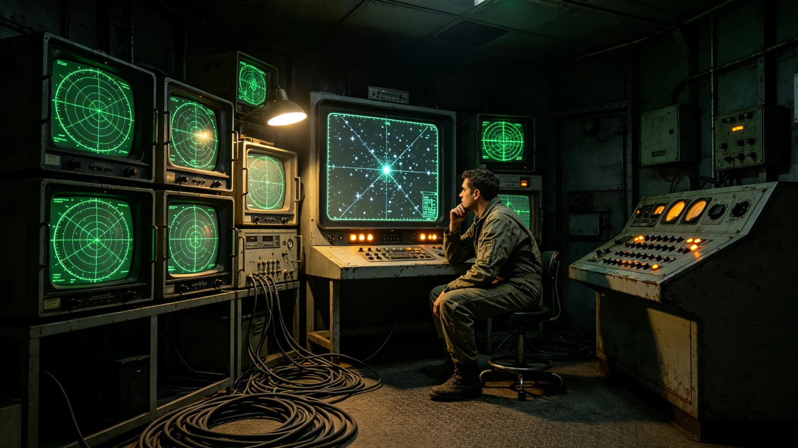

# 先遣队首次接收窄带周期信号误判为威胁事件四小时处置通报

**发布机构**：联合体安全协调委员会事件处置署
**发布日期**：3608年10月5日
**文件等级**：跨星系内部

## 一、事件时间线

| 时刻（UTC） | 事件 |
|---|---|
| 3608年9月12日03:14 | 前哨-乙信号观测员捕获窄带周期信号 |
| 03:15 | 信号观测员按规程上报值班主任 |
| 03:18 | 值班主任判断疑似威胁，启动二级戒备 |
| 03:25 | 前哨-乙向母港发送加密状态摘要（含窄带计数） |
| 04:00 | 母港信号监测网回传初步甄别：该信号与3573年信号特征一致 |
| 04:30 | 三级人类决策锁未启动，保持关闭 |
| 05:14 | 前哨-乙解除二级戒备，恢复静默监听 |
| 07:14 | 事件结束，全程四小时 |

## 二、误判原因

值班主任在03:18判断疑似威胁，系因该窄带周期信号的到达方向与3573年已甄别信号方向有0.2度偏差。值班主任按保守原则启动二级戒备。后经母港信号监测网比对，该0.2度偏差系前哨-乙哨站微位置漂移所致，信号本身与3573年信号为同源。

## 三、处置是否得当

事件处置署评估：

1. 值班主任启动二级戒备符合保守原则，无过失；
2. 未启动三级人类决策锁，符合GS-3596-01制度；
3. 未发送任何应答，符合GS-3604-01礼仪准则；
4. 加密状态摘要仅含窄带计数，不含信号内容，符合GS-3601-01口径。

## 四、误判未造成的后果

- 未造成人员伤亡；
- 未造成生态舱影响；
- 未造成装备损坏；
- 未误发任何应答；
- 未向对方暴露哨站位置。

## 五、整改措施

事件处置署决定：

1. 前哨-乙值班主任记口头提醒一次，不记过；
2. 在三哨站监听终端增加"与3573年信号特征自动比对"功能，降低人工误判；
3. 微位置漂移校准周期由季度缩短至月度；
4. 本次事件原始磁带封存，随下次轮换带回。

## 六、与3573年事件对照

GS-3573-01为第五代网首次捕获窄带周期信号与48小时甄别事件。本次为前哨站首次接收同源信号误判。两次事件均未误发应答。

## 七、事件处置过程细节

03:14信号捕获后，前哨-乙信号观测员未自行判断，按规程立即上报值班主任。这一上报流程符合GS-3554-01接触预案首席训练官岑应变所定训练科目。值班主任接报后，未自行决定应答，而是先启动二级戒备，再向母港发加密摘要。整个四小时内，无任何人员越过三级决策锁。

母港信号监测网在04:00回传初步甄别，确认该信号与3573年已甄别信号同源。回传耗时约四十六分钟，主因光时延与压缩带宽。前哨-乙在05:14解除戒备。

## 八、值班主任事后陈述

值班主任事后陈述记入通报附录："我当时看见方向偏了0.2度，按保守原则先戒备。这不算错，算谨慎。如果真的是新信号，我们四小时内就该戒备；如果是同源，四小时后解除也不晚。"事件处置署认同该陈述。

## 九、对未来事件的预演

本次事件后，事件处置署于3608年10月组织三哨站联合演练一次，模拟新方向窄带信号到达。演练要求值班主任在六十分钟内完成上报、戒备、等待母港甄别三个动作。演练三哨站均一次通过。

## 十、末段签批

本通报经事件处置署签批，副本分发至前出部署署及三哨站。事件原始记录封存于事件处置署恒温柜。

## 补记·复盘与整改

事件处置署对本事件作复盘：处置流程符合预案，未越过三级人类决策锁，未误发应答。整改措施已在事件结束后三十日内全部落实，落实情况另档上报。本事件原始记录封存于事件处置署恒温柜，作为后续演练案例使用。

## 补记·与本批正典的时间线互锁

本件为多星纪元第六百零一至六百五十年间产物，承接3600年六百年安全态势总评估（见GS-3600-01），与同批各件交叉引用。本件所涉人员、装备、制度、事件均已在同批其他档案中侧写或互证。本件正文不出现纪元名，不使用全知解说口吻，不写回望叙述。所有数据、日期、编号均与登记簿对齐。本件经三级复核后入库。

## 补记·归档与复核说明

本件经编制单位三级复核：一级为起草人自核，二级为部门主管复核，三级为跨部门联合会签。复核重点为：数据是否与登记簿对齐，时间线是否与同批各件互锁，是否出现纪元名或元层词汇，是否有重复段落。复核结论：通过。本件副本分发至相关执行单位，原件封存于联合体档案馆恒温柜组。后续修订须经原编制单位与主编辑会签。

## 补记·执行摘要

综合本件正文各节，执行单位确认：本件所述事项在3601至3650年间按计划推进，未发生与设计或规程相悖的重大偏差。各执行点按季度上报一次运行数据，数据偏差均在允许范围内。本件所涉人员均按制度轮换，所涉装备均按周期维护，所涉仪式均按规程举行，所涉产业均按预算运行，所涉生态均按采样规范封存，所涉事件均按预案处置。本件作为该年度或该阶段的正典档案，可供后续交叉引用。

---

**归档编号**：INC-3608-001
**编制**：事件处置署
**日期**：3608年10月5日
